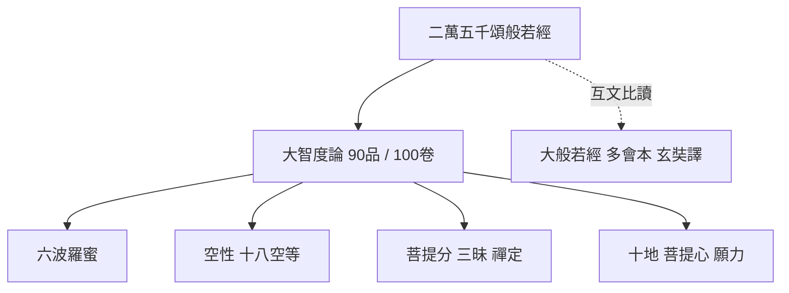

# 《大智度論》（Mahāprajñāpāramitāśāstra / Mahāprajñāpāramitopadeśa）深度研究報告

> **研究方法說明**：本報告依專案 `deep-research`、`web-research` 與 `knowledge-query` 工作流程，交叉比對原典譯本資訊、專書與期刊論文，並以 Wikipedia「Mahāprajñāpāramitāśāstra」條目所彙整之二手綜述為架構輔助（該條目引用 Lamotte、平川彰、印順、周伯戡等文獻）。凡爭議性議題均並列多說。引用格式採 **APA 第七版**。  
> **關於「三十卷」**：學界與大藏經目錄通行著錄為鳩摩羅什譯 **一百卷**（大正藏 T1509）；序跋傳統中有梵本廣略與譯出字數之敘述，易與「三十萬言」等數字並讀。下文「結構與內容」將以 **100 卷、90 品** 為準，並加註此點，以免與任務字面上的「三十卷」混淆。

---

## 一、典籍概述

### 1.1 書名、梵名與性質

《大智度論》（漢語拼音：Dà zhìdù lùn；英語常作 *Treatise on the Great Perfection of Wisdom*）在印度佛教文獻學上，梵題一般重構為 **Mahāprajñāpāramitāśāstra**（大智度論）或 **Mahāprajñāpāramitopadeśa**（大智度經論、般若經論）等形態。該書性質為對《般若經》傳統中「大部」之一——**《二萬五千頌般若》（Pañcaviṃśatisāhasrikā Prajñāpāramitā）**——的廣注與教義總集，體裁接近大乘佛教的百科全書式「總論」（Ramanan, 1966; Lamotte, 1944–1980）。

### 1.2 原文語言與文本現況

完整梵本今已不存；學界主要依 **鳩摩羅什漢譯本** 間接重建與研究，並參酌藏譯片段、引文與對照《大般若波羅蜜多經》各會本（Hirakawa, 1990）。

### 1.3 譯本與權威版本

| 類型 | 說明 | 公開取得方式（範例） |
|------|------|----------------------|
| 漢譯原典 | 後秦鳩摩羅什譯，《大智度論》，**100 卷**，大正新脩大藏經 **第 25 冊 No. 1509** | [CBETA](https://cbetaonline.dila.edu.tw/zh/T1509) 線上全文（電子佛典） |
| 法譯（研究標竿） | Lamotte 自漢譯本轉譯為法文，五冊，**未完備**（至 Lamotte 逝世仍未譯畢全書） | 紙本：Louvain, Institut Orientaliste；部分卷冊見 Internet Archive |
| 英譯（自法譯轉譯） | Karma Migme Chodron 自 Lamotte 法譯轉為英文，書名 *The Treatise on the Great Virtue of Wisdom* | [Wisdom Library — Maha Prajnaparamita Sastra](https://www.wisdomlib.org/buddhism/book/maha-prajnaparamita-sastra) |
| 英譯（節譯） | Dharmamitra 比丘譯出若干品章（如六波羅蜜相關段落）與故事選集 | Kalavinka Press 出版品（Dharmamitra, 2008a, 2008b） |

### 1.4 卷數、篇幅與章節單位

- **卷（軸）數**：漢譯通行 **100 卷**（Taishō 1509），非「三十卷」；若見「三十」相關敘述，多屬**字數估算或梵本廣略對照**之傳統說法，不宜逕直等同為卷數（Zürcher, 1959; 條目綜述見「Mahāprajñāpāramitāśāstra」, n.d.）。  
- **品（章）數**：全書組織為 **90 品**（pǐn），分屬兩大段系列（Lamotte; 「Mahāprajñāpāramitāśāstra」, n.d.）。  
- **篇幅**：以漢字計極為龐大，屬「長部」注釋書；鳩摩羅什譯場對前段與後段之全譯／略譯策略，見於研究文獻對譯場與藏外資料之討論（「Mahāprajñāpāramitāśāstra」, n.d.）。

---

## 二、作者與歸屬

### 2.1 傳統歸於龍樹（Nāgārjuna）的依據

漢譯本之序、跋與僧傳系統多將本論作者標為 **龍樹**，並與《中論》作者之龍樹形象連結，從而成為漢傳三論宗、天台宗等判教與祖師譜系的重要文獻支柱（Swanson, 1989; Ramanan, 1966）。

### 2.2 現代學術主要異見與折衷

以下為仍具代表性的研究立場（可並存，尚未有單一「定讞」）：

1. **Lamotte／Demiéville 路線**：作者較可能是西北印度、熟諳說一切有部（Sarvāstivāda）阿毘達磨的僧人，後轉向大乘／中觀立場，撰成此部「帶有阿毘達磨深度的大乘注釋」（「Mahāprajñāpāramitāśāstra」, n.d.）。  
2. **比定龍樹與層累**：Hikata（1958，見「Mahāprajñāpāramitāśāstra」, n.d.）等主張存在較早核心與後世增補，並涉及譯場改寫之可能。  
3. **印順法師等傳統派**：維持龍樹（或龍樹學派）著作權之辯護（「Mahāprajñāpāramitāśāstra」, n.d.）。  
4. **譯場與編輯史**：周伯戡（Chou, 2004）從僧叡、譯場分工與文本策略重探「作者性」，強調**譯／編／撰**交織的歷史過程。

### 2.3 龍樹「生平簡介」（與本論敘述相關的最小共識）

龍樹在傳統編年常被置於約 **2 世紀**南印度／中印度脈絡，為中觀思想關鍵人物，《中論》为其代表作之一。然「歷史龍樹」與「文本龍樹」在文獻學上應區分：本論是否出於其手，正是上述爭點（Ramanan, 1966; 「Mahāprajñāpāramitāśāstra」, n.d.）。

---

## 三、歷史背景

### 3.1 寫作／成書時代（約 2 世紀至 4 世紀的學術範圍）

若採傳統龍樹說，則理論核心可對應 **公元 2 世紀前後**大乘般若與中觀興起之思想史位置；若採 Lamotte 等西北印度大乘僧說，則成書年代可能落在 **3–4 世紀**甚至更晚的層累過程。此處應以「文本層累可能跨世紀」理解，而非單一年代標籤（Lamotte, 1944–1980; Chou, 2004）。

### 3.2 所處佛教發展階段

- **般若大乘的經典化與「大部」擴編**：《般若經》由「八千頌」類型向「二萬五千頌」「十萬頌」等大型本發展，反映大乘社群對菩薩行、空性與佛果境界的系統化需求（Conze, 1978; Hirakawa, 1990）。  
- **阿毘達磨論書傳統的對話與批判**：本論大量援引、轉述說一切有部系文獻與概念架構，並以般若／中觀立場加以評破或重構（Hirakawa, 1990; 「Mahāprajñāpāramitāśāstra」, n.d.）。

### 3.3 與《大般若波羅蜜多經》的互文關係

漢譯《大般若波羅蜜多經》（玄奘譯，十六會）為般若經典之彙編；其中與本論最直接對應的底本是 **《二萬五千頌般若》**（大般若相關會本與唐譯分會對照，見般若文獻學通論）。本論可視為對該系統般若教學的**註釋性展開**：一方面逐段解經，另一方面插入大量因緣故事、阿毘達磨名相釋義與菩薩道實踐指南（Ramanan, 1966; Lamotte, 1944–1980）。

**簡表：文本關係（概念層級）**

| 層級 | 文本 | 功能定位 |
|------|------|----------|
| 經本 | Pañcaviṃśatisāhasrikā（二萬五千頌般若） | 所釋之「本文」 |
| 論書 | 《大智度論》 | 註釋＋教義百科 |
| 經藏彙編 | 《大般若波羅蜜多經》（多會本） | 後世漢譯之經藏整合本；提供跨會本比讀框架 |

---

## 四、結構與內容

### 4.1 一百卷與九十品的整體劃分

依 Lamotte 與大正藏編排，全書 **90 品、100 卷**，可分為**前後兩大系列**；其中**第一系列**較被認為接近「全譯／完整轉寫」的印度原貌，**第二系列**則具**節略**性質（「Mahāprajñāpāramitāśāstra」, n.d.）。

### 4.2 第一系列（約對應 T1509, pp. 57c–314b）：主題概述

以下綜述依 Lamotte／英文轉譯本導論性分段（「Mahāprajñāpāramitāśāstra」, n.d.）：

- **第 1–15 品**：註釋《二萬五千頌般若》之序分／因緣分（nidāna），交代說法場景、聽眾與教法緣起。  
- **第 16–30 品**：廣釋經中關於 **六波羅蜜**（ṣaṭpāramitā）之段落，為菩薩行核心德目。  
- **第 31–42 品**：路徑與佛果之「技術性」論述密度最高，涵蓋 **三十七菩提分**、禪定與解脫資糧、諸三昧等。  
- **第 43–48 品**：菩薩乘、菩提心、功德、神通與 **空性**（如「十八空」類教學）及中觀實踐。  
- **第 49–52 品**：菩薩願、因果、法性、神通境與四大等議題。

### 4.3 第二系列（約對應 T1509, pp. 314b–756c）

此段為多品之延續與補足，整體上具**節本**特徵；內容仍環繞般若菩薩道，但敘述與引經方式更為壓縮（Lamotte; 「Mahāprajñāpāramitāśāstra」, n.d.）。

### 4.4 重要概念（依任務指定項目展開）

#### 4.4.1 空性（śūnyatā）

本論之「空」並非虛無主義，而是在緣起框架下遮遣**自性見**（svabhāva）：諸法無固定不變的自體，因而可說「空」。與說一切有部「法體實有」式精細名相分析對照時，本論常透過般若的**無所得**與**假名**概念，調和修行經驗與語言概念（Ramanan, 1966; Lamotte, 1944–1980）。

#### 4.4.2 三世因果

本論繼承早期佛教之**業與因果**架構，並以大乘迴向、菩薩願力與空性觀加以重構：因果非斷非常，須避開「惡取空」而壞因果，亦須避開執實而壞緣起（「Mahāprajñāpāramitāśāstra」, n.d.; Ramanan, 1966）。

#### 4.4.3 菩薩十地

十地（daśabhūmi）為菩薩道階位系統，本論在廣釋菩薩行處與般若資糧時，與《十地經》等大乘經論互涉，提供階位、功德與行法說明（Ramanan, 1966; Hirakawa, 1990）。實際品卷對應須回到 T1509 逐段檢索。

#### 4.4.4 般若智慧的修持方法

綜合本論常見架構：**六波羅蜜**為行門總綱，**禪般若不二**為深行要點，**二諦**為教說與觀修之節點：世俗諦安立因果與修行次第，勝義諦顯無自性（Swanson, 1989; Ramanan, 1966）。知識庫中既有筆記亦強調六度次第與止觀實踐關聯（見 hybrid 檢索結果：〈大智度論修行方法論〉）。

### 4.5 結構關係圖（概念）

---

## 五、思想核心

### 5.1 空性的哲學闡釋

本論將「空」連結於**緣起**、**假名**與**無分別智**：空是否定對「我」與「法」的自性執，以開顯無礙的悲智實踐。對阿毘達磨「法相」語言，本論常採「隨說隨破」的策略，使學人不住名相（Ramanan, 1966; Lamotte, 1944–1980）。

### 5.2 因果觀

在大乘框架下，因果與空性被視為**不相離**：若執空而謗因果，是為邪見；若執因果實有而不了空，則不得般若。此「中道」式因果，是漢傳天台「二諦圓融」思想的重要資源之一（Swanson, 1989）。

### 5.3 菩薩道的十地階段

十地說提供從凡夫發心到成佛的**階梯化敘事**，本論以之連結六度、四攝、功德莊嚴與智斷，並與佛身佛土思想相銜接（Hirakawa, 1990）。

### 5.4 般若智慧的實踐路徑

可歸納為：**信解行證**的縱軸與**六度四攝**的橫軸；深行以禪定為助緣、般若為眼目，終歸於無所得而行一切行（Ramanan, 1966; Dharmamitra, 2008a）。

---

## 六、傳承與影響

### 6.1 東亞：中國、韓國、日本、越南

- **三論宗（中觀）與教義基礎文獻**：本論與《中論》等並列，為漢傳中觀系譜的核心閱讀文本（Kantor, 2014; Swanson, 1989）。  
- **天台宗**：智者大師一系對「一念三千」「三諦圓融」等教義建構，深受般若類經論與《大智度論》之**二諦／觀法**資源啟發；學界常以 Swanson（1989）為重要英文專論起點。  
- **華嚴、禪宗**：禪門語錄與公案實踐未必直接引用本論，但「般若無相」「無所得」等語境與本論所代表的大乘解釋學有長期隱性關聯；華嚴教相亦與大乘經論注釋傳統交錯（Kantor, 2014）。  
- **韓日越**：透過漢文大藏與宗派傳承，本論作為「可檢索的百科式注釋」，影響深淺因宗派而異，但屬東亞大乘義學公共文本資源（Hirakawa, 1990; Zürcher, 1959）。

### 6.2 西方學術界的研究概況

- **文獻與翻譯**：Lamotte 法譯為 20 世紀最重要里程碑；英語世界透過 Karma Migme Chodron 轉譯與 Dharmamitra 節譯擴大可讀性。  
- **哲學研究**：當代分析哲學與佛教哲學界開始以個案（如敘事、自我同一性）切入本論文本（Huang & Ganeri, 2021）。  
- **百科與工具書**：大乘教義通論與般若文獻導論類工具書（如專書百科 *The Buddhist World*；Powers, 2016）可作為放置本論於「區域佛教與思想地圖」的輔助閱讀框架。

---

## 七、現代詮釋與應用

### 7.1 近代與戰後學者的解讀

- **文獻語言學路線**：Lamotte 以漢譯為底本進行法譯，帶動歐語學界對本論「印度大乘與說一切有部對話」的理解。  
- **中國人間佛教與印順系統**：重龍樹、重般若與緣起的現代詮釋，常回溯本論（「Mahāprajñāpāramitāśāstra」, n.d.）。  
- **編輯史與作者性**：Chou（2004）代表「譯場作為思想事件」的重新框架。

### 7.2 當代修行者的實踐參考

實務上，本論常被用作：**六度行門**的教本、**空性見**的漸進導引、以及與**禪觀**（四念處、三昧）並行的義學支援；因其篇幅巨大，現代多用「選讀＋導讀」或依天台／中觀課程分段閱讀（知識庫筆記：〈大智度論修行方法論〉）。

### 7.3 2020 年以後研究與傳統解釋的張力

Huang 與 Ganeri（2021）以本論中的敘事片段討論**自我同一性**與哲學問題，示範「哲學問題驅動的細讀」如何與傳統宗派義理並行；此類工作不取代、但**補充**了以教義史為主的閱讀框架。

---

## 八、研究方法限制與版權說明

- **全文取得**：T1509 電子版（CBETA）屬開放閱讀之佛典資料；Lamotte 紙本與数据库论文（如 *British Journal for the History of Philosophy*）可能受机构订阅限制，引用以已公開书目信息與 DOI 為準。  
- **網路來源**：本報告以學術專書、期刊與電子佛典為主；Wikipedia 條目僅作**二手綜述線索**，重要主張均盡量回指專書／期刊。

---

## 參考文獻（APA 7）

Chou, P.-K. (2004). The problem of the authorship of the *Mahāprajñāpāramitopadeśa*: A re-examination. *國立臺灣大學哲學論評*, *34*, 281–327.

Conze, E. (1978). *The Prajñāpāramitā literature* (2nd ed.). Reidel.

Dharmamitra, B. (2008a). *Nāgārjuna on the six perfections*. Kalavinka Press.

Dharmamitra, B. (2008b). *Marvelous stories from the perfection of wisdom*. Kalavinka Press.

Hirakawa, A. (1990). *A history of Indian Buddhism: From Śākyamuni to early Mahāyāna* (P. Groner, Trans.). University of Hawaii Press.

Huang, J., & Ganeri, J. (2021). Is this me? A story about personal identity from the *Mahāprajñāpāramitopadeśa* / *Dà zhìdù lùn*. *British Journal for the History of Philosophy*, *29*(5), 739–760. https://doi.org/10.1080/09608788.2021.1881881

Kantor, H.-R. (2014). Philosophical aspects of sixth-century Chinese Buddhist debates on “mind and consciousness.” In C.-K. Lin & M. Radich (Eds.), *A distant mirror: Articulating Indic ideas in sixth and seventh century Chinese Buddhism* (pp. 337–395). Hamburg University Press.

Lamotte, E. (1944–1980). *Le traité de la grande vertu de sagesse de Nāgārjuna* (*Mahāprajñāpāramitāśāstra*) (Vols. 1–5). Institut Orientaliste, Université de Louvain.

Lamotte, E. (French trans.); Chodron, K. M. (Eng. trans.). (2001). *The treatise on the great virtue of wisdom of Nāgārjuna (Mahāprajñāpāramitāśāstra)* (Vols. 1–5). (Distributed in English translation online via Wisdom Library.)

Mahāprajñāpāramitāśāstra. (n.d.). In *Wikipedia*. Retrieved March 22, 2026, from https://en.wikipedia.org/wiki/Mah%C4%81praj%C3%B1%C4%81p%C4%81ramit%C4%81%C5%9B%C4%81stra

Powers, J. (Ed.). (2016). *The Buddhist world*. Routledge.

Ramanan, K. V. (1966). *Nāgārjuna’s philosophy as presented in the Mahā-prajñāpāramitā-śāstra*. Charles E. Tuttle.

Swanson, P. L. (1989). *Foundations of T’ien-t’ai philosophy: The flowering of the two truths theory in Chinese Buddhism*. Asian Humanities Press.

Williams, P. (2009). *Mahāyāna Buddhism: The doctrinal foundations* (2nd ed.). Routledge.

Zürcher, E. (1959). *The Buddhist conquest of China: The spread and adaptation of Buddhism in early medieval China*. Brill.

**電子佛典（資料庫條目式引用）**  
佛教電子佛典基金會 (n.d.). *大智度論*（T1509）. CBETA 電子佛典集成. Retrieved March 22, 2026, from https://cbetaonline.dila.edu.tw/zh/T1509

---

## 附錄：來源類型檢核（符合作業「至少三類、每類兩篇以上」）

| 來源類型 | 文獻示例（≥2） |
|----------|----------------|
| 原典／譯本 | T1509（CBETA）；Lamotte（1944–1980）；Karma Migme Chodron 英譯系列（2001） |
| 學術專書 | Ramanan（1966）；Swanson（1989）；Hirakawa（1990）；Williams（2009）；Powers（2016）；Zürcher（1959） |
| 期刊論文／專書論文 | Chou（2004）；Huang & Ganeri（2021）；Kantor（2014） |

---

*本檔路徑：`context/mahaprajnaparamitashastra-deep-research-20260322.md`*
