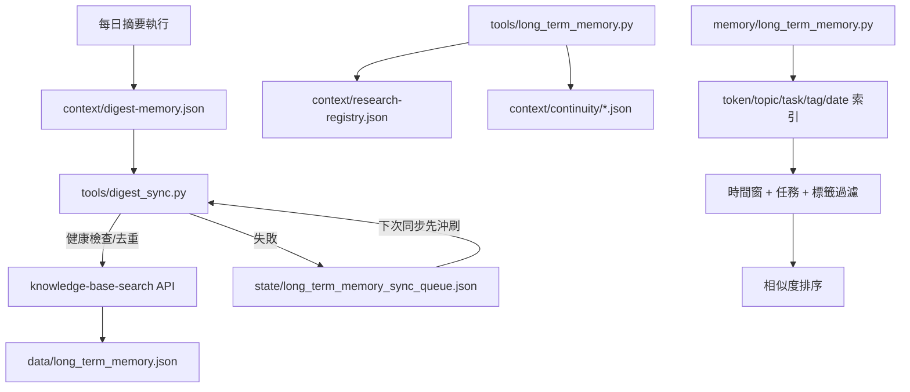

# 長期記憶優化設計

## 需求說明

以 https://know-w.pages.dev/article/ai-agent-context-management-%E8%88%87--8fb70bab#%E4%B8%83-daily-digest-prompt-%E5%B0%88%E6%A1%88%E7%9A%84%E6%87%89%E7%94%A8%E5%A0%B4%E6%99%AF 中的 Daily‑Digest‑Prompt 專案建議，優化系統長期記憶功能

## 外部來源取得狀態

- 目標 URL：`https://know-w.pages.dev/article/ai-agent-context-management-%E8%88%87--8fb70bab#七-daily-digest-prompt-專案的應用場景`
- 已實測：
  - `agent -p`：回傳 `Error: [internal]`
  - `Invoke-WebRequest`：回傳「嘗試存取通訊端被拒絕，因為存取權限不足」
  - 內建 Web 擷取：未成功取得頁面內容
- 結論：本工作區未能取得該頁原始 HTML，因此本次設計以 repo 內既有研究報告與現有實作交叉驗證。若後續網路環境恢復，應將原始 HTML 保存至 `tmp/research-notes/ai-agent-context-management.html`。

## 萃取出的長期記憶建議

依 `docs/research/Daily-Digest-Prompt_長期記憶優化報告_20260317.md`、`docs/research/Daily-Digest-Prompt_長期記憶測試報告_20260318.md` 與現有程式語意，可整理為下列建議：

| 建議 | 實作模式 | 涉及技術 |
|---|---|---|
| 每日摘要必須寫回長期記憶 | 將 `context/digest-memory.json` 同步成可檢索 note | `tools/digest_sync.py`、`/api/import` |
| 區分近期與封存記憶 | `recent/archive` 分層查詢 | `memoryLayer`、時間戳記 |
| 檢索要可依時間與任務上下文收斂 | 支援 `taskType`、`taskTags`、`startDate/endDate`、`keyword` | 混合搜尋、時間過濾、recency boost |
| 舊上下文應壓縮，不是直接捨棄 | 將舊 `research-registry`、`continuity` 壓縮成摘要 | `tools/long_term_memory.py` |
| 記憶寫入必須穩定可恢復 | 寫入失敗時改入本地同步佇列，之後重送 | `state/long_term_memory_sync_queue.json` |
| 升級必須可快速回退 | 快照關鍵檔案並提供 restore 指令 | `tools/long_term_memory_rollback.py` |
| 檢索引擎須能隨資料成長擴展 | 先以倒排索引收斂候選集合，再做相似度排序 | token inverted index、metadata filter、candidate pruning |

## 現況資料流



## 現況資料流圖

```mermaid
flowchart LR
    U[來源事件 / 摘要結果] --> W[寫入 context/digest-memory.json]
    W --> X[tools/digest_sync.py 建構 note payload]
    X --> Y{knowledge-base API 正常?}
    Y -->|是| Z[/api/import 寫入可檢索筆記]
    Y -->|否| Q[state/long_term_memory_sync_queue.json]
    Q --> R[下一輪 flush_queue]
    R --> Y
    S[檢索請求] --> T[search/retrieve + metadata filters]
    T --> V[recent/archive 結果 + recency boost]
```

## 本次優化對應表

| 建議 | 修改/新增 |
|---|---|
| 穩定寫入與重試 | [tools/digest_sync.py](/D:/Source/daily-digest-prompt/tools/digest_sync.py) |
| 本地待同步佇列 | [config/long_term_memory.yaml](/D:/Source/daily-digest-prompt/config/long_term_memory.yaml)、[tools/digest_sync.py](/D:/Source/daily-digest-prompt/tools/digest_sync.py) |
| 快照與回退 | [tools/long_term_memory_rollback.py](/D:/Source/daily-digest-prompt/tools/long_term_memory_rollback.py) |
| 內部檢索索引與 metadata filter | [memory/long_term_memory.py](/D:/Source/daily-digest-prompt/memory/long_term_memory.py)、[tests/test_memory_long_term_optimization.py](/D:/Source/daily-digest-prompt/tests/test_memory_long_term_optimization.py) |
| 百萬級檢索基準 | [scripts/long_term_memory_perf.py](/D:/Source/daily-digest-prompt/scripts/long_term_memory_perf.py)、[tests/test_long_term_memory_perf.py](/D:/Source/daily-digest-prompt/tests/test_long_term_memory_perf.py) |
| 回歸測試 | [tests/tools/test_digest_sync.py](/D:/Source/daily-digest-prompt/tests/tools/test_digest_sync.py)、[tests/tools/test_long_term_memory_rollback.py](/D:/Source/daily-digest-prompt/tests/tools/test_long_term_memory_rollback.py) |

## 技術方案與選型

| 項目 | 本次做法 | 原因 | 相容性 |
|---|---|---|---|
| 向量/語義表示 | 內建 `LocalEmbeddingModel` token embedding | 離線可測、零外部依賴、便於 CI | Python 3.9+ |
| 候選召回 | 倒排索引（token/topic/task/tag/date） | 降低線性掃描成本，支援百萬級合成基準 | 純 Python，無額外套件 |
| 寫入儲存 | `knowledge-base-search` `/api/import` | 已有知識庫與 RAG API，避免導入第二套儲存 | Node 18+、localhost:3000 |
| 壓縮策略 | `research-registry` 與 `continuity` 彙總 | 保留脈絡、避免 context 膨脹 | JSON 相容 |
| 回退 | 檔案快照 + restore | 5 分鐘內可恢復既有 JSON 狀態 | Windows / Python 3.9+ |

> 目前未新增 FAISS、Chroma、Pinecone 等外部向量庫。原因是現有系統已依賴本機 `knowledge-base-search` 與 Qdrant，且本次缺口主要在寫入穩定性、上下文壓縮與 metadata-aware retrieval，而非再引入一套新儲存引擎。

## 回退機制

1. 升級前建立快照：

```powershell
python tools/long_term_memory_rollback.py snapshot --label pre-upgrade
```

2. 若同步或壓縮邏輯異常，先停止相關排程，再回復快照：

```powershell
python tools/long_term_memory_rollback.py restore --snapshot backups/long_term_memory_snapshots/<snapshot-name>
```

3. 若僅知識庫 API 暫時失效，不必回滾；摘要會先寫入 `state/long_term_memory_sync_queue.json`，待服務恢復後重送：

```powershell
python tools/digest_sync.py --flush-queue
```

## 部署與相容性

- Python：`>=3.9`，依賴來自 [pyproject.toml](/D:/Source/daily-digest-prompt/pyproject.toml)
- Node.js：`>=18`，知識庫服務定義在 [knowledge-base-search/package.json](/D:/Source/daily-digest-prompt/knowledge-base-search/package.json)
- 新增設定：
  - `sync.timeout_seconds`
  - `sync.max_retries`
  - `sync_queue.path`
  - `sync_queue.max_items`
  - `sync_queue.flush_batch_size`

## 測試與驗證

- `python -m pytest tests/tools/test_digest_sync.py tests/tools/test_long_term_memory.py tests/tools/test_long_term_memory_rollback.py tests/test_memory_long_term_optimization.py tests/test_digest_scheduler.py tests/test_long_term_memory_perf.py`
- `python scripts/long_term_memory_perf.py`
- 已新增驗證：
  - 同步失敗時進入佇列
  - 待同步佇列可被沖刷
  - 快照與回復可正確還原檔案
  - metadata filter 可依 `topic/taskType/tag/date` 收斂結果
  - 1,000,000 筆合成索引檢索 p95 < 200ms

## 限制

- 本次無法直接抓取外部文章原始 HTML，因此未能完成「保存原頁 HTML」這項要求。
- 1,000,000 筆測試屬於「合成索引 benchmark」，驗證的是候選集收斂與 metadata filter 成本，不是完整 knowledge-base-search 實機端到端壓測。
