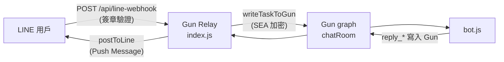

# 於 Gun Relay 新增 LINE Webhook 取代 Make.com 觸發

## 現況摘要

- **Make.com 現有流程**：Make.com 呼叫 Relay 的 `POST /api/task`，傳入 `{ "text": "任務內容" }`；Relay 以 Bot 的 epub 與自身 keypair 算出 `sharedSecret`，將 payload 用 SEA 加密後寫入 Gun `chatRoomName`（`render_isolated_chat_room`），並可選等待 bot 收件確認。程式位於 [D:\Source\my-gun-relay\index.js](D:\Source\my-gun-relay\index.js) 約 325–459 行。
- **轉送進 Gun 的共用邏輯**：`writeTaskToGun(msgId, encryptedData)`、`sharedSecret` 初始化（含 `fetchBotEpub()`）、msgId 前綴（目前 `mk_`）。LINE 進來後應複用同一套「取得 sharedSecret → 組 payload → 加密 → writeTaskToGun」，僅差在 **msgId 前綴**（例如 `line_`）與 **文字來源**（LINE 事件裡的 `event.message.text`）。

## 設計要點

### 1. LINE Webhook 簽章驗證（必須）

- LINE 以 **HMAC-SHA256**(請求 body 原始字串, channel secret) 產生簽章，放在 header `x-line-signature`。
- 官方要求：**簽章驗證前不得對 body 做任何修改**（不能先 `JSON.parse` 再轉回字串、不能改編碼）。因此：
  - LINE Webhook 路徑**不能**使用已解析過的 `req.body`（即不能依賴全域的 `express.json()` 來驗簽）。
  - 做法：對 **POST /api/line-webhook** 單一路徑使用 **raw body**（例如 `express.raw({ type: 'application/json' })`），在該 route 內先用 raw body 驗簽，通過後再 `JSON.parse` 取得 `events`。

### 2. 路徑與 Middleware 順序

- 在 [index.js](D:\Source\my-gun-relay\index.js) 中，目前約 45 行有 `app.use(express.json())`，會把 body 先吃掉。
- 建議：在 `express.json()` **之前**為 LINE Webhook 單一路徑掛上 raw parser，例如：
  - `app.post('/api/line-webhook', express.raw({ type: 'application/json' }), lineWebhookHandler)`
- 這樣只有 `/api/line-webhook` 會拿到 `req.body` 為 Buffer（原始 body），其餘路由仍用 `express.json()` 的 parsed body。

### 3. 從 LINE 事件取出文字並寫入 Gun

- LINE Webhook 請求體結構：`{ "destination": "...", "events": [ { "type": "message", "message": { "type": "text", "text": "..." }, "replyToken": "...", ... } ] }`。
- 只處理 `event.type === 'message'` 且 `event.message.type === 'text'`；其餘類型（圖/貼圖等）可選擇忽略或轉成一段說明文字。
- 對每個符合條件的 event：
  - `text = event.message.text`（必要時 trim、長度上限與現有 `/api/task` 一致或共用常數）。
  - 若 `sharedSecret` 尚未就緒，與 `/api/task` 相同：`fetchBotEpub()`、必要時建立 relay pair 並 `publishRelayEpub()`、計算 `sharedSecret`。
  - `msgId = 'line_' + crypto.randomBytes(8).toString('hex')`（與 `mk_` 區隔，方便日誌與除錯）。
  - `payload = JSON.stringify({ id: msgId, text, ts, updatedAt: ts })`，與 `/api/task` 相同結構。
  - `encryptedData = await SEA.encrypt(payload, sharedSecret)`，然後 `await writeTaskToGun(msgId, encryptedData)`。
- 是否等待 bot 收件（如 `waitForBotReceipt`）：可做成可選（例如依 query 或 env 決定），以縮短 LINE 端回應時間、避免 LINE 重試；建議預設不等待，僅寫入 Gun 即回 200。

### 4. 回應 LINE 平台

- LINE 要求：收到 webhook 後需**盡快**回傳 HTTP 200，否則會重試。因此處理邏輯應「先回 200，再非同步處理事件」或「同步只做驗簽 + 寫 Gun（快速），再回 200」。
- 回傳 body：空或 `{}` 即可；不需回傳 events 內容。

### 5. 環境變數

- **LINE_CHANNEL_SECRET**（必填）：用於 webhook 簽章驗證；未設定時 LINE webhook 回 503。
- **LINE_CHANNEL_ACCESS_TOKEN**（必填，若啟用回傳 LINE）：用於 Push Message / Reply Message；未設定時不呼叫 LINE API，僅寫入 Gun。

### 6. 完全改用 LINE 取代 Make.com（入站＋出站）

- **入站**：LINE 用戶發訊 → `POST /api/line-webhook` → 驗簽、寫入 Gun（`line_` msgId），取代 Make.com 呼叫 `POST /api/task`。
- **出站**：Bot 回覆寫入 Gun（`reply_*`）後，由 Relay 的 reply forwarder 改為呼叫 **LINE Messaging API** 回傳給用戶，**不再呼叫** `postToMakeWebhook(entry)`。實作上改為 `postToLine(entry)`（見下節），並以 env 控制：有 `LINE_CHANNEL_ACCESS_TOKEN` 時只送 LINE，不送 Make.com；可選擇保留 `MAKE_WEBHOOK_URL` 作為備援或完全移除。

### 7. Bot 回覆 → LINE Messaging API 回傳

- **觸發點**：與現有 `startReplyForwarder()` 相同，監聽 Gun 上 `reply_*` 節點，解密得到 `entry = { id, text, ts }`。改為呼叫 `postToLine(entry)` 取代 `postToMakeWebhook(entry)`。
- **要送給誰**：LINE Push Message 需要 **userId**（`event.source.userId`）。reply 事件本身沒有帶「對應哪個 LINE 用戶」，因此需在 **收到 LINE webhook 時** 把該事件的 `event.source.userId` 存起來，供之後轉發使用。
  - **單一用戶模式**：維護一個變數 `lineUserId`（或 `lineReplyTarget`）。每次處理 LINE webhook 且成功寫入 Gun 時，以該 event 的 `source.userId` 覆寫。Forwarder 收到任一 `reply_*` 時，就用目前儲存的 `lineUserId` 發 Push Message。適用「一個 Bot 對一個 LINE 用戶」。
  - 若未來要支援多用戶，可改為 queue：寫入 Gun 時 push `{ msgId, userId }`，轉發時 pop（FIFO）；需注意 bot 處理順序與 reply 順序可能不完全一致。
- **API 選擇**：
  - **Reply Message**（`replyToken`）：僅能在「收到 webhook 的同一請求週期內」使用，且 replyToken 有效時間極短。Bot 回覆是異步的（Worker 處理完才寫 `reply_*`），故**無法**用 replyToken 回傳最終結果。
  - **Push Message**：隨時可用，需 `userId`。本實作採用 Push Message，並以「最近一筆 LINE 來源的 userId」為對象。
- **實作**：
  - 新增 `postToLine(entry)`：若未設定 `LINE_CHANNEL_ACCESS_TOKEN` 或沒有 `lineUserId`，則不送；否則 `POST https://api.line.me/v2/bot/message/push`，Body `{ "to": lineUserId, "messages": [ { "type": "text", "text": entry.text } ] }`，Header `Authorization: Bearer <LINE_CHANNEL_ACCESS_TOKEN>`。處理 4xx/5xx 與逾時（例如 10s），錯誤僅 log 不拋出。
  - 在 LINE webhook handler 內，每當成功將一則 text 寫入 Gun 時，從對應的 `event.source.userId` 更新 `lineUserId`（若 event 來自 group，可選用 `event.source.userId` 或 `event.source.groupId`；一對一聊天用 `userId`）。
  - 在 `startReplyForwarder()` 中：若設定了 `LINE_CHANNEL_ACCESS_TOKEN`，改為呼叫 `postToLine(entry)`；不再呼叫 `postToMakeWebhook(entry)`（或依 env 二擇一／皆可關閉）。
- **即時回覆（選用）**：在 webhook handler 內、回 200 前，可用該事件的 `replyToken` 呼叫 Reply Message 送出一則「已收到，處理中」之類的簡短訊息，提升體感；實作上需在驗簽與解析後、寫 Gun 前或後、同步呼叫 LINE Reply API，注意 replyToken 有效時間很短。
- **長文**：LINE 單則 text 有 5000 字元上限；若 `entry.text` 過長，可截斷或拆成多則訊息送出（Push Message 的 `messages` 陣列可多筆）。

---

## 實作步驟

1. **簽章驗證函式**
  在 [index.js](D:\Source\my-gun-relay\index.js) 中新增函式 `verifyLineSignature(rawBody, channelSecret, signature)`：  
   - 使用 Node.js `crypto.createHmac('sha256', channelSecret).update(rawBody).digest('base64')`，與 header `x-line-signature` 比較（timing-safe 更佳）。  
   - `rawBody` 為 Buffer 或原始字串（勿先 JSON.parse）。
2. **LINE Webhook 路由與 raw body**
   - 在 **app.use(express.json()) 之前** 掛載：  
    `app.post('/api/line-webhook', express.raw({ type: 'application/json' }), lineWebhookHandler)`  
   - `lineWebhookHandler` 內：  
     - 若未設定 `process.env.LINE_CHANNEL_SECRET`，回 503 並 return。  
     - 讀取 `req.headers['x-line-signature']` 與 `req.body`（此時為 Buffer）。  
     - 若簽章不符，回 401 或 403，不解析 body。  
     - `const body = JSON.parse(req.body.toString('utf8'))`；若 `!body.events || !Array.isArray(body.events)`，回 200（避免 LINE 重試）。  
     - 遍歷 `body.events`，篩選 `type === 'message' && message.type === 'text'`，取 `event.message.text`。  
     - 對每則 text（可限制長度、去空白）：呼叫與 `/api/task` 相同的 sharedSecret 初始化邏輯（可抽出成 `ensureSharedSecret()` 若尚未存在），產生 `line_` msgId、組 payload、加密、`writeTaskToGun`；並以 `event.source.userId` 更新 `lineUserId`（供 Bot 回覆時 Push 用）。  
     - 回應 `res.status(200).json({ ok: true, received: events.length })` 或僅 `res.status(200).end()`。
3. **共用邏輯抽取（建議）**
   - 將「取得/確保 sharedSecret」「組 payload + 加密 + writeTaskToGun」從 `/api/task` 抽成共用的 helper（例如 `injectTaskToGun(text, msgIdPrefix)` 回傳 `{ msgId, ack }`），讓 `/api/task` 與 LINE webhook 都呼叫它，避免重複程式碼與行為不一致。
4. **Bot 回覆 → LINE（postToLine）與出站切換**
   - 新增模組級變數 `lineUserId`，僅在處理 LINE webhook 時以 `event.source.userId` 更新。
   - 新增 `postToLine(entry)`：若缺 `LINE_CHANNEL_ACCESS_TOKEN` 或 `lineUserId` 則 return。呼叫 `POST https://api.line.me/v2/bot/message/push`，Body `{ "to": lineUserId, "messages": [ { "type": "text", "text": entry.text.slice(0, 5000) } ] }`，Header `Authorization: Bearer <token>`；逾時 10s，錯誤僅 log。
   - 在 `startReplyForwarder()` 內：若已設定 `LINE_CHANNEL_ACCESS_TOKEN`，改為呼叫 `postToLine(entry)`，**不再呼叫** `postToMakeWebhook(entry)`；未設定則可保留 Make 或兩者皆不呼叫。
5. **錯誤與日誌**
   - 簽章失敗、sharedSecret 無法取得時記錄 log；驗簽失敗回 4xx。日誌標註 `[line-webhook]`、`[postToLine]` 與 msgId。
6. **部署與設定**
   - Render 新增 `LINE_CHANNEL_SECRET`、`LINE_CHANNEL_ACCESS_TOKEN`。LINE Console Webhook URL 設為 `https://gun-relay-bxdc.onrender.com/api/line-webhook` 並 Verify。
7. **測試**
   - LINE 發訊後確認 `line_` msgId 寫入 Gun、bot 處理完成後該用戶在 LINE 收到 Push 回覆。必要時可暫留 `MAKE_WEBHOOK_URL` 比對再移除。

---

## 架構關係（簡化）

---

## 風險與注意

- **Raw body 與 body size**：若 LINE 一次送大量事件，可對 `/api/line-webhook` 的 raw parser 設定 `limit`（例如 100kb），避免過大 payload。
- **重試與冪等**：LINE 可能重送同一 webhook；若需冪等，可依 `webhookEventId` 做短期去重（本階段可先不做，僅寫入 Gun 即回 200）。
- **出站完全改用 LINE**：本計畫以 `postToLine`（Push Message）取代 `postToMakeWebhook`；單一用戶以 `lineUserId` 儲存，多用戶需另做 queue 或 msgId 關聯。
