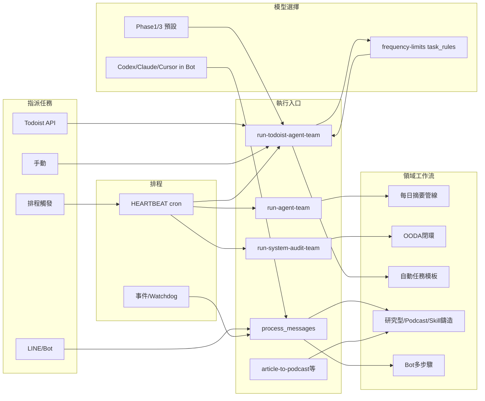

# 專案總覽：工作流、指派管道、模型與 Skill

> 整理自 `config/frequency-limits.yaml`、`config/pipeline.yaml`、`config/ooda-workflow.yaml`、`HEARTBEAT.md`、`skills/SKILL_INDEX.md`、`bot/lib/workflow.js`。  
> 更新：2026-03-15

---

## 1. 工作流數量與類型

專案內「工作流」一詞出現在多種層級，整理如下。

| # | 類型 | 數量 | 定義位置 | 說明 |
|---|------|------|----------|------|
| 1 | **GitHub Actions** | 1 | `.github/workflows/ci.yml` | push/PR 觸發：pytest + ruff + pip-audit |
| 2 | **OODA 系統自省閉環** | 1 | `config/ooda-workflow.yaml` | Observe → Orient → Decide → Act；對應 system-insight → system-audit → arch-evolution → self-heal |
| 3 | **每日摘要管線** | 1 | `config/pipeline.yaml` | init → steps（todoist / news / hackernews / habits / learning / knowledge / zen）→ finalize |
| 4 | **Bot 工作流引擎** | 動態 | `bot/lib/workflow.js`、`bot/data/workflows.json` | 使用者透過 LINE/聊天室建立的多步驟工作流（依賴關係、步驟完成後推進）；由 `process_messages.ps1` Worker 執行各步驟 |

---

### 1.1 研究型工作流

專案內「研究型工作流」指：**以固定步驟產出結構化報告並可選匯入知識庫**的流程；有兩種實作形態。

| 形態 | 觸發 | 定義/執行 | 說明 |
|------|------|-----------|------|
| **Bot 單次研究** | LINE/聊天室意圖 `is_research` 或 Todoist 自動任務（如 shurangama、ai_deep_research） | `bot/process_messages.ps1` | 先執行 kb-research-strategist（產出 `context/kb-research-brief.json`），注入「研究工作流」前言與 KB 系列上下文，再以 Codex gpt-5.4（或 fallback Cursor CLI/Claude）執行主任務；完成時由 `bot/lib/routes.js` 將研究型工作流結果存知識庫 |
| **Bot 多步驟研究** | 使用者建立多步驟工作流且含研究/報告意圖 | `bot/skills/workflow-decomposer.md` | 分解時強制採用「研究型工作流強制架構」：**① 研究規劃**（writing-plans）→ **② 深度資料蒐集** → **③ 完整報告初稿**（writing-masters）→ **④ 三輪審查優化**（report-reviewer）；可選追加「存 KB → 生成 Podcast → 通知」 |

- **研究工作流前言**（注入至任務內容）：優先使用 WebSearch/WebFetch 與 knowledge-query、web-research，產出結構化報告或寫入 context/，必要時匯入知識庫；若 WebSearch/WebFetch 被拒絕則依專案內資源產出並在報告中註明。  
- **相關檔**：`bot/process_messages.ps1`（前言與 Codex/fallback 路徑）、`bot/skills/workflow-decomposer.md`（研究型強制架構）、`bot/lib/routes.js`（完成時存 KB）。

---

### 1.2 Podcast 工作流

**Podcast 工作流**將知識庫文章或查詢主題轉成**雙主持人對話腳本 → TTS 音檔 → 合併 MP3 → 可選上傳 R2 / 存 KB**。

| 形態 | 觸發 | 定義/執行 | 說明 |
|------|------|-----------|------|
| **article-to-podcast 腳本** | 手動或排程呼叫 `tools/article-to-podcast.ps1`（-NoteId / -Query） | `tools/article-to-podcast.ps1` | **Phase 1**：Claude 依 `prompts/article-to-podcast-script.md` 生成雙主持人 JSONL 腳本；**Phase 2**：`generate_podcast_audio.py` TTS 生成各段音檔；**Phase 3**：`concat_audio.py` 合併為 MP3；**Phase 4**：腳本存知識庫；**Phase 5**：R2 上傳（依 config）。配置：`config/podcast.yaml`、`config/media-pipeline.yaml`、`config/tts-abbreviation-rules.yaml` |
| **Bot 意圖 podcast** | LINE/聊天室 `task_type=podcast` 或「製作 N 則 X podcast」 | `bot/process_messages.ps1` | 直接呼叫 `article-to-podcast.ps1`（略過 claude -p 自由詮釋），可多集迴圈 |
| **排程 / 備援** | 每日 15:20 或「今日自動任務達上限」 | `run-podcast-latest-buddhist.ps1`、`tools/run-jiaoguang-podcast-next.ps1` | 教觀綱宗：KB 最新筆記 → article-to-podcast；淨土教觀學苑單集：讀 `context/jiaoguang-podcast-next.json` → 依 `prompts/team/jiaoguang-podcast-one-episode.md` 製作 1 集 → 更新 next_episode |

- **Podcast 研究工作流**（workflow-decomposer）：若任務同時含「研究 + podcast/播客」，在研究四步驟之後追加「存入知識庫 → 生成 Podcast（腳本 + TTS + 音檔）→ 通知」（見 `bot/skills/workflow-decomposer.md`「Podcast 研究工作流」）。

---

### 1.3 類似工作流一覽（領域/內容管線）

以下為「多步驟、有固定順序或強制架構」的流程，與研究型、Podcast 同屬**領域工作流**，一併納入說明。

| 名稱 | 步驟摘要 | 定義/入口 | 備註 |
|------|----------|-----------|------|
| **Skill 鑄造流程** | 讀取 improvement-backlog + adr-registry + system-insight → 優先級矩陣 → KB 深研 → 生成 SKILL.md → LLM 自評分（≥7/10）→ 安全驗證 → 整合 SKILL_INDEX → ntfy + 結果 JSON | `skills/skill-forge/SKILL.md`、`prompts/team/todoist-auto-skill_forge.md` | 單一 Agent 執行 10 步驟，後端 claude_sonnet |
| **淨土教觀學苑單集** | 讀 `context/jiaoguang-podcast-next.json` → 選題（依專輯計畫）→ 製作 1 集（腳本/TTS/上傳）→ 更新 next_episode | `tools/run-jiaoguang-podcast-next.ps1`、`prompts/team/jiaoguang-podcast-one-episode.md` | all_exhausted_fallback 時由 run-todoist-agent-team 觸發；後端可為 claude（article-to-podcast）或 cursor_cli |
| **教觀綱宗排程 Podcast** | KB 查詢最新教觀綱宗筆記 → article-to-podcast 一集 | `run-podcast-latest-buddhist.ps1` | 每日 15:20（HEARTBEAT media-podcast-buddhist） |
| **研究 + Podcast 複合** | 研究型四步驟 → 存 KB → 生成 Podcast → 通知 | `bot/skills/workflow-decomposer.md` | 僅當使用者建立之多步驟工作流同時含「研究」與「podcast/播客」時，由 decomposer 產出此結構 |

---

**小計**：  
- **固定定義的工作流**：3 個（CI、OODA、每日摘要管線）。  
- **領域工作流**（研究型、Podcast、Skill 鑄造、教觀/淨土單集等）：見上表，多由 YAML/腳本 + prompt 或 Bot 分解器定義。  
- **使用者可建立的工作流**：Bot 工作流引擎支援多個（由 `workflows.json` 儲存）。

因此，若只算「專案內建、有固定步驟定義」的**管線級**工作流，為 **3 個**；若含研究型、Podcast、Skill 鑄造等領域工作流與 Bot 動態工作流，則為 **3 + 多個領域工作流 + N**。

---

## 2. 指派任務的管道

任務進入系統並被執行的管道如下。

| # | 管道 | 觸發方式 | 執行入口 | 備註 |
|---|------|----------|----------|------|
| 1 | **Windows 排程（Todoist 團隊）** | 每小時半點 01:30–23:30 | `run-todoist-agent-team.ps1` | 讀取 Todoist 待辦 + 無待辦時 round-robin 自動任務（frequency-limits） |
| 2 | **Windows 排程（每日摘要）** | 每日 21:15 等 | `run-agent-team.ps1` | 依 `config/pipeline.yaml` 執行每日摘要 |
| 3 | **Windows 排程（系統審查）** | 每日 00:40 | `run-system-audit-team.ps1` | OODA Orient 等，含 Phase 3 觸發 arch_evolution / self_heal |
| 4 | **Windows 排程（其他）** | 見 HEARTBEAT.md | 如 check-health、kb-backup-all、media-podcast-buddhist、bot-server-restart、watchdog 等 | 非「指派任務」為主，偏維運 |
| 5 | **Todoist API** | 使用者於 Todoist 新增/更新任務 | 同上 `run-todoist-agent-team.ps1`（或單一模式） | 三層路由篩選後由 Phase 2 執行對應 prompt |
| 6 | **LINE / Bot 聊天室** | LINE Webhook → bot 意圖分類 | `bot/process_messages.ps1` Worker | 單一任務入列 `records`；若 `is_workflow` 則建立 `workflows.json` 多步驟工作流並依序執行 |
| 7 | **手動執行腳本** | 手動執行 | 如 `run-agent-team.ps1`、`run-todoist-agent-team.ps1`、`agent -p` | 同管道 1/2 邏輯，僅觸發來源為手動 |

**指派「任務」的管道小計**：  
- **排程驅動**：Todoist 團隊、每日摘要、系統審查（3 類排程指派任務）。  
- **外部系統**：Todoist API（1 個來源）。  
- **即時互動**：LINE / Bot 聊天室（1 個來源）。  
- **手動**：腳本 / CLI（1 類）。  

可簡化為 **5 種指派任務的管道**（排程 3 + Todoist 1 + LINE/Bot 1 + 手動 1）；若把「排程」拆成多個腳本，則為更多「入口」，但邏輯上仍屬上述管道。

---

## 2.1 五者整合關係

以下將**指派任務**、**領域工作流**、**模型**、**排程**、**執行任務**五者在專案中的角色與資料流整理為單一視圖。

### 五者角色定義

| 概念 | 角色 | 專案中的載體 |
|------|------|----------------|
| **指派任務** | 決定「要做什麼」的來源與單位（一筆待辦、一輪自動任務、一則訊息） | Todoist API、Windows 排程觸發的腳本、LINE Webhook、手動執行 |
| **領域工作流** | 對「要做什麼」的結構化定義（多步驟、順序、產出格式） | pipeline.yaml、ooda-workflow.yaml、article-to-podcast.ps1、workflow-decomposer 研究/Podcast 架構、skill-forge 10 步驟、Bot workflows.json |
| **模型** | 執行單一步驟或單一任務時使用的 LLM/後端 | frequency-limits backends + task_rules、llm-router（Groq）、process_messages 內 Codex/Claude/Cursor CLI |
| **排程** | 決定「何時」觸發哪一個入口 | HEARTBEAT.md → setup-scheduler → Windows Task Scheduler；或事件驅動（LINE、Bot 認領） |
| **執行任務** | 實際跑起來的流程：讀取計畫/任務、選模型、呼叫 Agent 或腳本、寫結果 | run-todoist-agent-team.ps1 Phase 1/2/3、run-agent-team.ps1、run-system-audit-team.ps1、process_messages.ps1、article-to-podcast.ps1 |

### 關係與資料流

- **排程**只決定「何時跑哪支腳本」；不直接決定領域工作流或模型。
- **執行入口**讀取設定與計畫後，決定要跑哪一個**領域工作流**（或單一任務），並依 **task_key / 意圖** 查 **模型**（frequency-limits 或 Bot 內建邏輯）。
- **領域工作流**可能被多個入口共用（例如 Podcast 工作流：排程 run-podcast-latest-buddhist、all_exhausted 的 run-jiaoguang-podcast-next、Bot 意圖 podcast、Todoist 自動任務 podcast_jiaoguangzong）。

### 依執行入口的五者對應

| 執行入口 | 指派任務來源 | 排程 | 領域工作流 | 模型決定 | 執行任務摘要 |
|----------|--------------|------|------------|----------|--------------|
| run-todoist-agent-team.ps1 | Todoist 待辦 或 無待辦時 round-robin 自動任務 | 每小時半點（HEARTBEAT todoist-team） | 各自動任務對應 template（含 Podcast/研究/Skill 鑄造等） | config/frequency-limits.yaml task_rules → Get-TaskBackend(TaskKey) | Phase 1: todoist-query 產 plan；Phase 2: 並行 N 個 Agent（claude/codex/openrouter）；Phase 3: assemble + 通知 |
| run-agent-team.ps1 | 僅排程（無 Todoist） | 每日 21:15 等（daily-digest-pm） | config/pipeline.yaml 每日摘要管線 | Phase 1 並行 fetch 用預設 Claude；組裝階段同一模型 | Phase 0 快取；Phase 1 並行擷取；Phase 2 組裝 + 通知 |
| run-system-audit-team.ps1 | 僅排程 | 每日 00:40（system-audit） | config/ooda-workflow.yaml OODA 閉環 | 各步驟對應 auto_task_key（system_insight → audit script → arch_evolution → self_heal） | Observe → Orient(PS 腳本) → Decide → Act |
| bot/process_messages.ps1 | LINE/聊天室訊息 → 意圖分類 | 事件驅動（Chatroom Scheduler / Watchdog） | 研究型前言、Podcast 直接呼叫 article-to-podcast、多步驟 workflow-decomposer | is_research → Codex（或 Cursor/Claude fallback）；podcast → 腳本；其餘 Cursor CLI 等 | Worker 認領 → 組裝內容 → Codex/claude/agent -p 或 article-to-podcast |
| tools/article-to-podcast.ps1 | 手動/排程/run-jiaoguang-podcast-next/ Bot 意圖 | 可被 media-podcast-buddhist 或 all_exhausted 觸發 | 內建 Phase 1~5（腳本→TTS→concat→KB→R2） | Phase 1 用 Claude（-Model 參數） | 單一腳本串起領域工作流 |

**整合說明**：指派來源（排程觸發、Todoist API、LINE、手動）經由**排程**或事件決定是否啟動；啟動後進入對應的**執行入口**（上述腳本之一）。入口讀取 plan 或意圖後，選定**領域工作流**（管線、OODA、自動任務模板、研究/Podcast/Skill 鑄造、Bot 多步驟）與**模型**（由 frequency-limits 的 task_rules 或 Bot 內建邏輯決定）。**執行任務**即該入口的 Phase 1/2/3 或 Worker 實際呼叫 Agent/腳本並寫入結果的過程。

**備註**：`config/frequency-limits.yaml` 的 `task_rules` 中，`cursor_cli` 對應 fahua、podcast_create；但 run-todoist-agent-team.ps1 的 `Get-TaskBackend` 目前未列 `cursor_cli`，故該兩任務在團隊模式 Phase 2 會落入預設 `claude_sonnet`。若需與 frequency-limits 一致，需在 Get-TaskBackend 的後端迴圈中加入 `cursor_cli` 並實作對應 Job 啟動（可列為後續改進）。

---

## 3. 使用的模型

來源：`config/frequency-limits.yaml`（backends）、`config/llm-router.yaml`。

| 後端 ID | 類型 | 模型/指令 | 用途摘要 |
|---------|------|-----------|----------|
| `claude_sonnet` | claude_code | 預設（空 cli_flag） | Phase 1/3 主力、skill-forge、多數未指定任務 |
| `claude_sonnet45` | claude_code | `--model claude-sonnet-4-5` | 系統任務（self_heal、system_insight、log_audit、chatroom_optimize、skill_audit）、佛學研究（楞嚴/教觀/淨土）、podcast、git_push、arch_evolution |
| `claude_haiku` | claude_code | `--model claude-haiku-4-5` | 緊急降級、Token 過高時 Phase 1/3 降級 |
| `codex_exec` | codex | `codex exec --full-auto -m gpt-5.4` | 研究任務（AI/技術/佛學多數，含 live WebSearch） |
| `codex_standard` | codex | `codex exec --full-auto`（gpt-5.3-codex） | 創意遊戲、QA、GitHub Scout |
| `openrouter_research` | openrouter_runner | `openrouter/free` | Codex 的 fallback |
| `openrouter_standard` | openrouter_runner | `openrouter/free` | 已廢除（git_push 改走 claude_sonnet45） |
| `cursor_cli` | cursor_cli | `agent -p`（可 --model） | 法華經研究、Podcast 生成（任務檔在 temp/） |
| **Groq**（llm-router） | 外部 API | `llama-3.1-8b-instant`（Relay） | 摘要、翻譯、分類、萃取等前處理，非主執行 Agent |

**模型小計**：  
- **Claude Code**：3（sonnet 預設、sonnet45、haiku）。  
- **Codex**：2（gpt-5.4、gpt-5.3-codex）。  
- **OpenRouter**：1（free，研究用 fallback）。  
- **Cursor CLI**：1（agent -p，模型可選）。  
- **Groq**：1（Relay，輔助前處理）。  

共 **8 種後端/模型**（若把 OpenRouter 算一種、Groq 算一種）。

---

## 4. 各模型分別使用的 Skill

依 `config/frequency-limits.yaml` 的 `task_rules`、`skill_guidance` 與各任務的 `skills` 欄位整理；Groq 由 `config/llm-router.yaml` 對應到「任務類型」而非單一 Agent Skill 名。

### 4.1 claude_sonnet（預設）

- **使用情境**：Phase 1/3 預設、skill-forge、未列入其他規則的任務。
- **Skill**：依 `config/pipeline.yaml` 與 `docs/skill-routing-guide.md`，必用/積極用：todoist、pingtung-news、pingtung-policy-expert、hackernews-ai-digest、atomic-habits、learning-mastery、ntfy-notify、digest-memory、api-cache、scheduler-state；積極用 knowledge-query、gmail；以及 skill-forge 相關（kb-research-strategist、skill-scanner、knowledge-query、ntfy-notify）。

### 4.2 claude_sonnet45

- **任務**：self_heal、system_insight、log_audit、chatroom_optimize、skill_audit、shurangama、jiaoguangzong、podcast_jiaoguangzong、git_push、arch_evolution。
- **Skill**：system-insight、scheduler-state、knowledge-query、ntfy-notify、skill-scanner、chatroom-query、api-cache、git-smart-commit；完整 Claude 工具鏈（讀寫 state/context、Bash、TTS/FFmpeg/R2）。

### 4.3 codex_exec（gpt-5.4）

- **任務**：ai_sysdev、ai_workflow_github、ai_github_research、ai_deep_research、ai_smart_city、tech_research、unsloth_research、jingtu。
- **Skill**：knowledge-query、web-research、kb-research-strategist、hackernews-ai-digest、groq、github-scout、todoist（依各任務 template 的 skills 欄位）。

### 4.4 codex_standard（gpt-5.3-codex）

- **任務**：creative_game_optimize、qa_optimize、github_scout。
- **Skill**：game-design、knowledge-query、web-research、system-insight、github-scout、kb-research-strategist。

### 4.5 cursor_cli（agent -p）

- **任務**：fahua、podcast_create（及 all_exhausted 時 jiaoguang_podcast_one 等）。
- **Skill**：依 `skills/cursor-cli/SKILL.md`，應積極採用專案 Skill：knowledge-query、ntfy-notify、api-cache、web-research 等；任務檔可指定步驟與採用之 Skill。

### 4.6 Groq（llm-router）

- **用途**：摘要、翻譯、分類、萃取等（由 Relay / llm_router 呼叫）。
- **對應**：非「一個 Agent 對一個 Skill」，而是任務類型（如 summarize、translate、classify、extract）對應到 Groq；與這些類型相關的 Skill 包括 hackernews-ai-digest、pingtung-news、api-cache、kb-content-scoring 等前處理流程。

---

## 5. cursor-cli Skill 能否使用工作流？

**結論：可以「使用」工作流，但 cursor-cli 本身不是工作流引擎。**

- **cursor-cli 的定位**：以 Cursor CLI 的 `agent -p` 執行**單一任務**（腳本/排程/單次程式碼/重構/審查）；與 Todoist Agent / run-agent-team 管線並行，不取代 Phase 1/2/3。
- **使用工作流的方式**：  
  1. **依步驟執行**：先 Read 某工作流定義（如 `config/ooda-workflow.yaml` 或 `config/pipeline.yaml`），再依步驟撰寫任務檔，用 `agent -p` 依序執行各步驟（每個步驟可一次 agent -p 或拆成多次）。  
  2. **執行「屬於工作流」的任務**：run-todoist-agent-team 會把 fahua、podcast_create 等派給 cursor_cli 後端；這些任務本身可能是 OODA 或 Bot 工作流中的一環，cursor-cli 執行的是該環節的單一任務檔。  
  3. **Bot 工作流**：多步驟存在 `workflows.json`，由 `process_messages.ps1` Worker 推進；若在任務檔中寫明「依 bot 工作流 ID 執行下一步」，cursor-cli 可透過讀取 API/檔案取得步驟內容並用 `agent -p` 執行，即「能使用工作流定義」。
- **限制**：cursor-cli 不內建「多步驟狀態機」；多步驟的推進與狀態仍由 OODA 腳本、pipeline、或 Bot workflow 引擎負責，cursor-cli 負責的是「單次 agent -p 執行」那一層。

**一句話**：cursor-cli skill **能使用工作流**（讀取工作流定義、依步驟執行或執行工作流中的單一任務），但**不提供工作流引擎**，引擎在 OODA、pipeline 與 Bot 中。

---

## 6. 速查表

| 項目 | 數量/說明 |
|------|------------|
| 五者關係 | 見「2.1 五者整合關係」；Phase 2 與 task_rules.cursor_cli 對齊為後續改進 |
| 工作流（固定管線） | 3：CI、OODA、每日摘要管線 |
| 領域工作流 | 研究型（Bot 單次/多步驟）、Podcast（article-to-podcast、Bot、排程/備援）、Skill 鑄造、淨土教觀學苑單集、教觀綱宗排程、研究+Podcast 複合 |
| Bot 動態工作流 | N 個（workflows.json） |
| 指派任務管道 | 5 類：排程（Todoist/摘要/審查）、Todoist API、LINE/Bot、手動 |
| 模型/後端 | 8：claude_sonnet、claude_sonnet45、claude_haiku、codex_exec、codex_standard、openrouter_research、cursor_cli、Groq |
| cursor-cli 與工作流 | 可使用工作流（依定義執行或執行其中一步），但不含工作流引擎 |

---

*本文件為整理用，細部以 `config/frequency-limits.yaml`、`config/pipeline.yaml`、`config/ooda-workflow.yaml`、`bot/skills/workflow-decomposer.md`、`tools/article-to-podcast.ps1`、`skills/SKILL_INDEX.md`、`skills/cursor-cli/SKILL.md` 為準。*
