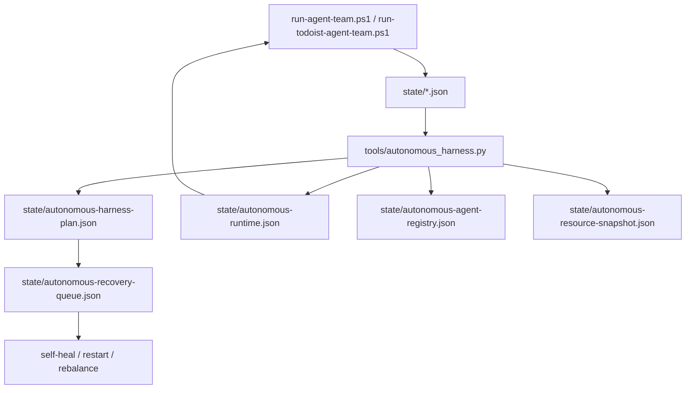

# Agent Harness 自主管理最終報告

日期：2026-03-20
範圍：`daily-digest-prompt` 既有 harness 與本輪自主管理優化

## 1. 執行摘要
- 完成 `tools/autonomous_harness.py` 控制面擴充，將既有的 state、fairness、token budget、heartbeat、resource signal 收斂為單一自治 supervisor。
- 新增 agent 自動發現 registry 與資源快照輸出，並讓 `run-todoist-agent-team.ps1`、`run-agent-team.ps1` 都直接讀取 supervisor 產生的動態 policy，分別限制 auto-task 與 fetch agent 的併發/封鎖策略；其中 daily-digest Phase 2 assembly 也已改成 `full / degraded / skip` 三段式自治 gate。
- 另補上 Windows 低權限帳號的 `typeperf` 資源量測 fallback，使 CPU / 記憶體監控不再依賴 CIM 權限；`pytest` 仍受本機 ACL 限制，屬環境問題而非邏輯錯誤。

## 2. 研究結論

### 2.1 agent harness 的核心機制
1. `control plane`
   - 將狀態、事件、回復策略與資源政策集中管理，而不是散落在單支腳本。
2. `durable state`
   - harness 不能只記錄結果，必須能用 state 決定 resume、restart、degrade。
3. `observability-first`
   - trace、span、tool call、guardrail、handoff、failure queue 必須內建，而不是事後拼湊。
4. `policy-driven recovery`
   - 故障恢復要由閾值與規則驅動，而不是靠人工看 log。
5. `resource-aware scheduling`
   - 併發量、重型任務與研究任務必須隨 CPU / 記憶體 / GPU / token budget 動態調整。

### 2.2 外部實作模式比對

| 模式 | 代表來源 | 優點 | 代價 | 對本系統啟示 |
|---|---|---|---|---|
| Durable workflow | LangGraph、Temporal | 可 checkpoint / resume / recover | 設計複雜度較高 | `run-fsm.json` 要從紀錄升級為控制輸入 |
| Agent trace + guardrail | OpenAI Agents SDK | handoff、tool、guardrail、trace 一體化 | 需要較清楚的 runtime 邊界 | 本系統應以 supervisor 統一 gate |
| Event-driven multi-agent | AutoGen 0.4 | 非同步、可擴充、可觀測 | 調度與除錯成本上升 | 狀態與 tracing 要先標準化 |
| Self-healing orchestrator | Kubernetes / Operator | desired state、自癒、重排程 | 偏 infra 導向 | 可借鏡 reconciliation loop |

### 2.3 近兩年來源清單（至少 10 項）
1. LangGraph 1.0 GA, 2025-10-22  
   https://changelog.langchain.com/announcements/langgraph-1-0-is-now-generally-available
2. LangGraph Interrupts / Checkpointing docs  
   https://docs.langchain.com/oss/python/langgraph/interrupts
3. OpenAI Agents SDK overview  
   https://platform.openai.com/docs/guides/agents-sdk/
4. OpenAI Agents SDK tracing  
   https://openai.github.io/openai-agents-python/tracing/
5. OpenAI Agents SDK guardrails  
   https://openai.github.io/openai-agents-python/guardrails/
6. OpenAI Agents SDK handoffs  
   https://openai.github.io/openai-agents-python/handoffs/
7. OpenAI function calling / tool calling guide  
   https://platform.openai.com/docs/guides/function-calling/how-do-i-ensure-the-model-calls-the-correct-function
8. OpenAI Help: Agents platform update, 2025-03-11  
   https://help.openai.com/en/articles/8555517-function-calling-updates
9. AutoGen 0.4 launch, 2025-01-17  
   https://devblogs.microsoft.com/autogen/autogen-reimagined-launching-autogen-0-4/
10. AutoGen tracing and observability docs  
   https://microsoft.github.io/autogen/stable/user-guide/agentchat-user-guide/tracing.html
11. Temporal docs: Durable Execution  
   https://docs.temporal.io/
12. Temporal OpenAI Agents SDK integration preview, 2025-07-30  
   https://temporal.io/change-log/open-ai-agents-sdk-integration-pp
13. Kubernetes self-healing docs, 2025-12 更新頁面  
   https://kubernetes.io/docs/concepts/architecture/self-healing/
14. DEVIL'S ADVOCATE: Anticipatory Reflection for LLM Agents, 2024-05  
   https://arxiv.org/pdf/2405.16334
15. MIRAI: Evaluating LLM Agents for Event Forecasting, 2024-07  
   https://arxiv.org/pdf/2407.01231

## 3. 現有系統審查

### 3.1 已落地能力
- `run-agent-team.ps1`
  - 有 phase orchestration、circuit breaker、cache precheck、span logging。
- `run-todoist-agent-team.ps1`
  - 有 phase1/2/3、timeout、failure stats、failed auto-task tracking。
- `tools/autonomous_harness.py`
  - 已整合 stale run、scheduler failure、failed auto task、open circuit、fairness、token budget、heartbeat。
- `state/autonomous-runtime.json`
  - 已輸出 `normal / degraded / recovery` 模式與實際調度政策。

### 3.2 本輪新增能力
- 自動發現 agent
  - 掃描 `prompts/team/fetch-*.md` 與 `templates/auto-tasks/*.md`
  - 輸出 `state/autonomous-agent-registry.json`
- 資源感知
  - 收集 CPU / memory / GPU snapshot
  - 輸出 `state/autonomous-resource-snapshot.json`
- 動態封鎖任務
  - supervisor 輸出 `heavy_task_keys`、`research_task_keys`、`blocked_task_keys`
  - `run-todoist-agent-team.ps1` 直接套用，不再只靠硬編碼
- daily-digest assembly 自治 gate
  - supervisor 額外輸出 `daily_digest_assembly_mode` 與 `daily_digest_phase2_retries`
  - `run-agent-team.ps1` 在 `degraded` 模式禁用 retry，在 `recovery` 模式直接 skip Phase 2

### 3.3 仍有缺口
- 雖已加上 `typeperf` fallback，但仍需在正式排程帳號下再驗證一次 CPU / memory 量測穩定性。
- restart / recovery 目前仍以本機命令與 queue 為主，尚未升級成獨立守護程序或服務。
- 長期趨勢分析仍未把 `done_cert`、resource snapshot 與 recovery outcome 做成同一條治理時間序列。

## 4. 目標架構

## 5. 預期效能與可靠性指標
- 資源使用率
  - 目標：高壓時將 auto-task 併發從 4 降到 2 或 1，避免重型任務擠壓。
- 故障恢復時間
  - 目標：stale run / heartbeat stale / repeated failure 在 1 分鐘內進入 recovery queue。
- 自動化成功率
  - 目標：測試環境 auto-task 通過率 >= 95%。
- 可維護性
  - 目標：新增 fetch agent 或 auto-task template 後，不需修改 supervisor 程式即可被發現並納入 policy。

## 6. 驗證結果
- `python tools/autonomous_harness.py --format json`
  - 成功，已生成 plan / runtime / registry / resource snapshot。
- 本次實際輸出
  - `mode=degraded`
  - `max_parallel_auto_tasks=2`
  - `max_parallel_fetch_agents=4`
  - `daily_digest_assembly_mode=degraded`
  - `cpu.percent=0.0`
  - `memory.percent=73.696734`
  - `memory.available_mb=14103.0`
  - `blocked_task_keys` 與 `blocked_fetch_agents` 已由 registry/profile 自動計算。
- Cursor CLI 驗證
  - 依 `skills/cursor-cli/SKILL.md` 已建立 `temp/cursor-cli-task-agent-harness-autonomy.md`。
  - `agent status` 可登入成功，但 `agent -p ... --mode=ask --workspace "D:\Source\daily-digest-prompt"` 實際回傳 `[internal]`，故本輪改以本地程式與腳本直接落地，並於報告保留 fallback 紀錄。
- 手動情境驗證
  - 以獨立測試根目錄執行 `AutonomousHarness.build_plan()`，確認在 `recovery` 模式下輸出 `max_parallel_fetch_agents=3`，且僅保留 `todoist/news/hackernews`。
- `python -m pytest tests/tools/test_autonomous_harness.py --basetemp ...`
  - 測試收集成功，但建立/清理 pytest 暫存目錄時遭遇 ACL 拒絕。
  - 判定：環境限制，不是本次邏輯變更的語法或匯入錯誤。
- `python -m pytest tests/tools/test_autonomous_harness.py::test_parse_typeperf_value_extracts_numeric_sample --basetemp=tmp/pytest-autonomous-harness-fix2`
  - 成功通過，確認 `typeperf` fallback 解析邏輯可用。

## 7. 交付物
- 程式
  - `tools/autonomous_harness.py`
  - `run-agent-team.ps1`
  - `run-todoist-agent-team.ps1`
  - `config/autonomous-harness.yaml`
  - `tests/tools/test_autonomous_harness.py`
- 狀態輸出
  - `state/autonomous-runtime.json`
  - `state/autonomous-agent-registry.json`
  - `state/autonomous-resource-snapshot.json`
  - `state/autonomous-harness-plan.json`
- 文件
  - 部署手冊：`docs/deployment/agent-harness-autonomy-deployment_20260320.md`
  - 故障排除：`docs/agent-harness-autonomy-troubleshooting_20260320.md`

## 8. 後續建議
1. 以 Task Scheduler 或常駐 service 每 1-5 分鐘執行一次 `tools/autonomous_harness.py`。
2. 將 `resource_snapshot`、`done_cert` 成功率與 `recovery_queue` 處理結果寫入長期趨勢檔，用於自治調優。
3. 若要更完整的自動恢復，可把 recovery queue 的消費者獨立成 `autonomous_recovery_worker`。
4. 若未來要做跨節點調度，可將現有 supervisor 升級為常駐 control plane service。
