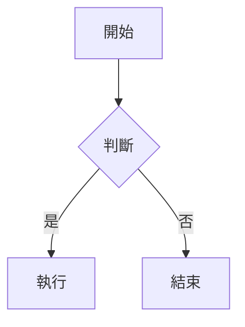

# Markdown 指令、編輯與總結 Skill 完整指南

> **最後更新**：2026-03-09
> **維護者**：daily-digest-prompt 專案
> **基準規範**：CommonMark 0.30 + GitHub Flavored Markdown (GFM)
> **適用渲染器**：GitHub、Typora、VS Code 內建預覽
> **對應 Skill**：本指南為 `skills/markdown-editor/SKILL.md` 之知識庫來源；Agent 執行 Markdown 相關任務時應先讀取該 SKILL，必要時再查閱本文件章節。

---

## 目錄

- [第一章：Markdown 解析機制](#第一章markdown-解析機制)
- [第二章：指令用法彙整表](#第二章指令用法彙整表)
- [第三章：指令詳細說明與範例](#第三章指令詳細說明與範例)
  - [3.1 標題 (Headings)](#31-標題-headings)
  - [3.2 段落 (Paragraphs)](#32-段落-paragraphs)
  - [3.3 換行 (Line Breaks)](#33-換行-line-breaks)
  - [3.4 粗體 (Bold)](#34-粗體-bold)
  - [3.5 斜體 (Italic)](#35-斜體-italic)
  - [3.6 粗斜體 (Bold Italic)](#36-粗斜體-bold-italic)
  - [3.7 刪除線 (Strikethrough)](#37-刪除線-strikethrough)
  - [3.8 引用區塊 (Blockquotes)](#38-引用區塊-blockquotes)
  - [3.9 無序清單 (Unordered Lists)](#39-無序清單-unordered-lists)
  - [3.10 有序清單 (Ordered Lists)](#310-有序清單-ordered-lists)
  - [3.11 任務清單 (Task Lists)](#311-任務清單-task-lists)
  - [3.12 行內程式碼 (Inline Code)](#312-行內程式碼-inline-code)
  - [3.13 程式碼區塊 (Code Blocks)](#313-程式碼區塊-code-blocks)
  - [3.14 表格 (Tables)](#314-表格-tables)
  - [3.15 連結 (Links)](#315-連結-links)
  - [3.16 圖片 (Images)](#316-圖片-images)
  - [3.17 分隔線 (Horizontal Rules)](#317-分隔線-horizontal-rules)
  - [3.18 跳脫字元 (Escape Characters)](#318-跳脫字元-escape-characters)
  - [3.19 HTML 內嵌 (Inline HTML)](#319-html-內嵌-inline-html)
  - [3.20 自動連結 (Autolinks)](#320-自動連結-autolinks)
  - [3.21 腳註 (Footnotes)](#321-腳註-footnotes)
  - [3.22 定義清單 (Definition Lists)](#322-定義清單-definition-lists)
  - [3.23 上標與下標 (Superscript / Subscript)](#323-上標與下標-superscript--subscript)
  - [3.24 高亮標記 (Highlight)](#324-高亮標記-highlight)
  - [3.25 摺疊區塊 (Details / Summary)](#325-摺疊區塊-details--summary)
  - [3.26 表情符號 (Emoji)](#326-表情符號-emoji)
  - [3.27 數學公式 (Math / LaTeX)](#327-數學公式-math--latex)
  - [3.28 Mermaid 圖表](#328-mermaid-圖表)
  - [3.29 告警區塊 (Alerts / Admonitions)](#329-告警區塊-alerts--admonitions)
  - [3.30 參考式連結 (Reference Links)](#330-參考式連結-reference-links)
  - [3.31 錨點與目錄跳轉 (Anchors)](#331-錨點與目錄跳轉-anchors)
  - [3.32 縮排程式碼區塊 (Indented Code)](#332-縮排程式碼區塊-indented-code)
  - [3.33 YAML Front Matter](#333-yaml-front-matter)
- [第四章：MD 格式編輯 Skill 手冊](#第四章md-格式編輯-skill-手冊)
- [第五章：內容總結 Skill 指南](#第五章內容總結-skill-指南)
- [附錄 A：渲染器兼容性矩陣](#附錄-a渲染器兼容性矩陣)
- [附錄 B：參考來源](#附錄-b參考來源)

---

## 第一章：Markdown 解析機制

### 1.1 CommonMark 解析管線（AST 視角）

Markdown 文本從原始字串到渲染輸出，經過三個階段：

```
原始文本 ──→ [Phase 1: 區塊解析] ──→ [Phase 2: 行內解析] ──→ AST ──→ HTML/渲染輸出
```

**Phase 1 — 區塊結構解析（Block Parsing）**

解析器逐行掃描，識別區塊層級結構：

| 區塊類型 | 辨識方式 | 範例觸發字元 |
|---------|---------|-------------|
| ATX 標題 | 行首 `#` + 空格 | `# Title` |
| Setext 標題 | 下一行全 `=` 或 `-` | `Title\n===` |
| 程式碼區塊 | ` ``` ` 或 4 空格縮排 | ` ```js ` |
| 引用區塊 | 行首 `>` | `> quote` |
| 清單項目 | 行首 `-`/`*`/`+` 或數字`.` | `- item` |
| 分隔線 | 3+ 個 `-`/`*`/`_` | `---` |
| HTML 區塊 | 行首 `<tag>` | `<div>` |
| 段落 | 以上皆非 | 任意文字 |

區塊解析採用 **容器 (container)** 與 **葉子 (leaf)** 的樹狀結構：
- **容器區塊**：可包含其他區塊（引用、清單）
- **葉子區塊**：不可嵌套（段落、標題、程式碼區塊、分隔線）

**Phase 2 — 行內解析（Inline Parsing）**

在已識別的葉子區塊內，解析行內元素：

| 行內類型 | 定界符 | 優先級 |
|---------|-------|-------|
| 程式碼跨度 | `` ` `` | 最高（內部不解析） |
| 自動連結 | `<URL>` | 高 |
| HTML 標籤 | `<tag>` | 高 |
| 連結/圖片 | `[text](url)` | 中 |
| 強調 | `*` / `_` | 中 |
| 換行 | 行尾 2 空格 | 低 |

行內解析使用 **定界符堆疊（delimiter stack）** 演算法：
1. 掃描到 `*` 或 `_` 時推入堆疊
2. 遇到匹配的關閉定界符時彈出配對
3. 單組 = 斜體，雙組 = 粗體，三組 = 粗斜體

**Phase 3 — AST 輸出**

最終 AST 是一棵樹：

```
Document
├── Heading (level=1)
│   └── Text "標題"
├── Paragraph
│   ├── Text "普通文字"
│   ├── Strong
│   │   └── Text "粗體"
│   └── Text "後續"
└── List (ordered=false)
    ├── ListItem
    │   └── Paragraph → Text "項目一"
    └── ListItem
        └── Paragraph → Text "項目二"
```

### 1.2 Skill 設計方法論

本文件建立的兩個 Skill 採用**指令 → 決策 → 輸出**三段式：

| Skill | 輸入 | 核心決策 | 輸出 |
|-------|------|---------|------|
| MD 格式編輯 | 原始文件 + 編輯意圖 | 語法選擇、結構調整、批次處理 | 格式正確的 .md 檔案 |
| 內容總結 | 完整 .md 檔案 | 層級萃取、重點判斷、長度控制 | 大綱 / 摘要 / TOC |

---

## 第二章：指令用法彙整表

以下表格列出 33 種 Markdown 指令的速查資訊：

| # | 指令名稱 | 語法範本 | 類別 | CommonMark | GFM | Typora | VS Code |
|---|---------|---------|------|:---------:|:---:|:------:|:-------:|
| 1 | ATX 標題 | `# H1` ~ `###### H6` | 區塊 | ✅ | ✅ | ✅ | ✅ |
| 2 | Setext 標題 | `Title\n===` | 區塊 | ✅ | ✅ | ✅ | ✅ |
| 3 | 段落 | 空行分隔 | 區塊 | ✅ | ✅ | ✅ | ✅ |
| 4 | 換行 | 行尾 2 空格 + Enter | 行內 | ✅ | ✅ | ✅ | ✅ |
| 5 | 粗體 | `**text**` / `__text__` | 行內 | ✅ | ✅ | ✅ | ✅ |
| 6 | 斜體 | `*text*` / `_text_` | 行內 | ✅ | ✅ | ✅ | ✅ |
| 7 | 粗斜體 | `***text***` | 行內 | ✅ | ✅ | ✅ | ✅ |
| 8 | 刪除線 | `~~text~~` | 行內 | ❌ | ✅ | ✅ | ✅ |
| 9 | 引用區塊 | `> text` | 區塊 | ✅ | ✅ | ✅ | ✅ |
| 10 | 無序清單 | `- item` / `* item` | 區塊 | ✅ | ✅ | ✅ | ✅ |
| 11 | 有序清單 | `1. item` | 區塊 | ✅ | ✅ | ✅ | ✅ |
| 12 | 任務清單 | `- [ ] task` | 區塊 | ❌ | ✅ | ✅ | ✅ |
| 13 | 行內程式碼 | `` `code` `` | 行內 | ✅ | ✅ | ✅ | ✅ |
| 14 | 程式碼區塊 | ` ```lang ` | 區塊 | ✅ | ✅ | ✅ | ✅ |
| 15 | 表格 | `\| H \| H \|` | 區塊 | ❌ | ✅ | ✅ | ✅ |
| 16 | 連結 | `[text](url)` | 行內 | ✅ | ✅ | ✅ | ✅ |
| 17 | 圖片 | `` | 行內 | ✅ | ✅ | ✅ | ✅ |
| 18 | 分隔線 | `---` / `***` / `___` | 區塊 | ✅ | ✅ | ✅ | ✅ |
| 19 | 跳脫字元 | `\*` | 行內 | ✅ | ✅ | ✅ | ✅ |
| 20 | HTML 內嵌 | `<div>...</div>` | 混合 | ✅ | ✅* | ✅ | ✅ |
| 21 | 自動連結 | `<https://url>` | 行內 | ✅ | ✅ | ✅ | ✅ |
| 22 | 延伸自動連結 | `https://url`（裸 URL） | 行內 | ❌ | ✅ | ✅ | ✅ |
| 23 | 腳註 | `[^1]` | 行內 | ❌ | ❌ | ✅ | 🔌 |
| 24 | 定義清單 | `Term\n: Def` | 區塊 | ❌ | ❌ | ✅ | 🔌 |
| 25 | 上標 | `^text^` | 行內 | ❌ | ❌ | ✅ | 🔌 |
| 26 | 下標 | `~text~` | 行內 | ❌ | ❌ | ✅ | 🔌 |
| 27 | 高亮 | `==text==` | 行內 | ❌ | ❌ | ✅ | 🔌 |
| 28 | 摺疊區塊 | `<details>` | HTML | ✅ | ✅ | ✅ | ✅ |
| 29 | 表情符號 | `:emoji_name:` | 行內 | ❌ | ✅ | ✅ | 🔌 |
| 30 | 數學公式 | `$...$` / `$$...$$` | 混合 | ❌ | ✅* | ✅ | 🔌 |
| 31 | Mermaid 圖表 | ` ```mermaid ` | 區塊 | ❌ | ✅* | ✅ | 🔌 |
| 32 | 告警區塊 | `> [!NOTE]` | 區塊 | ❌ | ✅ | ❌ | 🔌 |
| 33 | YAML Front Matter | `---\nkey: val\n---` | 後設 | ❌ | ✅ | ✅ | ✅ |

> **圖例**：✅ 原生支援 | ❌ 不支援 | ✅* 近期新增 | 🔌 需安裝擴充套件

---

## 第三章：指令詳細說明與範例

### 3.1 標題 (Headings)

**語法原型**

```markdown
# 一級標題 (H1)
## 二級標題 (H2)
### 三級標題 (H3)
#### 四級標題 (H4)
##### 五級標題 (H5)
###### 六級標題 (H6)
```

**Setext 變體**（僅 H1/H2）：

```markdown
一級標題
========

二級標題
--------
```

**注意事項**

- `#` 後**必須**有至少一個空格（`#標題` 在 CommonMark 中**不是**標題）
- 最多 6 級，`#######` 會被視為段落
- Setext 標題的底線字元需至少 1 個（`=` 或 `-`），但建議 3 個以上增加可讀性
- ATX 標題可有可選的關閉 `#`：`## 標題 ##`（關閉 `#` 數量不需匹配）
- 標題前後建議留空行（某些解析器要求）

**渲染器差異**

| 渲染器 | `#標題`（無空格） | Setext 單字元 `=` | 標題內 HTML |
|-------|:---------------:|:----------------:|:----------:|
| GitHub | ❌ 不渲染 | ✅ | ✅ |
| Typora | ✅ 容錯渲染 | ✅ | ✅ |
| VS Code | ❌ 不渲染 | ✅ | ✅ |

**範例**

輸入：
```markdown
## 今日待辦

### 上午
- 開會
### 下午
- 寫程式
```

渲染效果：二級標題「今日待辦」下有兩個三級標題，各含一個清單項目。

---

### 3.2 段落 (Paragraphs)

**語法原型**

```markdown
這是第一段。

這是第二段。
```

**注意事項**

- 段落之間需要**至少一個空行**（兩個換行符）
- 同一段落內的單一換行會被合併為空格（軟換行 soft break）
- 段落不能以 4 個空格開頭（否則會被解析為縮排程式碼）

**渲染器差異**：所有主流渲染器行為一致。

---

### 3.3 換行 (Line Breaks)

**語法原型**

```markdown
第一行（末尾兩個空格）
第二行

或使用反斜線：
第一行\
第二行
```

**注意事項**

- 行尾 2 個以上空格 = 硬換行（`<br>`）
- 反斜線換行 `\` 是 CommonMark 語法，部分舊渲染器不支援
- HTML `<br>` 也可用，但不建議（破壞純文字可讀性）
- 空行產生**新段落**（`<p>`），不同於硬換行（`<br>`）

**渲染器差異**

| 渲染器 | 行尾空格 | `\` 換行 | `<br>` |
|-------|:-------:|:-------:|:------:|
| GitHub | ✅ | ✅ | ✅ |
| Typora | ✅ | ✅ | ✅ |
| VS Code | ✅ | ✅ | ✅ |

---

### 3.4 粗體 (Bold)

**語法原型**

```markdown
**粗體文字**
__粗體文字__
```

**注意事項**

- 建議優先使用 `**`（`__` 在詞中（intraword）使用時行為不一致）
- `__` 在 CommonMark 中有左右側規則：需與非底線字元相鄰才能作為定界符
- CJK 文字與 `__` 的交互可能不一致（推薦用 `**`）

**渲染器差異**

| 情境 | GitHub | Typora | VS Code |
|-----|:------:|:------:|:-------:|
| `**正常**` | ✅ | ✅ | ✅ |
| `foo__bar__baz`（詞中） | ❌ 不加粗 | ❌ 不加粗 | ❌ 不加粗 |
| `foo**bar**baz`（詞中） | ✅ 加粗 | ✅ 加粗 | ✅ 加粗 |

---

### 3.5 斜體 (Italic)

**語法原型**

```markdown
*斜體文字*
_斜體文字_
```

**注意事項**

- 與粗體相同，`_` 有詞中限制，建議用 `*`
- CJK 文字使用 `_` 斜體時，各渲染器行為可能不同

---

### 3.6 粗斜體 (Bold Italic)

**語法原型**

```markdown
***粗斜體***
___粗斜體___
**_粗斜體_**
*__粗斜體__*
```

**注意事項**

- 推薦使用 `***` 組合（最簡潔且兼容性最佳）
- 定界符堆疊的配對規則：關閉定界符優先匹配最近的開啟定界符

---

### 3.7 刪除線 (Strikethrough)

**語法原型**

```markdown
~~刪除的文字~~
```

**注意事項**

- **非 CommonMark 標準**，為 GFM 擴展
- 必須使用**雙波浪號** `~~`（單 `~` 在 GFM 中不生效）
- 不可跨段落使用

**渲染器差異**

| 渲染器 | `~~text~~` | `~text~`（單波浪） |
|-------|:---------:|:----------------:|
| GitHub | ✅ | ❌ |
| Typora | ✅ | ✅（擴展） |
| VS Code | ✅ | ❌ |

---

### 3.8 引用區塊 (Blockquotes)

**語法原型**

```markdown
> 這是引用文字
>
> 引用中的第二段

> 層一
>> 層二
>>> 層三
```

**注意事項**

- `>` 後的空格是可選的，但建議加上（提高可讀性）
- 巢狀引用最深無限制，但建議不超過 3 層
- 引用內可包含其他區塊元素（標題、清單、程式碼）
- 懶惰延續（lazy continuation）：引用段落中的後續行可省略 `>`

**進階用法 — 引用內程式碼**：

```markdown
> ```python
> def hello():
>     print("world")
> ```
```

---

### 3.9 無序清單 (Unordered Lists)

**語法原型**

```markdown
- 項目一
- 項目二
  - 子項目
    - 孫項目

* 也可以用星號
+ 也可以用加號
```

**注意事項**

- 標記符號後**必須**有空格
- 子清單**縮排 2-4 個空格**（CommonMark 要求列表內容對齊列表標記後的第一個字元）
- 同一清單中**不要**混用 `-`、`*`、`+`（會被解析為不同清單）
- 清單項目之間加空行 = 寬鬆清單（每項包在 `<p>` 中），不加 = 緊湊清單

**渲染器差異**

| 情境 | GitHub | Typora | VS Code |
|-----|:------:|:------:|:-------:|
| 2 空格縮排子清單 | ✅ | ✅ | ✅ |
| 4 空格縮排子清單 | ✅ | ✅ | ✅ |
| 1 空格縮排子清單 | ❌ | ✅（容錯） | ❌ |

---

### 3.10 有序清單 (Ordered Lists)

**語法原型**

```markdown
1. 第一項
2. 第二項
3. 第三項

1. 全部用 1 也行
1. 渲染器自動編號
1. 依序遞增
```

**注意事項**

- 起始數字有意義：`3. 項目` 會從 3 開始編號
- 後續項目的數字被忽略（只看第一項的起始值）
- 使用 `)` 作為分隔符（`1) item`）在 CommonMark 中也合法
- 有序清單最大數字：最多 9 位數（999999999）

**進階用法 — 清單內段落**：

```markdown
1. 第一項

   這是第一項的第二段，需要對齊縮排。

2. 第二項
```

---

### 3.11 任務清單 (Task Lists)

**語法原型**

```markdown
- [x] 已完成任務
- [ ] 未完成任務
- [x] 另一個完成的
```

**注意事項**

- **GFM 擴展**，非 CommonMark 標準
- `[ ]` 中的空格必須存在（`[]` 不行）
- `[x]` 和 `[X]` 都可以，但建議統一用小寫
- GitHub 上可直接點擊 checkbox 切換狀態（會自動修改檔案）
- 可巢狀在有序或無序清單中

**渲染器差異**

| 渲染器 | 渲染 checkbox | 可互動點擊 |
|-------|:------------:|:---------:|
| GitHub | ✅ | ✅（修改原始碼） |
| Typora | ✅ | ✅（修改原始碼） |
| VS Code | ✅ | ❌（唯讀） |

---

### 3.12 行內程式碼 (Inline Code)

**語法原型**

```markdown
使用 `console.log()` 輸出
```

**注意事項**

- 行內程式碼內部**不進行** Markdown 解析（`*` 等字元原樣顯示）
- 若程式碼內含反引號，使用雙反引號包裹：``` `` `code` `` ```
- 開頭或結尾的空格：若內容以反引號開頭/結尾，CommonMark 會自動修剪各一個空格

**進階用法**：

```markdown
`` `反引號` ``     → 渲染為 `反引號`
`` ` ``            → 渲染為單個反引號
```

---

### 3.13 程式碼區塊 (Code Blocks)

**語法原型**

````markdown
```javascript
function hello() {
    console.log("Hello, World!");
}
```
````

或使用波浪號：

```markdown
~~~python
print("Hello")
~~~
```

**注意事項**

- 關閉圍欄的字元數必須 ≥ 開啟圍欄
- 語言標識（info string）僅取第一個詞，其餘被忽略
- 圍欄內的內容完全不解析 Markdown
- 要在程式碼區塊中顯示 ` ``` `，用 4 個反引號作外層圍欄

**語言高亮支援**（常見語言標識）：

| 語言 | 標識 | 別名 |
|-----|------|-----|
| JavaScript | `javascript` | `js` |
| TypeScript | `typescript` | `ts` |
| Python | `python` | `py` |
| PowerShell | `powershell` | `pwsh`, `ps1` |
| Bash | `bash` | `sh`, `shell` |
| JSON | `json` | - |
| YAML | `yaml` | `yml` |
| Markdown | `markdown` | `md` |
| SQL | `sql` | - |
| HTML | `html` | - |
| CSS | `css` | - |
| Diff | `diff` | - |
| Mermaid | `mermaid` | - |

**渲染器差異**

| 渲染器 | 語法高亮引擎 | 支援語言數 |
|-------|------------|----------|
| GitHub | Linguist + TreeSitter | 600+ |
| Typora | highlight.js / Prism.js | 180+ |
| VS Code | TextMate grammars | 取決於擴充 |

---

### 3.14 表格 (Tables)

**語法原型**

```markdown
| 標題一 | 標題二 | 標題三 |
|-------|:------:|------:|
| 靠左   | 置中   | 靠右  |
| 資料   | 資料   | 資料  |
```

**對齊方式**

| 語法 | 對齊 |
|-----|------|
| `---` | 預設（靠左） |
| `:---` | 靠左 |
| `:---:` | 置中 |
| `---:` | 靠右 |

**注意事項**

- **GFM 擴展**，非 CommonMark 標準
- 表頭分隔行**必須存在**（`---` 至少 3 個連字號）
- 欄位數以表頭行為準（多餘的被忽略，不足的補空格）
- 行首和行尾的 `|` 是可選的，但強烈建議加上
- 表格內可用行內語法（粗體、連結、程式碼），不可用區塊語法
- 表格不支援合併儲存格（需用 HTML `<table>` 實現）
- 單元格內換行：使用 `<br>` 標籤

**進階用法 — 寬表格**：

```markdown
| 很長的欄位名稱 | 說明 |
|:---|:---|
| 值 | 對齊不影響渲染，`|` 位置無需垂直對齊 |
```

---

### 3.15 連結 (Links)

**語法原型**

```markdown
[顯示文字](https://example.com)
[帶標題](https://example.com "滑鼠懸停提示")
```

**注意事項**

- URL 中的空格需編碼為 `%20` 或用 `<>` 包裹
- 括號內的標題用雙引號 `""`、單引號 `''` 或圓括號 `()` 包裹
- 連結文字可包含行內格式（粗體、程式碼等）
- URL 不可包含未跳脫的 `)`（需用 `\)` 或 `%29`）
- 相對路徑連結：`[說明](./docs/file.md)`

**進階用法 — 同頁錨點**：

```markdown
[跳到第一章](#第一章markdown-解析機制)
```

錨點規則（GitHub）：
1. 轉小寫
2. 移除標點符號（保留連字號和中文）
3. 空格替換為 `-`

---

### 3.16 圖片 (Images)

**語法原型**

```markdown


```

**注意事項**

- `alt` 文字必填（無障礙需求），可為空但 `` 不建議
- 圖片不支援直接設定尺寸（需用 HTML `` 標籤）
- 本地圖片使用相對路徑：``
- 連結圖片：`[](url)`

**渲染器差異**

| 渲染器 | 本地圖片 | 外部圖片 | 圖片尺寸控制 |
|-------|:-------:|:-------:|:----------:|
| GitHub | ✅（相對路徑） | ✅ | ❌（需 HTML） |
| Typora | ✅ | ✅ | ✅（拖曳調整） |
| VS Code | ✅ | ✅ | ❌（需 HTML） |

**HTML 方式設定圖片尺寸**：

```html

```

---

### 3.17 分隔線 (Horizontal Rules)

**語法原型**

```markdown
---
***
___
- - -
* * *
```

**注意事項**

- 至少 3 個連續的 `-`、`*` 或 `_`
- 字元之間可有空格（`- - -` 合法）
- `---` 易與 Setext 標題和 YAML front matter 混淆，前方需有空行
- 建議統一使用 `---`（最常見）

---

### 3.18 跳脫字元 (Escape Characters)

**語法原型**

```markdown
\*不是斜體\*
\# 不是標題
\[不是連結\]
```

**可跳脫的字元**：

```
\ ` * _ { } [ ] ( ) # + - . ! | ~ > "
```

**注意事項**

- 在程式碼區塊和行內程式碼中，反斜線為純文字
- CommonMark 定義了精確的可跳脫字元清單（上方列表）
- 在 HTML 區塊中，反斜線遵循 HTML 規則而非 Markdown

---

### 3.19 HTML 內嵌 (Inline HTML)

**語法原型**

```markdown
這段有<sup>上標</sup>和<sub>下標</sub>

<div align="center">
  <h2>置中標題</h2>
</div>
```

**注意事項**

- **區塊級 HTML** 標籤（`<div>`、`<table>`、`<pre>` 等）前後需空行，內部不解析 Markdown
- **行內 HTML** 標籤（`<span>`、`<a>`、`` 等）內部繼續解析 Markdown
- GitHub 會過濾部分 HTML（`<script>`、`<style>`、`<iframe>` 等，基於安全）
- Typora 對 HTML 最寬鬆，VS Code 次之，GitHub 最嚴格

**GitHub 允許的常用 HTML 標籤**：

```
<details> <summary> <div> <span> <table> <tr> <td> <th>
 <a> <br> <hr> <sup> <sub> <b> <i> <em> <strong>
<code> <pre> <kbd> <dl> <dt> <dd> <p> <h1>-<h6>
```

**GitHub 禁止的標籤**：

```
<script> <style> <iframe> <form> <input> <button>
<object> <embed> <link> <meta>
```

---

### 3.20 自動連結 (Autolinks)

**語法原型**

```markdown
<https://example.com>
<user@example.com>

<!-- GFM 延伸：裸 URL -->
https://example.com
```

**注意事項**

- CommonMark 自動連結需 `<>` 包裹
- GFM 延伸支援裸 URL 自動偵測（以 `http://`、`https://`、`www.` 開頭）
- Email 自動連結：GFM 會自動偵測 `user@domain.tld` 格式

---

### 3.21 腳註 (Footnotes)

**語法原型**

```markdown
這是正文[^1]，還有另一個引用[^note]。

[^1]: 這是腳註內容。
[^note]: 腳註可以用名稱標識。
    第二段內容需要縮排 4 個空格。
```

**注意事項**

- **非 CommonMark、非 GFM 標準**，但被廣泛支援
- GitHub 於 2021 年開始支援腳註（GFM 擴展）
- 腳註標識可用數字或字串（但渲染時按出現順序自動編號）
- 腳註定義可放在文件任何位置（渲染時統一放在文件底部）

**渲染器差異**

| 渲染器 | 支援 | 自動編號 | 雙向跳轉 |
|-------|:---:|:-------:|:-------:|
| GitHub | ✅ | ✅ | ✅ |
| Typora | ✅ | ✅ | ✅ |
| VS Code | 🔌 | 依擴充 | 依擴充 |

---

### 3.22 定義清單 (Definition Lists)

**語法原型**

```markdown
術語一
: 定義內容

術語二
: 定義一
: 定義二
```

**注意事項**

- **非 CommonMark、非 GFM 標準**
- PHP Markdown Extra 語法，Typora、Pandoc 支援
- GitHub **不支援**（會顯示為普通文字）

---

### 3.23 上標與下標 (Superscript / Subscript)

**語法原型**

```markdown
<!-- 使用 HTML（通用）-->
H<sub>2</sub>O
E = mc<sup>2</sup>

<!-- 部分渲染器支援 -->
H~2~O
E = mc^2^
```

**注意事項**

- `^text^` 和 `~text~` 語法僅 Pandoc、Typora 等少數渲染器支援
- 通用方案：使用 HTML `<sup>` / `<sub>` 標籤
- GitHub 支援 HTML 版本，不支援 `^` / `~` 語法

---

### 3.24 高亮標記 (Highlight)

**語法原型**

```markdown
==高亮文字==
```

**注意事項**

- **非標準語法**，僅 Typora、Obsidian 等支援
- GitHub、VS Code **不支援**
- 通用替代：`<mark>高亮文字</mark>`（GitHub 不支援 `<mark>`，VS Code 支援）

---

### 3.25 摺疊區塊 (Details / Summary)

**語法原型**

```markdown
<details>
<summary>點擊展開</summary>

這裡是摺疊的內容。

- 支援 Markdown 語法
- **粗體**也可以

</details>
```

**注意事項**

- 使用 HTML `<details>` 和 `<summary>` 標籤
- `<summary>` 後需空行才能在內部使用 Markdown（GitHub 特性）
- 預設摺疊，加 `open` 屬性可預設展開：`<details open>`

**渲染器差異**

| 渲染器 | 支援 | 內部 Markdown | 預設展開 |
|-------|:---:|:------------:|:-------:|
| GitHub | ✅ | ✅（需空行） | ✅ |
| Typora | ✅ | ✅ | ✅ |
| VS Code | ✅ | ✅ | ✅ |

---

### 3.26 表情符號 (Emoji)

**語法原型**

```markdown
:smile: :rocket: :thumbsup:
<!-- 或直接用 Unicode -->
😀 🚀 👍
```

**注意事項**

- `:emoji_name:` 語法為 GFM 擴展
- 完整清單：[emoji-cheat-sheet](https://github.com/ikatyang/emoji-cheat-sheet)
- Unicode emoji 在所有渲染器中都有效
- VS Code 內建預覽不支援 `:name:` 語法（需擴充）

---

### 3.27 數學公式 (Math / LaTeX)

**語法原型**

```markdown
行內公式：$E = mc^2$

區塊公式：
$$
\sum_{i=1}^{n} x_i = x_1 + x_2 + \cdots + x_n
$$
```

**注意事項**

- GitHub 於 2022 年起支援（使用 MathJax 渲染）
- `$` 行內公式前後需有空格或標點（避免與貨幣符號混淆）
- `$$` 區塊公式需獨立成行
- Typora 原生支援 MathJax / KaTeX
- VS Code 需安裝 [Markdown+Math](https://marketplace.visualstudio.com/items?itemName=goessner.mdmath) 擴充

**常用 LaTeX 符號速查**：

| 語法 | 效果 | 說明 |
|-----|------|------|
| `\frac{a}{b}` | 分數 | a/b |
| `\sqrt{x}` | 根號 | √x |
| `\sum_{i=1}^n` | 求和 | Σ |
| `\int_a^b` | 積分 | ∫ |
| `\alpha, \beta` | 希臘字母 | α, β |
| `\leq, \geq` | 不等式 | ≤, ≥ |
| `\infty` | 無窮 | ∞ |

---

### 3.28 Mermaid 圖表

**語法原型**

````markdown

````

**支援的圖表類型**：

| 類型 | 關鍵字 | 用途 |
|-----|-------|------|
| 流程圖 | `graph` / `flowchart` | 流程控制 |
| 序列圖 | `sequenceDiagram` | 時序互動 |
| 甘特圖 | `gantt` | 專案排程 |
| 類別圖 | `classDiagram` | UML 類別 |
| 狀態圖 | `stateDiagram-v2` | 狀態機 |
| ER 圖 | `erDiagram` | 資料庫關聯 |
| 圓餅圖 | `pie` | 比例分佈 |
| Git 圖 | `gitGraph` | 分支視覺化 |

**注意事項**

- GitHub 於 2022 年起原生支援 Mermaid
- Typora 原生支援
- VS Code 需安裝 [Markdown Preview Mermaid Support](https://marketplace.visualstudio.com/items?itemName=bierner.markdown-mermaid)
- Mermaid 最小版本：建議 9.0+ 以獲得完整功能

---

### 3.29 告警區塊 (Alerts / Admonitions)

**語法原型**

```markdown
> [!NOTE]
> 這是附註提示。

> [!TIP]
> 這是建議提示。

> [!IMPORTANT]
> 這是重要資訊。

> [!WARNING]
> 這是警告。

> [!CAUTION]
> 這是危險警告。
```

**注意事項**

- **GitHub 專有語法**（2023 年新增）
- 只支援 5 種類型：NOTE、TIP、IMPORTANT、WARNING、CAUTION
- Typora **不支援**（顯示為普通引用）
- VS Code 需擴充才能正確渲染
- 可自定義標題（非標準）：`> [!NOTE] 自定義標題`

---

### 3.30 參考式連結 (Reference Links)

**語法原型**

```markdown
[顯示文字][ref-id]
[ref-id]: https://example.com "標題"

<!-- 簡寫形式 -->
[Google][]
[Google]: https://google.com
```

**注意事項**

- 參考定義可放在文件任何位置（通常放底部）
- 標識符不區分大小寫（`[REF]` = `[ref]`）
- 適合重複引用同一 URL 的文件
- 未定義的參考會原樣顯示（不渲染為連結）

---

### 3.31 錨點與目錄跳轉 (Anchors)

**語法原型**

```markdown
<!-- 自動錨點（由標題產生）-->
[跳到標題](#標題文字轉小寫-空格變連字號)

<!-- 手動錨點 -->
<a id="custom-anchor"></a>
#### 自定義位置

[跳到自定義位置](#custom-anchor)
```

**GitHub 錨點生成規則**：

1. 轉為小寫
2. 移除標點（除了 `-` 和中文/日文/韓文字元）
3. 空格替換為 `-`
4. 連續 `-` 合併為一個
5. 重複標題自動加後綴：`-1`、`-2`...

**範例**：

| 標題 | 產生的錨點 |
|-----|----------|
| `## Hello World` | `#hello-world` |
| `## 3.1 標題` | `#31-標題` |
| `## C++ & Java` | `#c--java` |

---

### 3.32 縮排程式碼區塊 (Indented Code)

**語法原型**

```markdown
正常段落。

    這是程式碼區塊
    每行縮排 4 個空格
    或 1 個 Tab
```

**注意事項**

- CommonMark 標準語法，但**不建議使用**（無法指定語言、易與清單縮排衝突）
- 推薦使用圍欄式程式碼區塊（` ``` `）替代
- 在清單內部，縮排程式碼需要額外的縮排層級

---

### 3.33 YAML Front Matter

**語法原型**

```markdown
---
title: 文件標題
date: 2026-03-09
tags: [markdown, guide]
---

正文從這裡開始。
```

**注意事項**

- 必須在文件**最開頭**（前面不能有空行）
- 開頭和結尾都用 `---`
- GitHub 會渲染為表格顯示
- Typora 用於設定文件屬性（標題、日期等）
- 常用於靜態網站生成器（Jekyll、Hugo、Astro）

---

## 第四章：MD 格式編輯 Skill 手冊

### 4.1 編輯流程指南

#### 日常編輯七步驟

1. **確認渲染環境**：先確認文件最終在哪裡渲染（GitHub? 部落格?），決定可用語法範圍
2. **建立檔案骨架**：先寫標題層級結構，再填充內容
3. **撰寫內容**：使用語法輔助（見快捷鍵表）
4. **插入圖表**：圖片用相對路徑，圖表用 Mermaid
5. **加入連結**：重複 URL 用參考式連結
6. **格式化表格**：使用工具自動對齊
7. **預覽驗證**：在目標渲染器中確認效果

#### 常見編輯情境與操作

**情境一：批次修改連結**

使用正則表達式將絕對路徑改為相對路徑：

```regex
搜尋：\]\(https://github\.com/user/repo/blob/main/(.+?)\)
替換：](.\/$1)
```

在 VS Code 中：`Ctrl+H` → 啟用正則 → 貼上上方模式

**情境二：批次新增標題編號**

Python 腳本自動為標題加上編號：

```python
#!/usr/bin/env python3
"""為 Markdown 檔案的標題自動加上層級編號"""
import re
import sys

def add_heading_numbers(filepath):
    with open(filepath, 'r', encoding='utf-8') as f:
        lines = f.readlines()

    counters = [0] * 7  # H1-H6 計數器
    result = []

    for line in lines:
        match = re.match(r'^(#{1,6})\s+(.+)$', line)
        if match:
            level = len(match.group(1))
            counters[level] += 1
            # 重置子層級
            for i in range(level + 1, 7):
                counters[i] = 0
            # 產生編號（如 1.2.3）
            nums = '.'.join(str(counters[i]) for i in range(1, level + 1) if counters[i] > 0)
            result.append(f"{match.group(1)} {nums} {match.group(2)}\n")
        else:
            result.append(line)

    with open(filepath, 'w', encoding='utf-8') as f:
        f.writelines(result)

if __name__ == '__main__':
    add_heading_numbers(sys.argv[1])
```

**情境三：重排清單項目（按字母排序）**

```python
#!/usr/bin/env python3
"""將 Markdown 清單項目按字母/筆畫排序"""
import re
import sys

def sort_list_block(filepath):
    with open(filepath, 'r', encoding='utf-8') as f:
        content = f.read()

    def sort_items(match):
        items = match.group(0).strip().split('\n')
        marker = re.match(r'^(\s*[-*+]\s)', items[0]).group(1)
        texts = [re.sub(r'^\s*[-*+]\s', '', item) for item in items]
        texts.sort()
        return '\n'.join(f"{marker}{t}" for t in texts)

    # 匹配連續的無序清單區塊
    content = re.sub(
        r'(?:^[ \t]*[-*+][ \t]+.+\n?)+',
        sort_items,
        content,
        flags=re.MULTILINE
    )

    with open(filepath, 'w', encoding='utf-8') as f:
        f.write(content)

if __name__ == '__main__':
    sort_list_block(sys.argv[1])
```

### 4.2 快捷鍵對照表

#### VS Code

| 操作 | Windows / Linux | macOS |
|-----|:--------------:|:-----:|
| 粗體 | `Ctrl+B` | `Cmd+B` |
| 斜體 | `Ctrl+I` | `Cmd+I` |
| 預覽切換 | `Ctrl+Shift+V` | `Cmd+Shift+V` |
| 側邊預覽 | `Ctrl+K V` | `Cmd+K V` |
| 插入連結 | `Ctrl+K` (自訂) | `Cmd+K` (自訂) |
| 搜尋替換 | `Ctrl+H` | `Cmd+H` |
| 正則搜尋 | `Alt+R`（搜尋框中） | `Option+R` |
| 多游標 | `Alt+Click` | `Option+Click` |
| 整行移動 | `Alt+↑/↓` | `Option+↑/↓` |
| 複製行 | `Shift+Alt+↑/↓` | `Shift+Option+↑/↓` |

**推薦擴充套件**：

| 擴充 | 用途 |
|------|------|
| Markdown All in One | TOC 生成、快捷鍵、自動補全 |
| Markdown Preview Enhanced | 進階預覽（Mermaid、LaTeX、流程圖） |
| markdownlint | Markdown 語法規則檢查 |
| Markdown Table Formatter | 表格自動對齊 |
| Paste Image | 剪貼簿圖片直接貼入 |

#### Typora

| 操作 | Windows / Linux | macOS |
|-----|:--------------:|:-----:|
| 粗體 | `Ctrl+B` | `Cmd+B` |
| 斜體 | `Ctrl+I` | `Cmd+I` |
| 插入連結 | `Ctrl+K` | `Cmd+K` |
| 插入圖片 | `Ctrl+Shift+I` | `Cmd+Shift+I` |
| 插入表格 | `Ctrl+T` | `Cmd+Option+T` |
| 插入程式碼 | `Ctrl+Shift+K` | `Cmd+Shift+K` |
| 提升標題層級 | `Ctrl+'+/=` | `Cmd+'+/=` |
| 降低標題層級 | `Ctrl+-` | `Cmd+-` |
| 有序清單 | `Ctrl+Shift+[` | `Cmd+Shift+[` |
| 無序清單 | `Ctrl+Shift+]` | `Cmd+Shift+]` |
| 原始碼模式 | `Ctrl+/` | `Cmd+/` |

#### Obsidian

| 操作 | Windows / Linux | macOS |
|-----|:--------------:|:-----:|
| 粗體 | `Ctrl+B` | `Cmd+B` |
| 斜體 | `Ctrl+I` | `Cmd+I` |
| 插入連結 | `Ctrl+K` | `Cmd+K` |
| 高亮 | `Ctrl+Shift+H` (自訂) | `Cmd+Shift+H` (自訂) |
| 任務清單切換 | `Ctrl+Enter` | `Cmd+Enter` |
| 命令面板 | `Ctrl+P` | `Cmd+P` |
| 快速切換 | `Ctrl+O` | `Cmd+O` |
| 圖形視圖 | `Ctrl+G` | `Cmd+G` |

### 4.3 工具設定建議

#### VS Code settings.json

```json
{
    "[markdown]": {
        "editor.wordWrap": "on",
        "editor.quickSuggestions": {
            "other": true,
            "comments": false,
            "strings": false
        },
        "editor.unicodeHighlight.ambiguousCharacters": true,
        "editor.rulers": [80, 120],
        "editor.tabSize": 2
    },
    "markdown.preview.breaks": true,
    "markdown.validate.enabled": true,
    "markdownlint.config": {
        "MD013": false,
        "MD033": false
    }
}
```

**設定說明**：

| 設定 | 作用 |
|-----|------|
| `wordWrap: "on"` | 自動換行（Markdown 文件通常較長） |
| `unicodeHighlight` | 標記容易混淆的 Unicode 字元（CJK 常見） |
| `rulers: [80, 120]` | 顯示列寬參考線 |
| `MD013: false` | 關閉行長限制（Markdown 不需要） |
| `MD033: false` | 允許內嵌 HTML |

#### markdownlint 規則精選

常用的開啟 / 關閉規則：

| 規則 | 說明 | 建議 |
|-----|------|------|
| MD001 | 標題層級遞增 | ✅ 開啟 |
| MD004 | 無序清單風格統一 | ✅ 設為 `dash` |
| MD009 | 行尾空白 | ✅ 開啟 |
| MD013 | 行長限制 | ❌ 關閉 |
| MD024 | 禁止重複標題 | ⚠️ 設 `siblings_only` |
| MD033 | 禁止內嵌 HTML | ❌ 關閉 |
| MD041 | 首行必須是 H1 | ⚠️ 視需求 |

### 4.4 Git 協作最佳實踐

#### 減少合併衝突的技巧

1. **一行一句**（Semantic Line Breaks）：每個句子獨立一行，diff 更清晰

   ```markdown
   <!-- 不好：整段同一行 -->
   這是一段很長的文字，包含多個句子，修改任何一句都會顯示整段為衝突。

   <!-- 好：一行一句 -->
   這是一段文字。
   包含多個句子。
   修改任何一句只會顯示那一行為衝突。
   ```

2. **表格使用簡潔格式**（不對齊 `|`）：

   ```markdown
   <!-- 不好：對齊格式，加一欄就要改全部行 -->
   | 名稱     | 說明       |
   |---------|-----------|
   | 項目一   | 描述一     |

   <!-- 好：不對齊，改動最小化 -->
   | 名稱 | 說明 |
   |---|---|
   | 項目一 | 描述一 |
   ```

3. **在 `.gitattributes` 中設定 Markdown 合併策略**：

   ```
   *.md merge=union
   ```

4. **衝突解決原則**：
   - 標題衝突：保留層級較合理的
   - 清單衝突：合併兩方新增項目
   - 表格衝突：手動逐行比對（工具難以自動解決）

---

## 第五章：內容總結 Skill 指南

### 5.1 摘要目標定義

| 摘要類型 | 用途 | 輸出格式 |
|---------|------|---------|
| **目錄 (TOC)** | 文件導航 | 帶錨點的清單 |
| **大綱 (Outline)** | 快速理解結構 | 標題層級樹 |
| **摘要 (Summary)** | 理解核心內容 | 1-3 段文字 |
| **關鍵詞 (Keywords)** | 搜尋與分類 | 標籤清單 |
| **精華段落 (Highlights)** | 重點擷取 | 引用區塊 |

### 5.2 手動摘要方法

#### 方法一：使用註釋標記摘要區塊

在原始文件中插入摘要標記：

```markdown
<!-- summary:start -->
本文介紹 Markdown 的完整語法，涵蓋 33 種指令。
重點包含 CommonMark 與 GFM 差異、渲染器兼容性。
<!-- summary:end -->

## 正文開始
...
```

擷取腳本：

```python
#!/usr/bin/env python3
"""擷取 <!-- summary:start/end --> 之間的摘要區塊"""
import re
import sys

def extract_summary(filepath):
    with open(filepath, 'r', encoding='utf-8') as f:
        content = f.read()

    pattern = r'<!--\s*summary:start\s*-->\s*\n(.*?)\n\s*<!--\s*summary:end\s*-->'
    match = re.search(pattern, content, re.DOTALL)

    if match:
        print(match.group(1).strip())
    else:
        print("（未找到摘要標記）")

if __name__ == '__main__':
    extract_summary(sys.argv[1])
```

#### 方法二：標題層級萃取大綱

利用標題結構快速產生文件骨架：

```python
#!/usr/bin/env python3
"""從 Markdown 檔案萃取標題結構，產生大綱"""
import re
import sys

def extract_outline(filepath, max_level=3):
    with open(filepath, 'r', encoding='utf-8') as f:
        lines = f.readlines()

    in_code_block = False
    outline = []

    for line in lines:
        # 跳過程式碼區塊內的 #
        if line.strip().startswith('```'):
            in_code_block = not in_code_block
            continue
        if in_code_block:
            continue

        match = re.match(r'^(#{1,6})\s+(.+)$', line)
        if match:
            level = len(match.group(1))
            if level <= max_level:
                indent = '  ' * (level - 1)
                title = match.group(2).strip()
                outline.append(f"{indent}- {title}")

    return '\n'.join(outline)

if __name__ == '__main__':
    filepath = sys.argv[1]
    max_level = int(sys.argv[2]) if len(sys.argv) > 2 else 3
    print(extract_outline(filepath, max_level))
```

使用方式：

```bash
# 擷取前 3 層標題
python outline.py document.md 3

# 擷取所有層級
python outline.py document.md 6
```

### 5.3 半自動摘要方法

#### 方法一：自動產生 TOC

使用 VS Code 擴充 "Markdown All in One"：

1. 安裝擴充
2. 在文件中定位到要插入 TOC 的位置
3. `Ctrl+Shift+P` → 輸入 "Create Table of Contents"
4. 自動生成帶錨點的目錄清單
5. 儲存時自動更新（設定 `markdown.extension.toc.updateOnSave: true`）

#### 方法二：Python 完整 TOC 生成器

```python
#!/usr/bin/env python3
"""
Markdown TOC 生成器
功能：解析標題層級 → 產生帶錨點的目錄清單
支援：CommonMark 錨點規則、重複標題去重、中文標題
"""
import re
import sys
import unicodedata

def slugify(text):
    """將標題轉為 GitHub 風格的錨點 ID"""
    # 移除行內格式標記
    text = re.sub(r'[*_`~]', '', text)
    # 移除連結語法，保留顯示文字
    text = re.sub(r'\[([^\]]+)\]\([^)]+\)', r'\1', text)
    # 移除 HTML 標籤
    text = re.sub(r'<[^>]+>', '', text)
    # 轉小寫
    text = text.lower()
    # 移除標點（保留中文、字母、數字、空格、連字號）
    result = []
    for ch in text:
        if ch in (' ', '-'):
            result.append('-')
        elif ch.isalnum() or unicodedata.category(ch).startswith('Lo'):
            result.append(ch)
    slug = '-'.join(filter(None, ''.join(result).split('-')))
    return slug

def generate_toc(filepath, min_level=1, max_level=4):
    """產生 Markdown TOC"""
    with open(filepath, 'r', encoding='utf-8') as f:
        lines = f.readlines()

    in_code_block = False
    in_front_matter = False
    headings = []
    slug_counts = {}

    for i, line in enumerate(lines):
        stripped = line.strip()

        # 跳過 YAML front matter
        if i == 0 and stripped == '---':
            in_front_matter = True
            continue
        if in_front_matter:
            if stripped == '---':
                in_front_matter = False
            continue

        # 跳過程式碼區塊
        if stripped.startswith('```'):
            in_code_block = not in_code_block
            continue
        if in_code_block:
            continue

        # 匹配標題
        match = re.match(r'^(#{1,6})\s+(.+?)(?:\s+#*\s*)?$', line)
        if match:
            level = len(match.group(1))
            if min_level <= level <= max_level:
                title = match.group(2).strip()
                slug = slugify(title)

                # 處理重複錨點
                if slug in slug_counts:
                    slug_counts[slug] += 1
                    slug = f"{slug}-{slug_counts[slug]}"
                else:
                    slug_counts[slug] = 0

                indent = '  ' * (level - min_level)
                headings.append(f"{indent}- [{title}](#{slug})")

    return '\n'.join(headings)

if __name__ == '__main__':
    filepath = sys.argv[1]
    min_lvl = int(sys.argv[2]) if len(sys.argv) > 2 else 1
    max_lvl = int(sys.argv[3]) if len(sys.argv) > 3 else 4
    print(generate_toc(filepath, min_lvl, max_lvl))
```

使用方式：

```bash
# 產生完整 TOC
python toc_generator.py document.md

# 只產生 H2-H3 的 TOC
python toc_generator.py document.md 2 3
```

#### 方法三：npm 工具 markdown-toc

```bash
# 安裝
npm install -g markdown-toc

# 在文件中標記插入位置
# <!-- toc -->
# <!-- tocstop -->

# 生成 TOC
markdown-toc -i document.md
```

### 5.4 保證摘要可讀性的準則

| 準則 | 說明 |
|-----|------|
| **層級一致** | 摘要中的標題層級應與原文相同（不跳級） |
| **獨立可讀** | 摘要脫離原文也能理解（不用代詞指涉原文） |
| **連結回溯** | 每個摘要項目帶有錨點連結回原文 |
| **長度控制** | TOC 項目 ≤ 50 個字元；摘要段落 ≤ 3 句 |
| **跨平台語法** | 摘要只使用 CommonMark 語法（最大兼容性） |

---

## 附錄 A：渲染器兼容性矩陣

### 功能支援完整對照

| 功能 | CommonMark | GitHub | Typora | VS Code | Obsidian |
|-----|:----------:|:------:|:------:|:-------:|:--------:|
| ATX 標題 | ✅ | ✅ | ✅ | ✅ | ✅ |
| Setext 標題 | ✅ | ✅ | ✅ | ✅ | ✅ |
| 段落 / 換行 | ✅ | ✅ | ✅ | ✅ | ✅ |
| 粗體 / 斜體 | ✅ | ✅ | ✅ | ✅ | ✅ |
| 刪除線 | ❌ | ✅ | ✅ | ✅ | ✅ |
| 引用區塊 | ✅ | ✅ | ✅ | ✅ | ✅ |
| 有序 / 無序清單 | ✅ | ✅ | ✅ | ✅ | ✅ |
| 任務清單 | ❌ | ✅ | ✅ | ✅ | ✅ |
| 行內程式碼 | ✅ | ✅ | ✅ | ✅ | ✅ |
| 程式碼區塊 | ✅ | ✅ | ✅ | ✅ | ✅ |
| 語法高亮 | N/A | ✅ | ✅ | ✅ | ✅ |
| 表格 | ❌ | ✅ | ✅ | ✅ | ✅ |
| 連結 / 圖片 | ✅ | ✅ | ✅ | ✅ | ✅ |
| 分隔線 | ✅ | ✅ | ✅ | ✅ | ✅ |
| 跳脫字元 | ✅ | ✅ | ✅ | ✅ | ✅ |
| HTML 內嵌 | ✅ | ✅* | ✅ | ✅ | ✅* |
| 自動連結 | ✅ | ✅ | ✅ | ✅ | ✅ |
| 裸 URL 自動連結 | ❌ | ✅ | ✅ | ✅ | ✅ |
| 腳註 | ❌ | ✅ | ✅ | 🔌 | ✅ |
| 定義清單 | ❌ | ❌ | ✅ | 🔌 | ❌ |
| 上標 / 下標 | ❌ | ❌* | ✅ | 🔌 | ✅ |
| 高亮 `==` | ❌ | ❌ | ✅ | 🔌 | ✅ |
| 摺疊 `<details>` | N/A | ✅ | ✅ | ✅ | ✅ |
| Emoji `:name:` | ❌ | ✅ | ✅ | 🔌 | ✅ |
| 數學公式 | ❌ | ✅ | ✅ | 🔌 | ✅ |
| Mermaid 圖表 | ❌ | ✅ | ✅ | 🔌 | ✅(核心) |
| 告警 `[!NOTE]` | ❌ | ✅ | ❌ | 🔌 | ✅ |
| YAML Front Matter | ❌ | ✅ | ✅ | ✅ | ✅ |

> ✅* = 有限制（GitHub 過濾危險標籤；Obsidian 限制部分 HTML）
> ❌* = 需使用 HTML `<sup>`/`<sub>` 替代
> 🔌 = 需安裝擴充套件

---

## 附錄 B：參考來源

1. **CommonMark 規範 0.30**：https://spec.commonmark.org/0.30/
2. **GitHub Flavored Markdown 規範**：https://github.github.com/gfm/
3. **Typora 官方文件**：https://support.typora.io/
4. **VS Code Markdown 文件**：https://code.visualstudio.com/docs/languages/markdown
5. **Mermaid 官方文件**：https://mermaid.js.org/
6. **markdownlint 規則說明**：https://github.com/DavidAnson/markdownlint/blob/main/doc/Rules.md
7. **Markdown All in One 擴充**：https://marketplace.visualstudio.com/items?itemName=yzhang.markdown-all-in-one
8. **Emoji Cheat Sheet**：https://github.com/ikatyang/emoji-cheat-sheet
9. **MathJax 文件**：https://docs.mathjax.org/
10. **Obsidian 官方文件**：https://help.obsidian.md/
