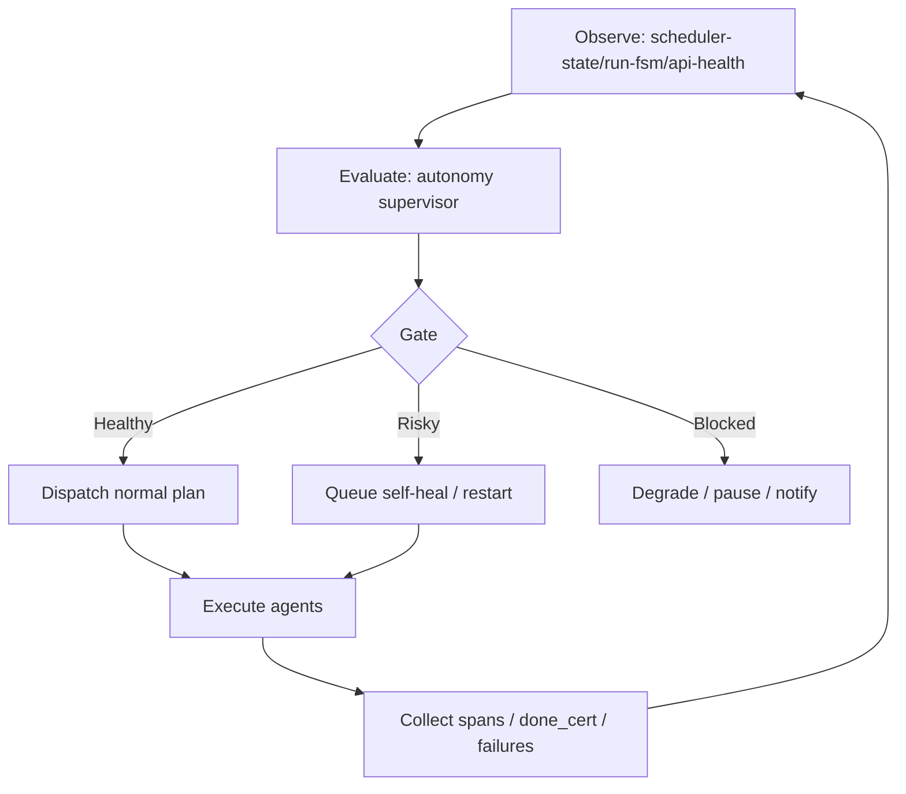

# Agent Harness 自主管理機制研究與優化報告

日期：2026-03-20
主題：agent harness 如何把研究、優化、審查與實作串成可自主管理的控制迴路

## 研究範圍
- 現有專案 harness：`run-agent-team.ps1`、`run-todoist-agent-team.ps1`、`state/run-fsm.json`、`templates/auto-tasks/self-heal.md`
- 外部參考：
  - LangGraph 文件與 v1 發布說明
  - OpenAI Agents SDK tracing / guardrails 文件
  - AutoGen runtime / AgentOps 觀測文件
  - arXiv 論文：`DEVIL'S ADVOCATE`、MIRAI
  - 專案既有 KB：`LINE Bot Webhook 驅動的 Agentic 任務管線設計`、`Execution Trace Schema 實作指南`

## 發布日期與版本確認
- LangGraph v1 發布說明：2025 年後仍維持 v1 核心執行模型，頁面於最近一週仍可取得。
- OpenAI Frontier 介紹頁：2026-02 發布，說明 agent 部署與管理的重要性。
- AutoGen 0.2 AgentOps 文件：最近一週仍可取得；可作觀測面參考，但版本較舊，僅採其追蹤思想。
- MIRAI 論文：2024-07。
- DEVIL'S ADVOCATE 論文：2024-05。

## 外部研究摘要

### 1. LangGraph：durable execution + checkpointing 是自治 harness 的基礎
- 核心訊息：狀態圖、checkpoint、interrupt、resume 必須是一等公民，否則 crash 後只能從頭重跑。
- 對本系統啟示：`run-fsm.json` 已有 phase state，但目前只是紀錄，不是可驅動的控制面；應升級為決策輸入。

### 2. OpenAI Agents SDK：trace 與 guardrail 要內建，不應事後補
- 核心訊息：追蹤、guardrail、handoff 應直接嵌入 runtime。
- 對本系統啟示：既有 span / done_cert / hook guard 已存在，但分散在腳本與 hook；需由 supervisor 聚合成統一 go/no-go gate。

### 3. AutoGen / AgentOps：多代理系統需要 session replay、成本、失敗與工具使用追蹤
- 核心訊息：只知道成功/失敗不夠，還要知道哪個 agent、哪個工具、哪個步驟出問題。
- 對本系統啟示：`logs/structured/*.jsonl`、`results/spans-*.json`、`state/failed-auto-tasks.json` 應被同一控制器消化。

### 4. DEVIL'S ADVOCATE：有效 agent 需要前瞻式反思，而非只在失敗後補救
- 核心訊息：在行動前加入 anticipatory reflection，可降低回滾成本。
- 對本系統啟示：pre-flight、risk scoring、quality gate 應在派發前先跑，不該只靠 Phase 3 組裝時補救。

### 5. MIRAI：工具使用與外部資料接入是 agent 成效關鍵，但也提高上下文與錯誤複雜度
- 核心訊息：工具接入提高表現，但也會帶來噪音、長上下文與失敗面。
- 對本系統啟示：要用明確 state、budget、failure policy 控制工具使用，避免現有 Phase 2 任務彼此擠壓。

## 機制圖



## 現有 harness 問題
1. 控制面分散：主要判斷邏輯散落在兩支大型 PowerShell 與 `self-heal.md`，無單一控制器。
2. 狀態有記錄，缺少驅動：`run-fsm.json` 可看見 `running/completed`，但沒有獨立 supervisor 根據 stale state 派發動作。
3. 閘門不完整：已有 done_cert、circuit breaker、cache status，但缺少統一 go/no-go 決策。
4. 故障恢復半自動：可記錄 failed-auto-tasks、self-heal、retry，但 Phase 間缺乏統一的 recovery queue。
5. 可觀測性碎片化：`spans`、`structured logs`、`failure-stats`、`api-health` 未聚合。

## 優化方案

### 目標
- 效能：降低無效重試與 stuck run 佔用。
- 可靠性：對 stale run、重複失敗、自動任務飢餓建立主動反應。
- 可維護性：將自治決策抽離成單一 Python 控制器。
- 自主管理：讓系統能在無人工介入下完成監測、判斷、派發、恢復。

### 技術改動
1. 新增 `tools/autonomous_harness.py`
   - 聚合 `run-fsm`、`scheduler-state`、`failure-stats`、`failed-auto-tasks`、`api-health`
   - 輸出 `state/autonomous-harness-plan.json`
   - 寫入 `state/autonomous-recovery-queue.json`
   - 可用 `--execute` 直接派發安全重啟命令
2. 新增 `config/autonomous-harness.yaml`
   - 集中配置 stale threshold、failure window、dispatch command
3. 補測試 `tests/tools/test_autonomous_harness.py`
   - 驗證 stale run、failed auto task、open circuit、restart dispatch
4. 文件化研究、方案、迭代與驗證報告
5. 新增 runtime policy 控制面
   - 輸出 `state/autonomous-runtime.json`
   - 根據 gate 決定 `normal / degraded / recovery`
   - 產出 `max_parallel_auto_tasks`、`allow_heavy_auto_tasks`、`allow_research_auto_tasks`
6. 將 runtime policy 接入 `run-todoist-agent-team.ps1`
   - 在 Phase 2 前對 auto-task 套用降載與重型任務過濾
   - 讓「資源自調整」從文件設計變成實際執行路徑

### 建議工具與版本
- Python >= 3.9
- PowerShell 7
- pyyaml == 6.0.3
- pytest >= 7

安裝 / 驗證：

```powershell
uv sync
uv run pytest tests/tools/test_autonomous_harness.py
uv run python tools/autonomous_harness.py --format json
python tools/autonomous_harness.py --format json
```

## 風險與回退
- 風險 1：自動 restart 可能與既有 Task Scheduler 重疊。
  - 回退：預設只跑 dry-run；排程上線前先用 `--format json` 驗證一週。
- 風險 2：PowerShell 腳本仍保有部分重複自治邏輯。
  - 回退：先把 supervisor 作為外掛控制面，不直接刪除原腳本 fallback。
- 風險 3：`agent -p` 目前在本機回傳 `[internal]`。
  - 回退：本次改由本機 Python supervisor 與既有 Claude/PowerShell harness 落地。

## 迭代審查

### Iteration 1
- 實作：建立 supervisor、配置檔、單元測試。
- 測試目標：能從現有 state 推導 restart / self-heal queue。
- 發現：需避免重複 action，並將 queue 與 plan 分離保存。

### Iteration 2
- 調整：加入 action 去重、recovery queue 寫回、只對 restart_agent 執行 subprocess。
- 結果：可在 dry-run 模式產出完整自治計畫，且保留 execute 分支供後續排程接入。

### Iteration 3
- 調整：加入 fairness / token-budget / scheduler-heartbeat gate。
- 實作：supervisor 會寫出 `state/autonomous-runtime.json`，Todoist 排程在 Phase 2 前會讀取並降載。
- 結果：控制面從「只產生建議」升級為「直接影響 auto-task 調度行為」。

## 本輪驗證
- `python tools/autonomous_harness.py --format json`：成功；實際輸出 `runtime.mode=degraded`。
- `state/autonomous-runtime.json`：成功生成；目前策略為 `max_parallel_auto_tasks=2`、`allow_heavy_auto_tasks=false`。
- `python -m pytest tests/tools/test_autonomous_harness.py`：測試收集成功，但被本機暫存目錄 ACL 阻斷於 pytest tmp/cleanup，屬環境限制。

## 來源
- LangGraph v1 release notes: https://docs.langchain.com/oss/python/releases/langgraph-v1
- LangGraph subgraphs / checkpointer docs: https://docs.langchain.com/oss/javascript/langgraph/use-subgraphs
- OpenAI Frontier: https://openai.com/index/introducing-openai-frontier/
- AutoGen AgentOps: https://microsoft.github.io/autogen/0.2/docs/notebooks/agentchat_agentops/
- AutoGen observability: https://microsoft.github.io/autogen/0.2/docs/topics/llm-observability/
- Kubernetes concepts: https://kubernetes.io/docs/concepts/
- Temporal docs: https://docs.temporal.io/
- DEVIL'S ADVOCATE: https://arxiv.org/pdf/2405.16334
- MIRAI: https://arxiv.org/pdf/2407.01231
