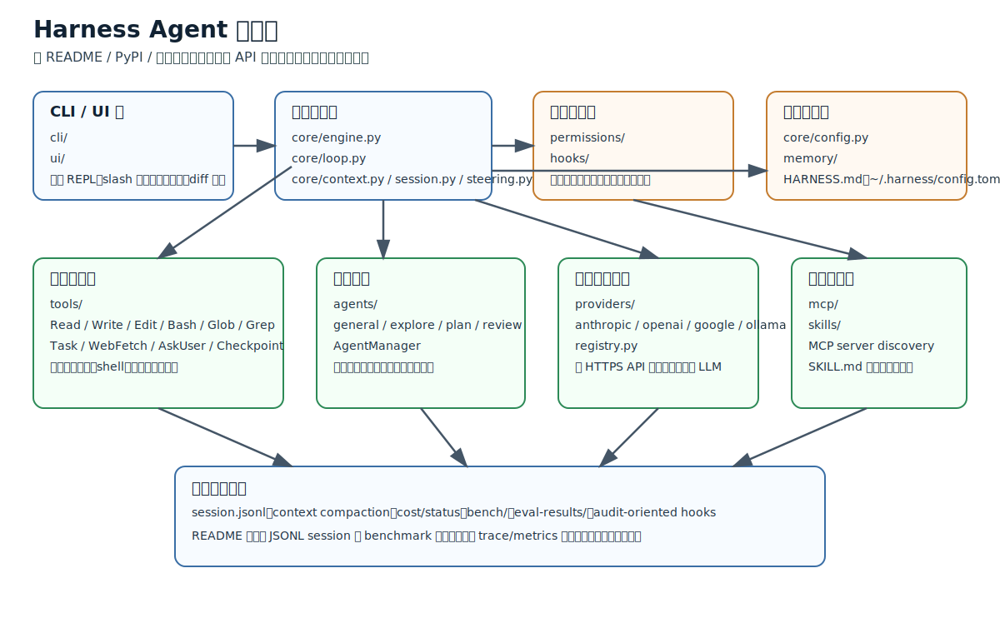
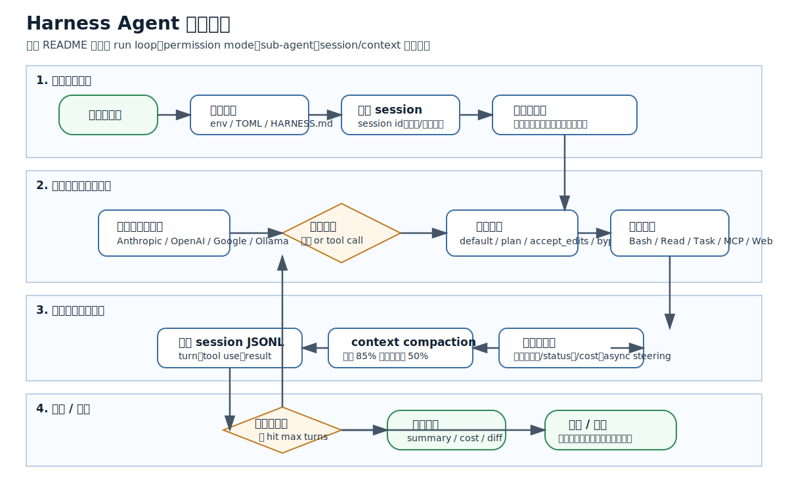

# Harness Agent 深度研究報告

> 研究日期：2026-03-20  
> 研究對象：`harness-agent` / `AgentBoardTT/openharness`  
> 範圍：運作機制、系統架構、工作流程、部署方式、設定結構、錯誤與觀測  
> 研究限制：本機對 GitHub 443 連線受限，無法直接 `git clone`；`agent -p` 實測回傳 `[internal]`；本機未安裝 `harness`、`plantuml`、`java`，且 Docker daemon 未啟動。





## 1. 研究概述

`Harness` 是一個以 Python 3.12+ 實作的開源 coding agent，提供 CLI 與 SDK 兩種入口，主打多模型供應商接入、內建工具、子代理平行化、MCP 擴充、技能載入與 session/context 管理。從官方 README 與 PyPI 描述來看，它不是傳統「多服務微服務平台」，而是以單一程序為主、在本機工作區內執行的 agent runtime；主要的外部依賴是 LLM provider API、MCP server、檔案系統與 shell。

本報告以官方 README、PyPI 發布頁、GitHub 倉庫目錄為主來源，補上本機環境驗證與風險說明。凡是無法直接從原始碼或官方文件逐行驗證的部分，我都明確標註為「推論」。

## 2. 版本、授權與來源判定

- 最新可確認版本：PyPI 顯示 `harness-agent 0.6.0`，發佈日期為 2026-02-24。
- 授權：MIT。
- 語言：GitHub 倉庫顯示 Python 99.7%、Shell 0.3%。
- 倉庫狀態：GitHub 頁面顯示 `17 commits`、`Issues 0`、未發佈 GitHub Releases。
- 重要判斷：目前最完整的官方資訊集中在 README 與 PyPI project description，GitHub Releases / Wiki / Discussions 訊號非常少，代表專案仍偏早期。

## 3. 系統架構

### 3.1 分層結構

根據 README 的架構段落，`src/harness/` 可拆為 10 個主要區塊：

1. `core/`
   - `engine.py`：頂層 `run()` 入口。
   - `loop.py`：核心 agent loop，負責「模型輸出 -> 工具呼叫 -> 再次推理」的反覆循環。
   - `session.py`：JSONL session persistence。
   - `context.py`：上下文窗口管理與 compaction。
   - `config.py`：從環境變數、TOML、`HARNESS.md` 載入設定。
   - `steering.py`：執行中插入使用者訊息的非同步通道。
2. `providers/`
   - `anthropic.py`、`openai.py`、`google.py`、`ollama.py`、`registry.py`。
3. `tools/`
   - Read、Write、Edit、Bash、Glob、Grep、Task、WebFetch、AskUser、Checkpoint。
4. `agents/`
   - 子代理註冊與生命週期管理。
5. `hooks/`
   - 工具呼叫前後的 hook。
6. `mcp/`
   - MCP client 與漸進式工具發現。
7. `skills/`
   - `SKILL.md` 解析與載入。
8. `memory/`
   - 專案指令與跨 session 記憶。
9. `permissions/`
   - 權限規則引擎。
10. `ui/` / `eval/` / `cli/`
   - 終端呈現、評測框架、CLI 入口。

### 3.2 核心組件依賴關係

可合理重建的依賴方向如下：

1. `cli/` 與 `ui/` 接收使用者命令，將任務交給 `core/engine.py`。
2. `core/engine.py` 初始化 `config`、`session`、`context`、provider、tool registry。
3. `core/loop.py` 控制每一回合：
   - 把當前 context 送進 provider。
   - 解析模型輸出是否包含 tool call。
   - 呼叫 `permissions/` 決定是否放行。
   - 如有子任務，交給 `agents/` 的子代理管理器。
   - 如需外部能力，經 `mcp/` 或 `tools/` 執行。
4. `session.py` 與 `memory/` 提供持久化；`context.py` 在上下文過大時摘要壓縮。
5. `hooks/` 橫切進入工具呼叫前後，形成審計與自訂治理點。

### 3.3 通訊協定

官方明示與可推論的通訊方式如下：

| 模組/邊界 | 通訊方式 | 依據 |
|---|---|---|
| CLI/UI -> Core | 程序內函式呼叫 | README 架構樹 |
| Core -> Providers | HTTPS API / SDK 呼叫；Ollama 為本機模型介面 | README providers 與多供應商說明 |
| Core -> Tools | 程序內呼叫；`Bash` 會產生本機 shell 子程序 | README built-in tools |
| Core -> MCP servers | 推論為 MCP client 對外部 server 的程序/協定互動；樣例以 `command` + `args` 啟動 | README MCP 範例 |
| Session 持久化 | 本機檔案 I/O，JSONL | README session.py 描述 |
| Context compaction | 程序內摘要 | README context compaction 說明 |

**重要判斷**：目前看不到使用 gRPC、message queue 或獨立 control-plane service 的證據；`Harness` 比較像單機 agent runtime，而非分散式 workflow orchestrator。

## 4. 運作機制

### 4.1 啟動流程

根據 README 與官方使用方式，可整理為：

1. 使用者以 `harness`、`harness "task"` 或 Python SDK `harness.run(...)` 進入。
2. `config.py` 載入：
   - `~/.harness/config.toml`
   - 環境變數（如 `ANTHROPIC_API_KEY`）
   - 專案根目錄 `HARNESS.md`
3. `engine.py` 建立 session、選定 provider/model、註冊可用工具。
4. `context.py` 聚合：
   - 使用者 prompt
   - 歷史 session
   - project instructions
   - auto-memory
   - skill 指令
5. `loop.py` 啟動推理回圈。

### 4.2 關閉流程

官方沒有給出完整 shutdown 時序，但從 session persistence 與 CLI 行為可推論：

1. 任務完成、達到 `max_turns`、使用者終止，或工具/提供者錯誤導致 loop 結束。
2. 寫回 session JSONL。
3. 回傳 result、token usage、cost、必要時顯示 diff/status。
4. 互動模式可保留 session id 供後續 `--session` 繼續。

### 4.3 錯誤處理機制

README 雖未列出錯誤類型矩陣，但可從功能面推斷其錯誤分層：

1. Provider error：API 驗證、速率限制、模型不可用。
2. Tool error：shell 非零退出、檔案不存在、網頁抓取失敗。
3. Permission denial：在 `default`/`plan` 模式下被拒絕。
4. Context pressure：超過上下文閾值時觸發 compaction。
5. Session continuity：透過 JSONL 與 session id 支援恢復。

**推論**：由於專案提供 `Checkpoint` 工具與 `session.py`，它應具備至少「本地狀態可回放/可續跑」的基礎能力；但是否是嚴格的 durable execution，官方 README 沒有足夠證據。

### 4.4 日誌與監控

已知觀測能力：

- `/status`：顯示 provider、model、session、cost。
- `/cost`：顯示 token 與成本。
- `session.py`：JSONL 形式持久化對話/工具紀錄。
- `eval/`、`bench/`、`eval-results/`：評測輸出。
- `hooks/`：可在工具前後插入自訂命令，形成外部審計或告警。

**推論**：這是一種偏「本機審計 + CLI 可視化」的 observability，而不是像 Langfuse / OpenTelemetry 那樣明確的集中式追蹤後端。

## 5. 工作流分析

### 5.1 觸發條件

可辨識的觸發來源有四類：

1. CLI 單次命令。
2. 互動 REPL slash command。
3. SDK `harness.run(...)`。
4. 子代理 / Task 工具在主代理內部再觸發新的工作單元。

### 5.2 任務排程

`Harness` 沒有明示獨立 scheduler service。排程比較接近「回合制 agent loop + 可平行 spawn 的子代理」：

1. 主 loop 逐回合執行。
2. 當任務可拆分時，由 `AgentManager.spawn_parallel(...)` 啟動多個子代理。
3. 子代理型別目前公開為 `general`、`explore`、`plan`、`review`。
4. 主代理在收斂後整合子代理結果。

### 5.3 狀態遷移

根據 README 可重建下列狀態機：

`initialized -> configured -> running -> tool_pending -> tool_running -> provider_roundtrip -> compacting(optional) -> completed | aborted`

其中：

- `configured`：provider/model/permission mode 已決定。
- `tool_pending`：模型產生 tool call。
- `tool_running`：工具或子代理實際執行。
- `provider_roundtrip`：工具結果回灌模型。
- `compacting`：上下文接近 85% 時觸發。
- `completed`：產生最終結果。
- `aborted`：權限拒絕、工具失敗、人工中止、內部錯誤。

### 5.4 結果回饋

主要回饋管道：

1. 終端串流輸出。
2. `/diff` 顯示工作區變更。
3. `/status`、`/cost` 回傳執行狀態與成本。
4. session id 與 session 檔供續跑。
5. async steering 允許使用者在中途插入新指令。

## 6. 部署方式與設定結構

### 6.1 官方支援的部署型態

目前官方資料明示的型態是：

1. 單機 CLI 安裝：
   - `curl -fsSL .../install.sh | bash`
   - 或 `pip install harness-agent`
2. 本機 SDK 使用：
   - `import harness`
   - `async for msg in harness.run(...): ...`
3. CI / 腳本模式：
   - `harness --permission bypass "..."`。

### 6.2 容器化與 Kubernetes

README 沒有直接提供：

- `Dockerfile`
- `docker-compose.yml`
- `helm chart`
- `kustomize`

因此目前沒有足夠官方證據支撐「原生容器化/Kubernetes 部署已成熟」。若要上 K8s，較合理的落地方式是把 `harness` 視為短生命週期 job/runner，而非長駐 agent control plane。

### 6.3 設定檔結構

官方明示兩層設定：

1. 使用者層：`~/.harness/config.toml`
   - 儲存 provider API key。
2. 專案層：`HARNESS.md`
   - 儲存 project instructions。

另可由環境變數覆蓋，例如：

```bash
ANTHROPIC_API_KEY=...
OPENAI_API_KEY=...
GOOGLE_API_KEY=...
```

**推論**：`config.py` 應該做的是多來源設定合併，優先序可能是 CLI flag > env var > config.toml > `HARNESS.md` 的專案級預設，但這部分需要原始碼才能最終確認。

## 7. 核心模組實作方式

以下程式片段為依官方 README 範例整理出的「可執行介面樣貌」，不是直接從原始碼逐行摘錄。

### 7.1 頂層 SDK 介面

```python
import harness

async for msg in harness.run(
    "Refactor the database module",
    provider="openai",
    model="gpt-4.1",
    permission_mode="accept_edits",
    max_turns=50,
):
    ...
```

這顯示 `engine.py` 對外暴露的是高階 `run()` API；呼叫端不需自行組裝 event loop、provider adapter 或 tool registry。

### 7.2 子代理管理

```python
from harness.agents.manager import AgentManager

mgr = AgentManager(provider=provider, tools=tools, cwd=".")
result = await mgr.spawn("explore", "Find all API endpoints")
results = await mgr.spawn_parallel([...])
```

這說明 `agents/` 不是單純 prompt template，而是有明確的 manager 與 lifecycle 概念。

### 7.3 MCP 擴充

```python
async for msg in harness.run(
    "Search our Jira board",
    mcp_servers={
        "jira": {"command": "npx", "args": ["-y", "@anthropic/mcp-server-jira"]}
    },
):
    ...
```

這代表 MCP 整合偏向「把外部能力當工具動態注入」，而非在核心 loop 外另建一層獨立服務匯流排。

## 8. 本機驗證結果

### 8.1 工具檢查

| 項目 | 結果 |
|---|---|
| `git --version` | 成功，`2.45.1.windows.1` |
| `node --version` | 成功，`v22.11.0` |
| `python --version` | 成功，`3.11.13` |
| `agent --version` | 成功，`2026.03.18-f6873f7` |
| `docker version` | 有 client `26.0.0`，但 daemon 未啟動 |
| `docker compose version` | 不可用；此環境不是 Compose v2 子命令安裝型態 |
| `harness --help` | 失敗，未安裝 `harness` |
| `plantuml -version` | 失敗，未安裝 |
| `java -version` | 失敗，未安裝 |

### 8.2 依 `cursor-cli` 規則的實測

已完成：

1. 先建立任務檔 `temp/cursor-cli-task-harness-agent-research.md`
2. 以 `agent -p ... --mode=ask` 實際執行

結果：

- `agent -p` 回傳 `[internal]`
- 因此本次無法把外部研究流程完整委由 Cursor CLI 執行，後續改採本機 shell + Web 研究 fallback

### 8.3 原始碼與部署實測

已嘗試：

1. `git clone https://github.com/AgentBoardTT/openharness.git temp/openharness`

結果：

- 失敗，無法連到 `github.com:443`

因此無法完成下列驗收項目：

1. 本機安裝 `harness-agent`
2. 啟動實例並示範完整 workflow
3. 以 Docker/Compose 驗證部署

這些不是研究方法問題，而是本機網路與執行環境受限。

## 9. 舊版/新版差異

目前能直接確認的版本序列都集中在 2026-02-23 到 2026-02-24：

- `0.1.0` -> `0.6.0` 的更新非常密集，顯示專案仍快速演進。
- GitHub 沒有公開 release notes；因此無法精確列出 0.1.x、0.2.x、0.3.x、0.4.x、0.6.0 的逐版差異。
- 但從 README 可見現階段已同時宣稱：
  - 多 provider
  - sub-agents
  - MCP
  - skills
  - hooks
  - auto-memory
  - benchmark/eval

**判斷**：如果你要把它拿去生產，最大的風險不是架構不清楚，而是版本成熟度與變更紀錄不足。

## 10. 已知問題與風險

1. GitHub 倉庫與 PyPI 都很新，缺少長期維運訊號。
2. 官方文件對容器化、Kubernetes、集中式 observability、故障恢復細節不足。
3. 沒有足夠公開 issue/discussion 可供分析真實故障模式。
4. README 的能力面敘述很完整，但缺少對核心 state machine、exception taxonomy、storage schema 的正式文件。
5. 本機環境無法完成 clone / install / run，故本報告的「部署與工作流驗證」只能做到設計級與文件級驗證。

## 11. 實作建議

若要把 `Harness` 納入可落地部署的團隊流程，建議採以下策略：

1. 先以單機 runner 模式導入，不要一開始就假設它是分散式平台。
2. 自行補一層 wrapper：
   - session 存檔路徑
   - stdout/stderr 結構化收集
   - API key 與 model policy
   - tool allowlist / denylist
3. 若要上 CI：
   - 使用 `--permission bypass` 前，先在唯讀/測試工作區做 dry run。
4. 若要上 K8s：
   - 以 `Job` 或短命 `Runner` 心智模型部署，不要直接當長駐 orchestrator。
5. 若要做企業級治理：
   - 優先研究 hooks、permissions、skills、MCP 這四個邊界，因為它們最接近 policy enforcement points。

## 12. 參考資料

### 官方 / 一手來源

1. GitHub README  
   - https://github.com/AgentBoardTT/openharness
2. PyPI 專案頁  
   - https://pypi.org/project/harness-agent/

### 本機研究與驗證紀錄

1. Cursor CLI 任務檔  
   - `temp/cursor-cli-task-harness-agent-research.md`
2. 本機 KB 查詢結果  
   - `temp/harness-agent-kb-query.json`

## 13. 結論

`Harness Agent` 的核心不是「複雜的多服務分散式架構」，而是「單機 agent runtime + provider adapters + tool system + sub-agent orchestration + persistence/governance hooks」的組合。它的工作流相當清楚：初始化設定與 session，進入模型回圈，按權限執行工具與子代理，必要時壓縮上下文，最後把結果與 session 持久化。

但從可部署性的角度看，現階段最大的缺口是工程化證據不足：缺少 release notes、容器/K8s 標準部署、正式監控規範與更細緻的故障恢復文件。因此它適合先作為高能力的本機或 CI runner，而不是直接當成企業級長駐 agent platform。
