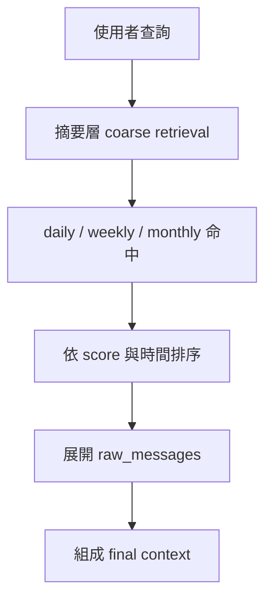

# 長期記憶優化設計

> 依據來源：本機知識庫筆記 `8fb70bab-5418-49ad-b267-4741958f82df` 中的 `七、Daily-Digest-Prompt 專案的應用場景`。

## 1. 設計目標

- 讓 Daily Digest 記憶可跨對話、跨會話、跨時間段檢索。
- 從單層 `daily digest note` 升級為 `daily / weekly / monthly` 三層摘要。
- 保留既有 `tools/digest_sync.py` 與 `knowledge-base-search` 的能力，不破壞舊流程。

## 2. 摘要頻率與範圍

| 層級 | 觸發條件 | 偵測方式 | 保存期限 |
|---|---|---|---|
| 每日摘要 | `>= 24` 小時 或 `>= 1000` 訊息 | `digest_scheduler.py` 比對 `last_digest_at.daily` 與 `message_count_since.daily` | 30 天 |
| 每週摘要 | `>= 168` 小時 或 `>= 7000` 訊息 | 同上 | 90 天 |
| 每月摘要 | `>= 720` 小時 或 `>= 30000` 訊息 | 同上 | 永久 |

### 觸發檢測

- 使用 `DigestTriggerState`
- 每個層級追蹤：
  - `last_digest_at`
  - `message_count_since`
- `should_trigger_digest()` 回傳：
  - `bool`
  - `reason`

## 3. 摘要內容結構

標準欄位：

| 欄位 | 說明 |
|---|---|
| `topic` | 摘要主題 |
| `taskType` | 任務類型，對應 research/task routing |
| `key_events` | 1-4 條關鍵事件 |
| `decisions` | 1-3 條已做決策 |
| `open_questions` | 1-3 條未解問題 |
| `follow_up_actions` | 1-3 條後續行動 |
| `source_window` | 統計視窗與訊息量 |
| `retrievalHints` | 供 hybrid search 加權的標籤與提示 |

Prompt 範本位置：

- `prompt_templates/daily_digest_prompt.txt`

設計要求：

- 支援 `{{language}}`
- 要求 JSON-only 輸出
- 明確規範脫敏

## 4. 向量化與儲存

### 本次實作

- 預設使用 `LocalEmbeddingModel`，以 deterministic token vector 供離線開發與測試。
- 優點：
  - 無外部 API 依賴
  - 單元測試穩定
  - 可驗證相似度門檻

### 正式環境建議

| 模型 | 版本 | 優點 | 限制 | 成本估算 |
|---|---|---|---|---|
| OpenAI `text-embedding-3-large` | 2024-03 系列 | 多語言效果穩定、維度高 | 需外網與費用 | 依 OpenAI 當期牌價計費，建議設月上限 |
| Sentence-Transformers `all-mpnet-base-v2` | HF 現行版 | 可自建、無 API 費 | 需自管推論環境 | 機器成本為主 |
| Mistral embedding | 依供應商版本 | 可與現有 Mistral 棧整合 | 仍需外部服務 | 依供應商計價 |

### 成本控制

- `LongTermMemoryConfig.embedding.monthly_cost_limit_usd`
- `can_embed(token_count)` 先做預估，再決定是否允許寫入

## 5. 資料庫選型建議

| 方案 | 優點 | 缺點 | 部署方式 | 整合步驟 |
|---|---|---|---|---|
| Qdrant | Rust 實作、效能穩、過濾好、可本地 | 需額外服務 | 自建 / Cloud | 以 API 取代本機 JSON store，保留 `topic/tags/expiresAt` metadata |
| Pinecone | SaaS 省維運 | 成本較高、受外網限制 | 雲端 | 新增 index、namespace、API key 管理 |
| Weaviate | Schema 與混合搜尋成熟 | 維運較重 | 自建 / Cloud | 映射 `StoredNote` 到 class schema |
| Milvus | 大規模擴展性佳 | 對小專案偏重 | 自建 / 雲端 | 需新增 collection 與 metadata filter |
| 現有本機 JSON store | 零外部依賴、適合開發 | 10k 筆以上管理與備份較弱 | 本機 | 作為 dev/test fallback |

### 建議

- 開發/測試：沿用本機 JSON store
- 正式：優先 Qdrant

## 6. 過期與回收策略

### TTL

- daily：30 天
- weekly：90 天
- monthly：永久

### 清理流程

1. 先將過期資料寫入 `backups/long_term_memory_expired.jsonl`
2. 再從主儲存刪除
3. 排程方式：
   - 開發機：Windows Task Scheduler / Cron
   - 伺服器：Cron 或 Airflow
   - 雲端：AWS Lambda / EventBridge

本次實作：

- `LongTermMemoryManager.expire_records()`
- `backup_reason=expired`

## 7. 檢索提升：多階段檢索

### 流程說明

1. 先查摘要層 embedding
2. 用 `min_score >= 0.78` 篩掉低相關記憶
3. 對命中結果再施加：
   - `exp(-days_old / 60)` 時間衰減
   - `1 + 0.2 * overlap(taskTags, note.tags)` 任務標籤加權
4. 命中後再展開 `raw_messages`
5. 將 retrieval path 記錄為：
   - `summary-index`
   - `digest level`
   - `raw-messages`

### 查詢參數

| 參數 | 用途 |
|---|---|
| `taskType` | 以任務類型過濾同類摘要 |
| `taskTags` | 對同類型標籤結果做 boost |
| `startDate` / `endDate` | 鎖定過去 30 天或指定區間 |
| `recencyHalfLifeDays` | 控制時間衰減速度，預設 60 天 |

## 8. 檔案落地

| 檔案 | 作用 |
|---|---|
| `digest_scheduler.py` | 判斷 daily/weekly/monthly 何時觸發 |
| `prompt_templates/daily_digest_prompt.txt` | 摘要 Prompt |
| `memory/long_term_memory.py` | 三層摘要、向量化、TTL、備份、檢索 |
| `demo_long_term_memory.py` | 示範完整流程 |
| `docker-compose.yml` | 長期記憶測試環境 |

## 9. 驗證策略

- 摘要生成正確性：驗證 `decisions` / `open_questions` 關鍵字
- 相似度檢索：驗證 `score > 0.78`
- 過期回收：驗證 daily 可刪、monthly 保留
- scheduler：驗證時間窗與訊息量雙觸發條件
- 檢索加權：驗證 `taskTags` 命中結果優先於舊的泛用摘要
- 高負載：驗證 100 筆摘要寫入與檢索 p95 < 200ms

## 10. 已知風險

1. 外部原始說明目前不可取得，因此「原文段落編號」無法嚴格還原。
2. 當前正式向量資料庫尚未切換，仍以本機持久化作為預設。
3. PDF 手冊為本地生成產物，內容正確但未經人工排版微調。
