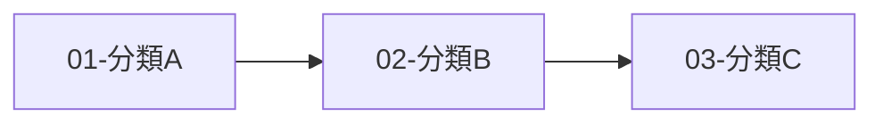

# Knowledge Domain Builder

從零搭建 Obsidian 知識領域庫的全自動化工作流。

> AI 一站式完成調研、架構、建庫，使用者專注於深度學習與內化 —— 解決「不知從何學起」與「如何組織知識」兩大難題。

## 工作流總覽

```
Phase 0  柏拉圖式對話    →  釐清目的、邊界、限制
Phase 1  深度研究        →  全面調研該領域
Phase 2  結構化大綱      →  生成 Markdown 學習路徑
Phase 3  搭建 Vault      →  自動建立資料夾、MOC、原子筆記、模板、外掛配置
Phase 4  同步與交付      →  跨設備同步建議 + ntfy 完成通知
```

---

## Phase 0：柏拉圖式對話（必須執行，不可跳過）

在動手之前，用蘇格拉底式提問挖掘使用者的真實需求。此階段的目的不只是「收集需求」，而是幫助使用者思考清楚自己到底要什麼。

### 執行方式

讀取 `references/socratic-questions.md` 取得完整問題框架，然後依序提問。

提問分為三個層次，每層必須等使用者回答後再進入下一層：

**第一層：目的與本質（Why）**
- 你為什麼想學這個領域？解決什麼問題？
- 你心中的「學會」是什麼樣貌？能教人、能應用、還是能查閱？
- 這個領域對你而言是長期投資，還是短期需要？

**第二層：邊界與範圍（What）**
- 這個領域的哪些部分是你最關心的？有沒有明確不需要的？
- 你目前對這個領域了解多少？完全空白，還是有零散知識？
- 你手邊有沒有已有的學習資料（PDF、書、課程筆記）？

**第三層：限制與偏好（How）**
- 你預計每天能投入多少時間學習？
- 你偏好什麼學習方式？（理論先行 / 實作導向 / 案例驅動）
- 知識庫需要跨設備使用嗎？（桌機、手機、平板）
- 是否需要整合到你現有的 Obsidian vault，還是建立獨立的新 vault？

### 輸出格式

將對話結果整理為 `domain_profile.json`，結構見 `references/socratic-questions.md` 底部。此檔案將驅動後續所有階段。

---

## Phase 1：深度研究

根據 `domain_profile.json` 的資訊，進行該領域的全面調研。

### 工具選擇策略

| 情境 | 工具 | 原因 |
|------|------|------|
| 使用者有上傳資料 | 先分析上傳資料，再 web search 補充 | 以使用者資料為主 |
| 完全陌生的領域 | web_search 多輪搜尋 | 廣泛涵蓋 |
| 需要快速摘要 | Groq API（llama-3.3-70b） | 速度快，免費 |
| 需要深度長文分析 | Claude 自身能力 | 長上下文處理 |

### 研究維度

根據 `domain_profile.json` 中的 `purpose` 和 `scope` 進行研究，確保涵蓋：

1. **領域全景**：這個領域的核心是什麼？主要分支有哪些？
2. **知識地圖**：哪些概念是基礎？哪些是進階？依賴關係是什麼？
3. **學習路徑**：公認的學習順序是什麼？有哪些常見的學習陷阱？
4. **實踐資源**：推薦書籍、課程、社群、工具
5. **前沿動態**：這個領域最新的發展和趨勢

### 研究步驟

```
1. web_search 搜尋 3-5 輪，每輪不同角度的關鍵字
2. web_fetch 讀取 2-3 篇高質量長文（教學路線、權威指南）
3. 整合所有資訊，生成研究報告
4. 將報告存為 research_report.md
```

### 輸出物

`research_report.md` — 一份結構化的領域調研報告（不超過 3000 字）

---

## Phase 2：結構化大綱

將研究報告轉化為嚴格的 Markdown 學習路徑大綱。

### 大綱結構規範

```markdown
## [序號]-[宏觀知識分類]（二級標題 → 一級資料夾）

### [序號]-[知識主題]（三級標題 → 二級資料夾 + MOC）
- [原子知識點名稱]（無序列表 → 原子筆記 .md）
- [原子知識點名稱]
- [原子知識點名稱]
```

### 命名規則

- 資料夾與筆記名稱使用 **中文**（配合使用者語言偏好）
- 序號格式：兩位數字（01、02、03...）
- 原子知識點命名要求：**明確、可獨立理解、不超過 15 字**
- **全域唯一性**：每個原子筆記名稱在整個 Vault 中必須唯一，避免 wikilink 歧義。若同一概念出現在不同主題下，需加上主題前綴區分（例：`藏教-基本概念` vs `通教-基本概念`）
- MOC 名稱天然唯一，格式固定為 `_MOC-{分類或主題名稱}`
- 禁止四級以上巢狀

### 品質檢查

生成大綱後，執行以下自動校驗：

1. **MECE 原則**：分類之間互不重疊、合在一起涵蓋完整
2. **粒度一致**：同一層級的知識點粒度應該相近
3. **數量合理**：每個三級標題下 3-8 個原子知識點；總量不超過 100 個
4. **依賴順序**：編號反映建議的學習順序
5. **參照 domain_profile.json**：排除使用者明確不需要的範圍
6. **名稱唯一性**：掃描所有原子知識點名稱，確保無重複

### 輸出物

`outline.md` — 結構化學習路徑大綱

---

## Phase 3：搭建 Obsidian Vault

這是核心自動化階段。讀取 `references/obsidian-best-practices.md` 取得 Obsidian 最佳實踐，然後執行 `scripts/build_vault.sh` 批量生成完整的 Vault 結構。

### 3-1. 建立目錄結構

根據 `outline.md` 自動生成：

```
{domain_name}/
├── .obsidian/                    ← Vault 配置
│   ├── app.json                  ← 基礎設定
│   ├── appearance.json           ← 外觀設定
│   ├── graph.json                ← 圖譜配色
│   └── templates.json            ← 模板路徑
├── _Templates/                   ← 筆記模板
│   ├── tpl-atomic-note.md        ← 原子筆記模板
│   ├── tpl-moc.md                ← MOC 模板
│   └── tpl-daily-learning.md     ← 每日學習日誌
├── _Assets/                      ← 附件存放
├── _Inbox/                       ← 快速捕獲收件匣
├── _Overview-MOC.md              ← 最高級別總覽索引
├── outline.md                    ← 原始大綱（留存參考）
├── research_report.md            ← 研究報告
├── domain_profile.json           ← 領域設定檔
├── 01-分類A/
│   ├── _MOC-分類A.md
│   ├── 01-主題A1/
│   │   ├── _MOC-主題A1.md
│   │   ├── 原子筆記1.md
│   │   ├── 原子筆記2.md
│   │   └── 原子筆記3.md
│   └── 02-主題A2/
│       ├── _MOC-主題A2.md
│       └── ...
└── 02-分類B/
    └── ...
```

### 3-2. 模板設計（發揮 Obsidian 特長）

每個筆記都使用 Obsidian 原生功能，詳見 `references/obsidian-best-practices.md`。

#### 原子筆記模板 (`tpl-atomic-note.md`)

```markdown
---
tags:
  - {{category}}
  - {{topic}}
status: "🌱"
created: {{date}}
category: "{{category}}"
topic: "{{topic}}"
up: "{{moc_name}}"
---

# {{title}}

## 定義
> 用一句話解釋這個概念是什麼。

## 用自己的話解釋
（學完後用自己的語言寫下理解）

## 舉例
（至少一個具體的例子或應用場景）

## 反思
（學到了什麼？還有什麼不確定的？）

---

## 相關連結
- 上層主題：[[_MOC-{{topic}}]]

> [!tip] AI 建議的相關筆記（待確認）
> - （build 階段自動填入語義相近的筆記連結）
```

**設計要點：**
- YAML `up` 欄位為**純文字**，僅供 Dataview 查詢分類用，**不承擔連結功能**（Obsidian 不解析 frontmatter 中的 wikilink）
- 真正的雙向回連寫在正文 `## 相關連結` 區塊第一行，確保 Obsidian 能解析為 wikilink、出現在反向連結面板和 Graph View 中
- 費曼學習法結構：定義 → 用自己的話解釋 → 舉例 → 反思
- 跨主題建議連結使用 `> [!tip]` callout，明確標記為 AI 建議，使用者確認後可保留或刪除

#### MOC 模板 (`tpl-moc.md`)

```markdown
---
tags:
  - MOC
  - {{category}}
status: "🌱"
created: {{date}}
---

# {{topic}} 索引

## 概述
> （學習後填入該主題的 2-3 句總結）

## 筆記清單

| 狀態 | 筆記 |
|------|------|
| 🌱 | [[原子筆記A]] |
| 🌱 | [[原子筆記B]] |
| 🌱 | [[原子筆記C]] |

## 學習進度

```dataview
TABLE status AS "狀態", file.name AS "筆記"
FROM "{{folder_path}}"
WHERE !contains(file.name, "_MOC")
SORT file.name ASC
```

---

## 相關連結
- 上層分類：[[_MOC-{{category}}]]
- 總覽：[[_Overview-MOC]]
```

**設計要點：**
- 「筆記清單」由 build script 預填所有子筆記的 `[[wikilink]]`（向下連結）
- Dataview 查詢自動列出筆記狀態與學習進度
- 底部 `## 相關連結` 提供向上回連到一級 MOC 和 Overview（真正的雙向連結，寫在正文中）

#### 總覽 MOC (`_Overview-MOC.md`)

```markdown
---
tags:
  - MOC
  - Overview
status: "🌱"
created: {{date}}
---

# {{domain_name}} 知識總覽

## 領域全景
> （自動填入研究報告的摘要，使用者日後可修改）

## 學習進度儀表板

```dataview
TABLE length(rows) AS "筆記數",
  length(filter(rows, (r) => r.status = "🌳")) AS "已精通",
  length(filter(rows, (r) => r.status = "🌿")) AS "學習中",
  length(filter(rows, (r) => r.status = "🌱")) AS "未開始"
FROM ""
WHERE status != null AND !contains(file.name, "_MOC") AND !contains(file.path, "_Templates")
GROUP BY category
```

## 知識分類索引

（以下由 build script 自動生成所有一級 MOC 連結）

- [[_MOC-分類A]]
- [[_MOC-分類B]]
- [[_MOC-分類C]]

## 學習路線圖



> 建議按照編號順序學習，箭頭表示知識依賴方向。
```

**設計要點：**
- 使用 `[[_MOC-分類名稱]]` 格式連結到一級 MOC（MOC 名稱天然唯一，無歧義）
- Dataview 儀表板按 category 分組統計進度
- Mermaid 圖呈現學習路線的依賴關係

### 3-3. 雙向連結策略

> **核心原則：所有雙向連結必須寫在 Markdown 正文中。**
> Obsidian **不會**解析 YAML frontmatter 中的 `[[wikilink]]`，放在 frontmatter 的連結不會出現在反向連結面板、Graph View 或點擊跳轉中。

#### 向下連結（父 → 子）

| 來源 | 目標 | 格式 | 寫入位置 |
|------|------|------|---------|
| `_Overview-MOC.md` | 一級 MOC | `[[_MOC-分類名稱]]` | 正文「知識分類索引」區塊 |
| 一級 `_MOC-分類.md` | 二級 MOC | `[[_MOC-主題名稱]]` | 正文「筆記清單」表格 |
| 二級 `_MOC-主題.md` | 原子筆記 | `[[原子筆記名稱]]` | 正文「筆記清單」表格 |

#### 向上連結（子 → 父）

| 來源 | 目標 | 格式 | 寫入位置 |
|------|------|------|---------|
| 原子筆記 | 所屬二級 MOC | `[[_MOC-主題名稱]]` | 正文 `## 相關連結` 第一行 |
| 二級 MOC | 所屬一級 MOC | `[[_MOC-分類名稱]]` | 正文 `## 相關連結` 第一行 |
| 二級 MOC | 總覽 | `[[_Overview-MOC]]` | 正文 `## 相關連結` 第二行 |

#### 跨主題連結（AI 建議）

在 build 階段，根據原子筆記名稱的語義相近度，在 `## 相關連結` 區塊中以 callout 形式預填建議：

```markdown
> [!tip] AI 建議的相關筆記（待確認）
> - [[建議筆記A]]
> - [[建議筆記B]]
```

**注意事項：**
- callout 中的 `[[wikilink]]` **會被** Obsidian 解析（出現在 Graph View 和反向連結中），這是預期行為
- 使用者學習後可以刪除不相關的建議連結、或新增自己發現的關聯
- 禁止使用 `%%` 註解包裹 wikilink（`%%` 中的連結仍會被 Obsidian 解析，無法隱藏）
- 若需要不被解析的純文字備註，使用 HTML 註解：`<!-- 備註文字 -->`

#### 連結完整性校驗

build script 執行完畢後，自動掃描檢查：

1. **斷連結檢查**：所有 `[[wikilink]]` 的目標檔案是否存在
2. **孤立筆記檢查**：是否有原子筆記未被任何 MOC 連結
3. **回連完整性**：每個原子筆記的 `## 相關連結` 是否包含至少一個 `[[_MOC-]]` 回連
4. **Overview 完整性**：`_Overview-MOC.md` 是否連結了所有一級 MOC

### 3-4. Obsidian 配置

自動生成 `.obsidian/` 配置，優化以下體驗：

- **Graph View**：按分類上色，MOC 節點放大
- **模板路徑**：指向 `_Templates/`
- **附件路徑**：指向 `_Assets/`
- **排除資料夾**：模板和資產不出現在圖譜中

### 執行方式

使用 bash 腳本 `scripts/build_vault.sh`，輸入 `outline.md` 和 `domain_profile.json`，自動完成所有檔案建立。腳本邏輯見 `scripts/build_vault.sh`。

---

## Phase 4：同步與交付

### 跨設備同步方案

根據 `domain_profile.json` 中的 `sync_needs` 推薦方案：

| 需求 | 推薦方案 | 成本 | 設定難度 |
|------|---------|------|---------|
| 桌機 ↔ 筆電 | Git + Obsidian Git 外掛 | 免費 | 低 |
| 含手機/平板 | Obsidian Sync 官方服務 | US$4/月 | 極低 |
| 含手機 + 免費 | Syncthing（Android）或 iCloud（iOS） | 免費 | 中 |
| 僅單機 | 不需配置 | 免費 | 無 |

在 Vault 根目錄生成 `SYNC_GUIDE.md`，包含所選方案的設定步驟。

### 推薦外掛清單

在 Vault 中生成 `PLUGIN_GUIDE.md`，列出建議安裝的社群外掛：

| 外掛 | 用途 | 必要性 |
|------|------|--------|
| Dataview | 動態查詢筆記狀態與進度 | ★★★ 必裝 |
| Templater | 進階模板與自動化 | ★★★ 必裝 |
| QuickAdd | 快速新增原子筆記到指定資料夾 | ★★☆ 推薦 |
| Obsidian Git | Git 自動同步 | ★★☆ 視需求 |
| Calendar | 搭配每日學習日誌 | ★☆☆ 可選 |
| Excalidraw | 手繪概念圖 | ★☆☆ 可選 |

### 完成通知

Vault 建置完成後：

1. 打包為 zip 檔供下載
2. 透過 ntfy 發送完成通知（topic: wangsc2025）
3. 輸出簡要統計：分類數、主題數、原子筆記數、預估學習時間

---

## 自動化串接邏輯

整個流程在 Phase 0 完成後，Phase 1-4 **完全自動串接，無需人工介入**：

```
[Phase 0 完成，取得 domain_profile.json]
    │
    ├─ Phase 1：根據 profile 執行 web_search 多輪研究
    │           → 產出 research_report.md
    │
    ├─ Phase 2：根據 report + profile 生成結構化大綱
    │           → 產出 outline.md
    │           → 自動品質校驗（MECE、粒度、數量、名稱唯一性）
    │
    ├─ Phase 3：執行 build_vault.sh
    │           → 批量生成整個 Vault 結構
    │           → 含模板、配置、Dataview 查詢、Mermaid 圖
    │           → 所有雙向連結寫入正文（非 frontmatter）
    │           → 執行連結完整性校驗
    │
    └─ Phase 4：打包 + 同步指南 + ntfy 通知
```

---

## 快速啟動

使用者只需說出類似以下的話：

- 「幫我建立一個 _____ 的知識庫」
- 「我想從零學 _____，幫我搭建 Obsidian vault」
- 「建立知識領域：_____」

Claude 會自動進入 Phase 0 開始柏拉圖式提問，完成後自動執行到底。