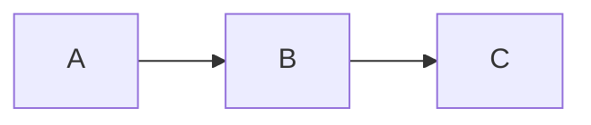

# Markdown 快速參考卡

> 5 分鐘掌握所有常用語法 | 標準：CommonMark + GFM

---

## 基礎語法（所有平台通用）

| 語法 | 標記 | 範例 | 注意 |
|------|------|------|------|
| **標題** | `# ~ ######` | `## 二級標題` | `#` 後**必須有空格** |
| **粗體** | `**text**` | **粗體文字** | 中文環境用 `*` 而非 `_` |
| **斜體** | `*text*` | *斜體文字* | 同上 |
| **粗斜體** | `***text***` | ***粗斜體*** | |
| **行內碼** | `` `code` `` | `console.log()` | 含 `` ` `` 時外層用 ` `` ` |
| **連結** | `[text](url)` | [範例](https://example.com) | URL 中 `)` 需跳脫 `\)` |
| **圖片** | `` | `` | 務必寫替代文字 |
| **引用** | `> text` | > 引用文字 | 可巢狀 `>>` |
| **分隔線** | `---` | ─── | 前後建議空行 |
| **跳脫** | `\*` | \*不是斜體\* | 特殊字元前加 `\` |

## 列表

```markdown
- 無序列表（- * + 皆可）
  - 子項目（縮排 2 空格）

1. 有序列表
2. 只有第一個數字有效

- [x] 任務清單（GFM）
- [ ] 未完成
```

**縮排規則**：子項縮排 = 列表標記寬度（`- ` = 2、`1. ` = 3）

## 程式碼區塊

````markdown
```python
def hello():
    print("Hello!")
```
````

語言標記啟用語法高亮。反引號數量需一致。

## 表格（GFM）

```markdown
| 左對齊 | 置中 | 右對齊 |
|--------|:----:|-------:|
| data   | data | data   |
```

對齊：`:---` 左、`:---:` 中、`---:` 右

## 連結進階

```markdown
[參考連結][id]          ← 參考式
<https://auto.link>    ← 自動連結
[跳到章節](#章節名稱)   ← 頁內錨點

[id]: https://example.com "標題"
```

## 換行

| 方法 | 寫法 | 說明 |
|------|------|------|
| 段落 | 空一行 | 新段落 |
| 換行 | 行尾 `\` | `<br>` |
| 換行 | 行尾兩空格 | `<br>`（不可見） |

---

## GFM 擴充（GitHub/GitLab/VS Code/Obsidian）

| 語法 | 標記 | 支援 |
|------|------|------|
| 刪除線 | `~~text~~` | GFM ✅ |
| 任務清單 | `- [x]`/`- [ ]` | GFM ✅ |
| 表格 | `\| \| \|` | GFM ✅ |
| 腳註 | `[^1]` | GitHub/GitLab/Obsidian ✅ |
| 自動 URL | `https://...` | GFM ✅ |
| 警示區塊 | `> [!NOTE]` | GitHub/Obsidian ✅ |

## 警示區塊（GitHub）

```markdown
> [!NOTE]
> 提示訊息

> [!WARNING]
> 警告訊息
```

類型：`NOTE`、`TIP`、`IMPORTANT`、`WARNING`、`CAUTION`

## 數學公式（需平台支援）

```markdown
行內：$E = mc^2$
區塊：
$$
\frac{a}{b}
$$
```

`$` 後不可有空格（GFM 規則）

## Mermaid 圖表（需平台支援）

````markdown

````

## YAML Frontmatter

```markdown
---
title: 標題
tags: [tag1, tag2]
---
```

必須在檔案**最開頭**。

## HTML 補充

| 需求 | 寫法 |
|------|------|
| 上標 | `x<sup>2</sup>` |
| 下標 | `H<sub>2</sub>O` |
| 按鍵 | `<kbd>Ctrl</kbd>` |
| 摺疊 | `<details><summary>...</summary>...</details>` |
| 圖片大小 | `` |

---

## 跨平台速查

| 特性 | CM | GH | GL | VS | Ob | Ty |
|------|:--:|:--:|:--:|:--:|:--:|:--:|
| 標題/粗體/斜體 | ✅ | ✅ | ✅ | ✅ | ✅ | ✅ |
| 表格 | ❌ | ✅ | ✅ | ✅ | ✅ | ✅ |
| 刪除線 | ❌ | ✅ | ✅ | ✅ | ✅ | ✅ |
| 腳註 | ❌ | ✅ | ✅ | 🔌 | ✅ | ✅ |
| 數學公式 | ❌ | ✅ | ✅ | 🔌 | ✅ | ✅ |
| Mermaid | ❌ | ✅ | ✅ | 🔌 | ✅ | ✅ |
| 警示區塊 | ❌ | ✅ | ❌ | 🔌 | ✅ | ❌ |
| 高亮 `==` | ❌ | ❌ | ❌ | ❌ | ✅ | ✅ |
| Wiki `[[]]` | ❌ | ❌ | ❌ | ❌ | ✅ | ❌ |

CM=CommonMark GH=GitHub GL=GitLab VS=VS Code Ob=Obsidian Ty=Typora 🔌=需擴充

---

## 自動化工具

```bash
# 產生目錄
uv run python tools/markdown-tools.py toc file.md

# 替換連結
uv run python tools/markdown-tools.py replace-links file.md \
  --old-prefix "/old" --new-prefix "/new"

# 產生摘要
uv run python tools/markdown-tools.py summarize file.md

# 格式檢查
uv run python tools/markdown-tools.py lint file.md
```

---

## 常見陷阱

1. `#標題` → 不是標題（缺空格）
2. `_word_` 在 `foo_bar_baz` 中不觸發斜體 → 改用 `*`
3. 文件開頭 `---` 被當成 Frontmatter → 用 `***` 或 `___` 做分隔線
4. 列表子項縮排不足 → 不會巢狀
5. 表格欄數不一致 → 渲染失敗
6. `$100` 可能觸發公式 → 跳脫 `\$100`
7. HTML `<details>` 內的 Markdown 前後要空行

> 完整指南：`skills/markdown-editor/Markdown_Skill_Guide.md`
