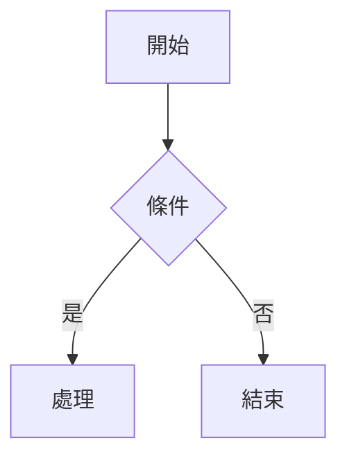

# Markdown 格式編輯與內容總結 — 完整技能指南

> **版本**: 1.0.0 | **日期**: 2026-03-08
> **涵蓋規範**: CommonMark 0.31.2 · GitHub Flavored Markdown (GFM) 0.29 · 常見擴充
> **目的**: 提供可直接應用於 Markdown 檔案編輯與內容總結的實用技能

---

## 目錄

1. [標題 (Headings)](#1-標題-headings)
2. [段落與換行 (Paragraphs & Line Breaks)](#2-段落與換行-paragraphs--line-breaks)
3. [強調 (Emphasis)](#3-強調-emphasis)
4. [列表 (Lists)](#4-列表-lists)
5. [區塊引用 (Blockquotes)](#5-區塊引用-blockquotes)
6. [程式碼 (Code)](#6-程式碼-code)
7. [連結 (Links)](#7-連結-links)
8. [圖片 (Images)](#8-圖片-images)
9. [表格 (Tables)](#9-表格-tables)
10. [分隔線 (Thematic Breaks)](#10-分隔線-thematic-breaks)
11. [HTML 內嵌 (Raw HTML)](#11-html-內嵌-raw-html)
12. [跳脫字元 (Escaping)](#12-跳脫字元-escaping)
13. [任務清單 (Task Lists)](#13-任務清單-task-lists)
14. [腳註 (Footnotes)](#14-腳註-footnotes)
15. [數學公式 (Math)](#15-數學公式-math)
16. [圖表 (Diagrams)](#16-圖表-diagrams)
17. [YAML Frontmatter](#17-yaml-frontmatter)
18. [定義列表 (Definition Lists)](#18-定義列表-definition-lists)
19. [警示區塊 (Admonitions / Callouts)](#19-警示區塊-admonitions--callouts)
20. [跨平台渲染差異總覽](#20-跨平台渲染差異總覽)
21. [自動化工具使用指南](#21-自動化工具使用指南)
22. [內容摘要技術](#22-內容摘要技術)

---

## 1. 標題 (Headings)

### 語法

**ATX 標題**（推薦）：

```markdown
# 一級標題 (H1)
## 二級標題 (H2)
### 三級標題 (H3)
#### 四級標題 (H4)
##### 五級標題 (H5)
###### 六級標題 (H6)
```

**Setext 標題**（僅支援 H1/H2）：

```markdown
一級標題
========

二級標題
--------
```

### 功能

將文字標記為章節標題，H1 最大、H6 最小。大多數平台會自動為標題產生錨點（anchor），用於頁內導航。

### 範例與渲染

| 語法 | 渲染效果 |
|------|---------|
| `# 標題一` | 最大字型、粗體 |
| `## 標題二` | 次大字型 |
| `###### 標題六` | 最小標題 |

### 注意事項

| 項目 | 說明 |
|------|------|
| **`#` 後必須有空格** | `#標題` 在 CommonMark 中**不是**標題，需寫 `# 標題` |
| **封閉 `#` 可選** | `## 標題 ##` 等同 `## 標題`，封閉 `#` 數量不需匹配 |
| **前後需空行** | CommonMark 不強制，但為避免解析歧義建議前後空行 |
| **Setext 標題限制** | 只能做 H1/H2，且 `=`/`-` 至少一個字元，不需對齊文字長度 |
| **ID 自動生成** | GitHub/GitLab 自動將標題轉為小寫、空格→`-`、移除特殊字元作為錨點 |
| **自訂 ID** | `## 標題 {#custom-id}` — 僅 Obsidian/Pandoc 支援，GitHub 不支援 |

### 跨平台差異

| 平台 | `#標題`（無空格） | Setext | 自訂 ID `{#id}` |
|------|:---:|:---:|:---:|
| CommonMark | ❌ | ✅ | ❌ |
| GitHub (GFM) | ❌ | ✅ | ❌ |
| GitLab | ❌ | ✅ | ❌ |
| VS Code 預覽 | ❌ | ✅ | ❌ |
| Obsidian | ✅ | ✅ | ✅ |
| Typora | ✅ | ✅ | ✅ |

---

## 2. 段落與換行 (Paragraphs & Line Breaks)

### 語法

```markdown
這是第一段。

這是第二段（空行分隔）。

這是同一段的第一行
第二行（行尾兩個空格 → 軟換行 <br>）。

這是同一段的第一行\
第二行（反斜線換行，CommonMark 支援）。
```

### 功能

- **段落**：以一個或多個空行分隔
- **軟換行（hard line break）**：行尾兩個空格或 `\` 後換行

### 注意事項

| 項目 | 說明 |
|------|------|
| **空行 = 段落分隔** | 單純換行（無空行）在大多數渲染器中視為同一段落 |
| **兩空格不可見** | 行尾的兩個空格肉眼難辨，`\` 換行更直觀 |
| **多個空行** | 連續空行等同一個空行（不會產生額外間距） |
| **首行縮排** | Markdown 不支援首行縮排，用 HTML `&emsp;` 或 CSS 處理 |

### 跨平台差異

| 平台 | 行尾 `\` 換行 | 行尾兩空格 | 單純換行 |
|------|:---:|:---:|:---:|
| CommonMark | ✅ | ✅ | 同段 |
| GitHub | ✅ | ✅ | 同段 |
| Obsidian | ✅ | ✅ | **新行**（預設嚴格換行） |

> **Obsidian 特殊行為**：預設開啟「嚴格換行」，單純換行即產生 `<br>`，可在設定中關閉。

---

## 3. 強調 (Emphasis)

### 語法

```markdown
*斜體* 或 _斜體_
**粗體** 或 __粗體__
***粗斜體*** 或 ___粗斜體___
~~刪除線~~              ← GFM 擴充
==高亮==                ← 非標準（Obsidian/Typora）
```

### 功能

| 標記 | HTML 輸出 | 視覺效果 |
|------|----------|---------|
| `*text*` | `<em>text</em>` | *斜體* |
| `**text**` | `<strong>text</strong>` | **粗體** |
| `***text***` | `<strong><em>text</em></strong>` | ***粗斜體*** |
| `~~text~~` | `<del>text</del>` | ~~刪除線~~ |

### 注意事項

| 項目 | 說明 |
|------|------|
| **`_` vs `*` 差異** | 中文環境建議用 `*`：`_` 在單詞中間（`foo_bar_baz`）不會觸發強調（CommonMark 規則） |
| **嵌套順序** | 粗體包斜體 `***text***`、斜體包粗體 `*text **bold** text*` 皆可 |
| **刪除線** | CommonMark 不支援，GFM 擴充。需 `~~` 雙波浪線 |
| **高亮** | `==text==` 僅 Obsidian/Typora/部分 Markdown 擴充支援 |
| **不可跨段落** | 強調標記必須在同一段落內配對 |

### 邊界條件

```markdown
5*6*7        → 5<em>6</em>7（數字間的 * 會觸發強調）
foo_bar_baz  → foo_bar_baz（不觸發，因 _ 被左右字母包圍）
**粗體       → **粗體（未關閉，原樣輸出）
```

---

## 4. 列表 (Lists)

### 語法

**無序列表**：
```markdown
- 項目一
- 項目二
  - 子項目（縮排 2-4 個空格）
    - 孫項目

* 也可以用星號
+ 也可以用加號
```

**有序列表**：
```markdown
1. 第一項
2. 第二項
3. 第三項

1. 起始數字不同
1. 後續數字被忽略
1. 渲染仍為 1, 2, 3
```

**起始數字有效**：
```markdown
3. 從 3 開始
4. 渲染為 3
5. 渲染為 4
```

### 功能

- **無序列表**：`-`、`*`、`+` 三者等價
- **有序列表**：數字 + `.` 或 `)`。只有**第一個數字**決定起始值

### 注意事項

| 項目 | 說明 |
|------|------|
| **巢狀縮排** | CommonMark 要求 2-4 個空格（取決於列表標記寬度）。GitHub 接受 2 個空格 |
| **混合標記** | `-` 和 `*` 混用會被視為**不同列表**（產生兩個 `<ul>`） |
| **列表中的段落** | 空行 + 縮排可在列表項內加入段落 |
| **列表中的程式碼** | 需額外縮排（列表縮排 + 4 空格） |
| **鬆散 vs 緊湊** | 列表項之間有空行 = 鬆散（每項包在 `<p>` 中），無空行 = 緊湊 |
| **數字格式** | `1)` 格式在 CommonMark 有效，但 GitHub 不渲染 `)` 格式 |

### 巢狀列表縮排規則（CommonMark 嚴格定義）

```
列表標記（含空格）的寬度決定子層級所需的縮排：

- item       → 標記 "- " = 2 字元 → 子項縮排 2 空格
  - sub      → 正確
 - sub       → 錯誤（只有 1 空格）

1. item      → 標記 "1. " = 3 字元 → 子項縮排 3 空格
   - sub     → 正確
  - sub      → 錯誤（只有 2 空格）

10. item     → 標記 "10. " = 4 字元 → 子項縮排 4 空格
    - sub    → 正確
```

### 跨平台差異

| 平台 | 最小縮排 | `1)` 格式 | 混合標記 |
|------|:---:|:---:|:---:|
| CommonMark | 標記寬度 | ✅ | 分列表 |
| GitHub | 2 空格 | ❌ | 分列表 |
| Obsidian | 2 空格（Tab） | ❌ | 合併 |

---

## 5. 區塊引用 (Blockquotes)

### 語法

```markdown
> 這是引用文字。
>
> 引用中的第二段。

> 外層引用
>> 巢狀引用
>>> 三層引用

> **引用中可包含其他 Markdown**
> - 列表項
> - `程式碼`
```

### 功能

以 `>` 開頭標記引用區塊，可巢狀、可包含任何 Markdown 語法。

### 注意事項

| 項目 | 說明 |
|------|------|
| **`>` 後空格** | `>text` 和 `> text` 都有效，但加空格更清晰 |
| **延續段落** | 引用段落可省略後續行的 `>`（懶惰延續），但不推薦 |
| **巢狀限制** | 理論上無限巢狀，但超過 3 層可讀性極差 |
| **空引用行** | `>` 單獨一行可在引用中產生空行 |

---

## 6. 程式碼 (Code)

### 語法

**行內程式碼**：
```markdown
使用 `console.log()` 輸出。
包含反引號：``there is a `backtick` here``
```

**圍欄式程式碼區塊**（推薦）：

````markdown
```javascript
function hello() {
  console.log("Hello, World!");
}
```
````

**縮排式程式碼區塊**：
```markdown
    function hello() {
      console.log("Hello");
    }
```

### 功能

- **行內程式碼**：單個反引號包圍
- **圍欄式區塊**：三個反引號或波浪號，可指定語言
- **縮排式區塊**：每行前 4 個空格

### 注意事項

| 項目 | 說明 |
|------|------|
| **語言標記** | ` ```python ` → 啟用語法高亮。語言名稱大小寫不敏感 |
| **反引號數量** | 開頭和結尾的反引號/波浪號數量必須**一致** |
| **內含反引號** | 行內碼若含 `` ` ``，外層用 ` `` ` 包圍；區塊碼若含 ` ``` `，外層用 ` ```` ` |
| **縮排式限制** | 不能指定語言、不能在列表中使用（縮排衝突）。**不推薦使用** |
| **diff 語法** | ` ```diff ` 可高亮 `+`/`-` 開頭的增刪行 |
| **行號** | 標準 Markdown 不支援行號，需靠渲染器 CSS 或擴充 |

### 跨平台語言支援

| 語言標記 | GitHub | VS Code | Obsidian |
|---------|:---:|:---:|:---:|
| `javascript`/`js` | ✅ | ✅ | ✅ |
| `python`/`py` | ✅ | ✅ | ✅ |
| `diff` | ✅ | ✅ | ✅ |
| `mermaid` | ✅ 渲染圖表 | 需擴充 | ✅ 渲染圖表 |
| `math` | ✅ 渲染公式 | 需擴充 | ✅ 渲染公式 |

---

## 7. 連結 (Links)

### 語法

```markdown
[行內連結](https://example.com)
[帶標題](https://example.com "滑鼠懸停標題")
[參考連結][ref-id]
[隱式參考連結]

[ref-id]: https://example.com "可選標題"
[隱式參考連結]: https://example.com

<https://example.com>          ← 自動連結
<user@example.com>            ← 郵件連結

https://example.com           ← GFM 自動偵測 URL（CommonMark 不支援）
```

### 功能

| 類型 | 用途 |
|------|------|
| 行內連結 | 一次性使用的連結 |
| 參考連結 | 多次引用同一 URL，集中管理 |
| 自動連結 | 裸 URL 自動轉為可點擊連結 |

### 注意事項

| 項目 | 說明 |
|------|------|
| **URL 中的空格** | 必須編碼為 `%20`：`[text](path%20with%20space.md)` |
| **URL 中的括號** | 必須跳脫 `\)` 或用 `<url>` 包圍 |
| **相對路徑** | `[link](./other.md)` — 行為因平台而異 |
| **頁內錨點** | `[跳到章節](#章節標題)` — 中文標題的錨點各平台不同 |
| **參考連結位置** | 可放在文件任何位置，通常放文末 |
| **target=_blank** | Markdown 不支援，需用 HTML：`<a href="url" target="_blank">` |

### 中文錨點跨平台差異

```markdown
## 我的標題

跳轉方式：
```

| 平台 | 錨點格式 | 範例 |
|------|---------|------|
| GitHub | 小寫 + 空格→`-` + 移除標點 | `#我的標題` |
| GitLab | 同 GitHub | `#我的標題` |
| Obsidian | 保留原始大小寫 | `#我的標題` |
| Typora | 自動 URL 編碼 | `#我的標題` |

---

## 8. 圖片 (Images)

### 語法

```markdown


![替代文字][img-ref]

[img-ref]: image.png "標題"

[](https://link.com)
```

### 功能

與連結語法相同，前加 `!`。渲染為 `` 標籤。

### 注意事項

| 項目 | 說明 |
|------|------|
| **替代文字** | 圖片無法顯示時的說明文字，也是螢幕閱讀器的依據（無障礙） |
| **圖片大小** | 標準 Markdown 不支援設定大小，需用 HTML `` |
| **Base64 嵌入** | `` 部分平台支援，但不推薦（檔案膨脹） |
| **相對路徑** | `./images/photo.png` — 確保路徑相對於 Markdown 檔案位置 |
| **圖片標題 vs 替代文字** | title 屬性是滑鼠懸停提示，alt 是替代文字，兩者用途不同 |

### 跨平台差異

| 平台 | 圖片大小控制 | Base64 | 外部 URL |
|------|:---:|:---:|:---:|
| GitHub | HTML only | ❌ | ✅ |
| GitLab | HTML only | ✅ | ✅ |
| Obsidian | `` | ✅ | ✅ |
| Typora | `` | ✅ | ✅ |

---

## 9. 表格 (Tables)

### 語法

```markdown
| 標題一 | 標題二 | 標題三 |
|--------|:------:|-------:|
| 左對齊 | 置中   | 右對齊 |
| 資料   | 資料   | 資料   |
```

### 功能

- GFM 擴充語法，**CommonMark 標準不包含表格**
- 使用 `|` 分隔欄位，`---` 分隔表頭
- 對齊：`:---` 左、`:---:` 中、`---:` 右

### 渲染結果

| 標題一 | 標題二 | 標題三 |
|--------|:------:|-------:|
| 左對齊 | 置中   | 右對齊 |

### 注意事項

| 項目 | 說明 |
|------|------|
| **分隔線最少** | `---` 至少 3 個連字號 |
| **首尾 `\|` 可選** | `標題 \| 標題` 不需首尾管線符，但建議加上 |
| **不支援合併** | Markdown 表格不支援 colspan/rowspan，需用 HTML |
| **欄位內換行** | 不支援。用 `<br>` 可在部分平台實現 |
| **欄位內管線符** | 需跳脫：`\|` |
| **寬表格** | 超過螢幕寬度時，各平台處理不同（溢出/捲軸） |

### 跨平台差異

| 平台 | 表格支援 | `<br>` 換行 | 表格內清單 |
|------|:---:|:---:|:---:|
| CommonMark | ❌ | — | — |
| GitHub | ✅ | ✅ | ❌ |
| GitLab | ✅ | ✅ | ❌ |
| Obsidian | ✅ | ✅ | ❌ |
| Typora | ✅ | ✅ | 部分 |

---

## 10. 分隔線 (Thematic Breaks)

### 語法

```markdown
---
***
___
- - -
* * *
```

### 功能

渲染為 `<hr>` 水平線，用於視覺分隔章節。

### 注意事項

| 項目 | 說明 |
|------|------|
| **至少 3 個字元** | `--` 不是分隔線 |
| **可含空格** | `- - -` 有效 |
| **與 Setext 標題衝突** | `---` 在文字下方會被解析為 H2 標題而非分隔線 |
| **與 YAML Frontmatter 衝突** | 文件開頭的 `---` 會被某些平台解析為 Frontmatter 分隔符 |

---

## 11. HTML 內嵌 (Raw HTML)

### 語法

```markdown
<div style="color: red;">
  紅色文字
</div>

<details>
<summary>點擊展開</summary>

隱藏的內容（注意空行）

</details>

<kbd>Ctrl</kbd> + <kbd>C</kbd>
```

### 功能

在 Markdown 中直接嵌入 HTML 標籤。用於表達 Markdown 無法實現的排版。

### 注意事項

| 項目 | 說明 |
|------|------|
| **安全過濾** | GitHub/GitLab 會移除 `<script>`、`<style>`、`<iframe>` 等標籤 |
| **XSS 風險** | 若 Markdown 在公開網站渲染，必須過濾 HTML 輸入 |
| **空行規則** | HTML 區塊標籤後必須空一行才能繼續寫 Markdown |
| **行內 HTML** | `<span>`、`<kbd>`、`<sub>`、`<sup>` 可在文字中使用 |
| **`<details>` 中的 Markdown** | 需要空行分隔 HTML 和 Markdown 內容 |

### GFM 禁止的 HTML 標籤

```
<title> <textarea> <style> <xmp> <iframe>
<noembed> <noframes> <script> <plaintext>
```

### 常用 HTML 補充

| 需求 | HTML 寫法 |
|------|----------|
| 上標 | `x<sup>2</sup>` |
| 下標 | `H<sub>2</sub>O` |
| 鍵盤按鍵 | `<kbd>Enter</kbd>` |
| 摺疊區 | `<details><summary>標題</summary>...內容...</details>` |
| 色彩文字 | `<span style="color:red">紅色</span>`（GitHub 不支援） |
| 置中 | `<div align="center">內容</div>` |

---

## 12. 跳脫字元 (Escaping)

### 語法

```markdown
\*不是斜體\*
\# 不是標題
\[不是連結\]
\| 不是表格分隔
```

### 可跳脫字元清單

```
\   反斜線       `   反引號       *   星號
_   底線         {}  大括號       []  方括號
()  圓括號       #   井號         +   加號
-   連字號       .   句點         !   驚嘆號
|   管線符       ~   波浪號
```

### 注意事項

- 在程式碼區塊內，`\` 不會觸發跳脫（原樣顯示）
- URL 中的特殊字元需用百分比編碼，不用反斜線

---

## 13. 任務清單 (Task Lists)

### 語法

```markdown
- [x] 已完成任務
- [ ] 未完成任務
- [x] ~~已取消的任務~~
```

### 功能

GFM 擴充，渲染為勾選框。在 GitHub Issues/PR 中可直接點擊切換。

### 注意事項

| 項目 | 說明 |
|------|------|
| **標記格式** | `[x]` 或 `[X]` 表示已完成，`[ ]` 表示未完成（空格必要） |
| **互動性** | 僅 GitHub/GitLab 的 Issue/PR 中可點擊；靜態渲染不可互動 |
| **巢狀** | 可巢狀但不建議超過 2 層 |
| **非標準** | CommonMark 不支援，純 CommonMark 渲染器顯示為普通列表 |

### 跨平台差異

| 平台 | 支援 | 可互動 |
|------|:---:|:---:|
| GitHub | ✅ | ✅（Issue/PR） |
| GitLab | ✅ | ✅ |
| VS Code | ✅ | ❌ |
| Obsidian | ✅ | ✅ |
| CommonMark | ❌ | — |

---

## 14. 腳註 (Footnotes)

### 語法

```markdown
這是正文[^1]，以及另一個腳註[^note]。

[^1]: 這是第一個腳註的內容。
[^note]: 腳註可以使用文字標籤。
    多行腳註需縮排。
```

### 功能

在正文中插入引用標記，文末自動產生腳註區域。**非 CommonMark 標準**。

### 注意事項

| 項目 | 說明 |
|------|------|
| **非標準語法** | CommonMark 不支援，屬於 PHP Markdown Extra / Pandoc 擴充 |
| **自動編號** | 無論標籤名稱，渲染時按出現順序自動編號 |
| **定義位置** | 可放在文件任何位置，渲染時統一出現在文末 |
| **多行內容** | 後續行需縮排 4 個空格 |

### 跨平台差異

| 平台 | 支援 | 反向連結 |
|------|:---:|:---:|
| GitHub | ✅（2022 起） | ✅ |
| GitLab | ✅ | ✅ |
| VS Code | 需擴充 | — |
| Obsidian | ✅ | ✅ |
| Typora | ✅ | ✅ |
| CommonMark | ❌ | — |

---

## 15. 數學公式 (Math)

### 語法

**行內公式**：
```markdown
質能方程式 $E = mc^2$
```

**區塊公式**：
```markdown
$$
\frac{-b \pm \sqrt{b^2 - 4ac}}{2a}
$$
```

### 功能

使用 LaTeX 語法渲染數學公式。**非 CommonMark 標準**。

### 注意事項

| 項目 | 說明 |
|------|------|
| **渲染引擎** | GitHub 用 MathJax，Obsidian 用 MathJax/KaTeX |
| **`$` 衝突** | 含金額的文字（如 `$100`）可能誤觸發。GFM 對行內公式有嚴格規則 |
| **空格規則** | `$ E=mc^2 $` 在 GFM 中無效（`$` 後不可有空格） |
| **複雜公式** | 跨行公式用 `$$...$$`，內含空行可能導致解析失敗 |

### 跨平台差異

| 平台 | `$...$` 行內 | `$$...$$` 區塊 | 渲染引擎 |
|------|:---:|:---:|:---:|
| GitHub | ✅（2022 起） | ✅ | MathJax |
| GitLab | ✅ | ✅ | KaTeX |
| VS Code | 需擴充 | 需擴充 | — |
| Obsidian | ✅ | ✅ | MathJax/KaTeX |
| Typora | ✅ | ✅ | MathJax |

---

## 16. 圖表 (Diagrams)

### 語法

````markdown

````

### 功能

使用 Mermaid 語法在 Markdown 中嵌入流程圖、時序圖、甘特圖等。

### 支援的圖表類型

| 類型 | Mermaid 語法 |
|------|-------------|
| 流程圖 | `graph TD` / `flowchart LR` |
| 時序圖 | `sequenceDiagram` |
| 甘特圖 | `gantt` |
| 類別圖 | `classDiagram` |
| 狀態圖 | `stateDiagram-v2` |
| 圓餅圖 | `pie` |
| ER 圖 | `erDiagram` |

### 跨平台差異

| 平台 | Mermaid 支援 | 其他圖表格式 |
|------|:---:|:---:|
| GitHub | ✅（原生） | PlantUML ❌ |
| GitLab | ✅（原生） | PlantUML ✅ |
| VS Code | 需擴充 | — |
| Obsidian | ✅（原生） | — |
| Typora | ✅（原生） | — |

---

## 17. YAML Frontmatter

### 語法

```markdown
---
title: 文件標題
date: 2026-03-08
tags: [markdown, guide]
draft: false
---

正文從這裡開始。
```

### 功能

文件開頭的 YAML 區塊，用於定義元資料。**非 CommonMark 標準**。

### 注意事項

| 項目 | 說明 |
|------|------|
| **位置** | 必須在文件**最開頭**，前面不可有空行或任何字元 |
| **分隔符** | 開頭 `---` 和結尾 `---`（或 `...`）|
| **GitHub 渲染** | GitHub 自動隱藏 Frontmatter 並解析部分欄位（如 title） |
| **Obsidian** | 完整支援，用於筆記屬性、標籤、別名等 |
| **與分隔線衝突** | 文件開頭的 `---` 被解析為 Frontmatter，非分隔線 |

---

## 18. 定義列表 (Definition Lists)

### 語法

```markdown
術語
: 定義說明

另一個術語
: 第一個定義
: 第二個定義
```

### 跨平台差異

| 平台 | 支援 |
|------|:---:|
| CommonMark | ❌ |
| GitHub | ❌ |
| GitLab | ❌ |
| Obsidian | ❌ |
| Typora | ✅ |
| Pandoc | ✅ |
| PHP Markdown Extra | ✅ |

> **替代方案**：使用粗體 + 無序列表模擬。

---

## 19. 警示區塊 (Admonitions / Callouts)

### GitHub 語法

```markdown
> [!NOTE]
> 這是提示訊息。

> [!WARNING]
> 這是警告訊息。

> [!IMPORTANT]
> 這是重要訊息。

> [!TIP]
> 這是建議。

> [!CAUTION]
> 這是注意事項。
```

### Obsidian 語法

```markdown
> [!info] 標題
> 內容...

> [!warning]- 可摺疊
> 隱藏的內容
```

### 跨平台差異

| 平台 | 語法 | 支援類型 |
|------|------|---------|
| GitHub | `> [!TYPE]` | NOTE, TIP, IMPORTANT, WARNING, CAUTION |
| GitLab | 不支援（用 HTML） | — |
| Obsidian | `> [!type]` | 13+ 類型（可自訂） |
| VS Code | 需擴充 | — |

---

## 20. 跨平台渲染差異總覽

### 核心相容性矩陣

| 語法特性 | CommonMark | GitHub | GitLab | VS Code | Obsidian | Typora |
|---------|:---:|:---:|:---:|:---:|:---:|:---:|
| ATX 標題 | ✅ | ✅ | ✅ | ✅ | ✅ | ✅ |
| Setext 標題 | ✅ | ✅ | ✅ | ✅ | ✅ | ✅ |
| 粗體/斜體 | ✅ | ✅ | ✅ | ✅ | ✅ | ✅ |
| 刪除線 | ❌ | ✅ | ✅ | ✅ | ✅ | ✅ |
| 表格 | ❌ | ✅ | ✅ | ✅ | ✅ | ✅ |
| 任務清單 | ❌ | ✅ | ✅ | ✅ | ✅ | ✅ |
| 腳註 | ❌ | ✅ | ✅ | 擴充 | ✅ | ✅ |
| 數學公式 | ❌ | ✅ | ✅ | 擴充 | ✅ | ✅ |
| Mermaid 圖表 | ❌ | ✅ | ✅ | 擴充 | ✅ | ✅ |
| YAML Frontmatter | ❌ | ✅ | ✅ | 擴充 | ✅ | ✅ |
| 定義列表 | ❌ | ❌ | ❌ | ❌ | ❌ | ✅ |
| 高亮 `==text==` | ❌ | ❌ | ❌ | ❌ | ✅ | ✅ |
| 警示區塊 | ❌ | ✅ | ❌ | 擴充 | ✅ | ❌ |
| 自訂 ID `{#id}` | ❌ | ❌ | ❌ | ❌ | ✅ | ✅ |
| 自動 URL 連結 | ❌ | ✅ | ✅ | ✅ | ✅ | ✅ |
| Wiki 連結 `[[]]` | ❌ | ❌ | ❌ | ❌ | ✅ | ❌ |

### 最佳相容性建議

1. **只用 CommonMark + GFM 語法**：確保 GitHub/GitLab/VS Code 都能正確渲染
2. **避免平台專屬語法**：`==高亮==`、`[[Wiki連結]]`、`{#自訂ID}` 不可移植
3. **表格用 GFM 格式**：幾乎所有現代平台都支援
4. **圖片大小用 HTML**：``
5. **複雜排版用 HTML**：合併儲存格、多欄佈局等

---

## 21. 自動化工具使用指南

### 工具位置

```
tools/markdown-tools.py
```

### 可用命令

#### 1. 產生目錄 (TOC)

```bash
uv run python tools/markdown-tools.py toc README.md
# 輸出 Markdown 格式目錄到 stdout

uv run python tools/markdown-tools.py toc README.md --output toc.md
# 寫入檔案

uv run python tools/markdown-tools.py toc README.md --max-depth 3
# 限制目錄深度（預設 6）

uv run python tools/markdown-tools.py toc README.md --inject
# 自動注入目錄到檔案中（尋找 <!-- TOC --> 標記）
```

#### 2. 批量替換連結

```bash
uv run python tools/markdown-tools.py replace-links docs/*.md \
  --old-prefix "/old/images" --new-prefix "/new/assets"
# 將所有圖片/連結路徑前綴替換

uv run python tools/markdown-tools.py replace-links README.md \
  --pattern "http://example.com" --replacement "https://example.com"
# 精確替換特定 URL
```

#### 3. 產生摘要

```bash
uv run python tools/markdown-tools.py summarize article.md
# 規則式摘要（提取標題 + 首句）

uv run python tools/markdown-tools.py summarize article.md --max-sentences 5
# 限制摘要句數

uv run python tools/markdown-tools.py summarize article.md --format bullet
# 輸出為項目符號列表
```

#### 4. 格式驗證 (Lint)

```bash
uv run python tools/markdown-tools.py lint document.md
# 檢查常見格式問題：
# - 標題層級跳躍（H1 → H3）
# - 行尾多餘空格
# - 連續空行
# - 未關閉的程式碼區塊
# - 缺少替代文字的圖片
```

### 依賴安裝

```bash
# 已包含在專案 pyproject.toml 中
uv sync
```

---

## 22. 內容摘要技術

### 方法一：規則式摘要（無需 AI）

**原理**：提取每個章節的標題和首句，組成結構化摘要。

**適用場景**：
- 結構化文件（有清晰的標題層級）
- README、技術文件、教學文件
- 不需要語義理解的快速總覽

**演算法**：
1. 解析所有標題（`#` ~ `######`）
2. 提取每個章節的首句或首段
3. 保留原始標題層級
4. 組合為摘要文件

### 方法二：關鍵句抽取

**原理**：基於 TF-IDF 或 TextRank 演算法，選出文件中最具代表性的句子。

**適用場景**：
- 非結構化長文
- 新聞稿、報告

### 方法三：AI 生成摘要（需 API）

**原理**：使用 LLM API 理解文意後生成摘要。

**適用場景**：
- 需要重新組織語言的摘要
- 跨語言摘要
- 複雜議題的精煉

**搭配本專案**：可透過 `groq` Skill 使用 Groq API 快速產生摘要。

### 摘要品質控制

| 參數 | 說明 | 建議值 |
|------|------|--------|
| `max_sentences` | 摘要最大句數 | 3-7 |
| `min_sentence_length` | 最小句子字數 | 10 |
| `preserve_keywords` | 保留關鍵字 | true |
| `include_headings` | 包含標題結構 | true |
| `output_format` | 輸出格式 | paragraph / bullet / heading |

---

## 附錄 A：常見錯誤與排除

| 問題 | 原因 | 解決方案 |
|------|------|---------|
| 標題不渲染 | `#` 後無空格 | 加空格：`# 標題` |
| 列表不巢狀 | 縮排不足 | 使用 2-4 個空格（取決於標記寬度） |
| 表格亂排 | 欄位數不一致 | 確保每行 `\|` 數量相同 |
| 程式碼區塊未關閉 | 反引號數量不匹配 | 開頭和結尾使用相同數量 |
| 連結中的括號 | `)` 未跳脫 | 用 `\)` 或 `<url>` 包圍 |
| 強調不生效 | `_` 在文字中間 | 改用 `*` |
| 圖片不顯示 | 路徑問題 | 確認相對路徑基準 |
| Frontmatter 顯示為文字 | 不在檔案最開頭 | 移到第一行，前面不可有空行 |
| `$` 觸發公式 | 金額文字被誤判 | 跳脫 `\$100` 或用行內碼 `$100` |

## 附錄 B：Markdown 編輯器推薦設定

### VS Code

```json
{
  "markdown.preview.breaks": true,
  "[markdown]": {
    "editor.wordWrap": "on",
    "editor.quickSuggestions": false,
    "editor.rulers": [80],
    "editor.defaultFormatter": "DavidAnson.vscode-markdownlint"
  }
}
```

**推薦擴充**：
- `yzhang.markdown-all-in-one`：快捷鍵、TOC、表格格式化
- `DavidAnson.vscode-markdownlint`：Lint 檢查
- `bierner.markdown-mermaid`：Mermaid 圖表預覽
- `goessner.mdmath`：數學公式預覽

### Obsidian

- 關閉「嚴格換行」以匹配 GitHub 行為
- 啟用「外部連結確認」避免誤操作
- 使用核心插件「大綱」快速導航

---

> **維護說明**：當有新語法或平台更新時，在對應章節表格中新增/修改即可。跨平台差異矩陣（§20）是變更的核心檢查點。
