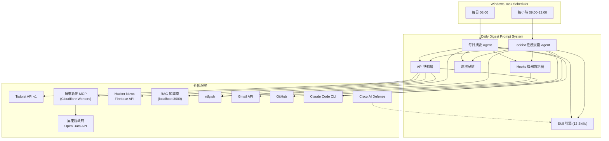

# Daily Digest Prompt -- 系統需求文件 (SRD)

---

## 1. 文件資訊

### 1.1 文件目的

本文件定義 Daily Digest Prompt 系統的功能需求、非功能需求、外部介面需求與約束條件。作為系統設計、實作、測試與驗收的唯一規範來源，確保所有子系統（每日摘要、Todoist 任務規劃、通知、記憶、快取、安全防護、Skill 引擎）的行為可追蹤、可驗證。

### 1.2 範圍

本文件涵蓋以下子系統：

| 子系統 | 說明 |
|--------|------|
| 每日摘要 (Daily Digest) | 自動彙整待辦事項、新聞、AI 動態、習慣/學習提示、禪語並推播通知 |
| Todoist 任務規劃 (Todoist Planner) | 每小時查詢待辦、路由篩選、自動執行、品質驗證 |
| 通知子系統 (Notification) | 透過 ntfy.sh 推播執行結果與告警 |
| 記憶與狀態 (Memory & State) | 跨次記憶持久化、排程狀態追蹤 |
| 快取子系統 (Cache) | API 回應快取與降級機制 |
| 安全防護 (Harness) | Hooks 機器強制層，攔截違規操作 |
| Skill 引擎 (Skill Engine) | Skill-First 策略、索引路由、鏈式組合 |

### 1.3 術語表

**Agent**：由 Claude Code CLI 驅動的自動化執行單元，讀取 Prompt 文件後依指示完成任務。

**DONE_CERT**：子 Agent 任務完成後輸出的結構化 JSON 認證，包含 status、checklist、self_assessment 等欄位，用於品質閘門判定。格式定義見 `templates/shared/done-cert.md`。

**Harness（機器強制層）**：透過 Claude Code Hooks 在 runtime 攔截工具呼叫的安全機制，違規操作在執行前被阻斷，取代依賴 Agent 自律的舊模式。

**Heartbeat**：版本控制的排程元資料文件 (`HEARTBEAT.md`)，定義所有排程的觸發時間、腳本、超時與重試策略。

**Hook**：Claude Code 提供的事件攔截機制，分為 PreToolUse（工具執行前）、PostToolUse（工具執行後）、Stop（Session 結束時）三類。

**MCP (Model Context Protocol)**：模型上下文協議，屏東新聞服務透過 Cloudflare Workers 實作 MCP 端點，以 JSON-RPC 格式提供新聞查詢。

**Pipeline（管線）**：每日摘要的執行流程定義，由 `config/pipeline.yaml` 描述 init -> steps -> finalize 三階段。

**Skill**：自包含的行為指引文件 (SKILL.md)，定義特定能力的觸發條件、操作步驟、API 端點與注意事項。Agent 必須先讀取 SKILL.md 再執行對應操作。

**Skill-First 策略**：本專案的最高設計原則——所有行為都由 Skill 指引，禁止自行拼湊已有 Skill 覆蓋的邏輯。

**TaskSense**：Todoist 任務優先級計分機制，公式為 `綜合分數 = Todoist 優先級分 x 信心度 x 描述加成`。定義見 `config/scoring.yaml`。

**TTL (Time To Live)**：快取有效期限，各 API 來源有不同的 TTL 設定，定義於 `config/cache-policy.yaml`。

**三層路由**：Todoist 任務篩選機制，依序為 Tier 1 標籤路由（信心度 100%）、Tier 2 關鍵字路由（信心度 80%）、Tier 3 LLM 語義判斷（信心度 60%）。定義見 `config/routing.yaml`。

**降級 (Degradation)**：API 呼叫失敗時，自動使用過期但仍在降級時限（24 小時）內的快取資料繼續執行，避免整體流程中斷。

**精練迴圈 (Refinement Loop)**：子 Agent 任務未通過品質閘門時，最多重試 3 次的迭代修正流程。每次精練聚焦於殘留問題，而非重新執行。

**薄層調度器**：Prompt 的設計原則——Prompt 只含角色宣告、步驟骨架、容錯語義，數據型邏輯全部外部化到 YAML 配置與 Markdown 模板。

### 1.4 參考文件

| 文件 | 路徑 | 說明 |
|------|------|------|
| 專案指引 | `CLAUDE.md` | 專案架構、執行流程、技術棧、慣例 |
| Skill 索引 | `skills/SKILL_INDEX.md` | 13 個 Skill 速查表與路由引擎 |
| 排程定義 | `HEARTBEAT.md` | 排程觸發時間與超時設定 |
| 管線配置 | `config/pipeline.yaml` | 每日摘要管線步驟定義 |
| 路由配置 | `config/routing.yaml` | Todoist 三層路由規則 |
| 快取策略 | `config/cache-policy.yaml` | 各 API 快取 TTL |
| 計分規則 | `config/scoring.yaml` | TaskSense 優先級計分 |
| 通知配置 | `config/notification.yaml` | ntfy 通知設定 |
| 頻率限制 | `config/frequency-limits.yaml` | 自動任務頻率上限 |
| 摘要格式 | `config/digest-format.md` | 摘要輸出排版模板 |
| 共用前言 | `templates/shared/preamble.md` | nul 禁令 + Skill-First 規則 |
| 品質閘門 | `templates/shared/quality-gate.md` | 驗證閘門流程 |
| DONE 認證 | `templates/shared/done-cert.md` | 子 Agent 完成認證格式 |

### 1.5 文件慣例

本文件採用以下編號體系：

| 前綴 | 類別 | 範例 |
|------|------|------|
| FR-DIG | 每日摘要功能需求 | FR-DIG-001 |
| FR-TOD | Todoist 任務規劃功能需求 | FR-TOD-001 |
| FR-NTF | 通知功能需求 | FR-NTF-001 |
| FR-MEM | 記憶與狀態功能需求 | FR-MEM-001 |
| FR-CAC | 快取功能需求 | FR-CAC-001 |
| FR-SEC | 安全與防護功能需求 | FR-SEC-001 |
| FR-SKL | Skill 引擎功能需求 | FR-SKL-001 |
| NFR-PERF | 效能非功能需求 | NFR-PERF-001 |
| NFR-AVAIL | 可用性非功能需求 | NFR-AVAIL-001 |
| NFR-MAINT | 可維護性非功能需求 | NFR-MAINT-001 |
| NFR-SEC | 安全非功能需求 | NFR-SEC-001 |
| NFR-COMP | 相容性非功能需求 | NFR-COMP-001 |
| EXT | 外部服務整合需求 | EXT-001 |

---

## 2. 系統概述

### 2.1 系統目標與願景

Daily Digest Prompt 是一套全自動的每日資訊彙整與任務規劃系統，核心目標：

1. **每日自動化摘要**：定時彙整待辦事項、在地新聞（含政策解讀）、AI 技術動態、習慣提示、學習技巧與禪語，透過推播通知送達使用者。
2. **每小時任務規劃**：自動查詢 Todoist 待辦、篩選可由 CLI 處理的項目、執行任務並回報結果。無待辦時執行自動任務（楞嚴經研究、Log 審查、Git 推送）。
3. **跨次記憶**：受 NanoClaw 架構啟發，實現連續天數追蹤、待辦完成率統計、Skill 使用統計等跨次持久化。
4. **容錯降級**：API 快取 + 過期降級機制，確保單一外部服務故障不影響整體摘要產出。
5. **機器強制安全**：透過 Hooks 在 runtime 攔截危險操作，從 Agent 自律升級到 Harness 強制。

### 2.2 系統上下文圖

### 2.3 使用者角色

| 角色 | 說明 | 互動方式 |
|------|------|---------|
| 自動排程 (Automated Scheduler) | Windows Task Scheduler 定時觸發，無人值守 | 透過 cron 表達式觸發 PowerShell 腳本 |
| 資訊接收者 (Information Consumer) | 接收每日摘要與任務執行結果的使用者 | 透過 ntfy 行動裝置推播接收通知 |
| 開發維護者 (Developer/Maintainer) | 維護 Prompt、配置、Skill 與腳本的開發者 | 修改配置檔、查看日誌、執行健康檢查 |

### 2.4 運行環境

| 項目 | 規格 |
|------|------|
| 作業系統 | Windows 11 Pro |
| Shell | PowerShell 7 (pwsh) |
| Agent 執行引擎 | Claude Code CLI (`claude -p`) |
| Python | 3.8+（Hooks 使用；Windows 必須用 `python` 而非 `python3`） |
| 排程器 | Windows Task Scheduler |
| 編碼 | UTF-8（pwsh 7 預設） |
| Node.js | 需安裝 npm（Claude Code CLI 透過 npm 安裝） |

---

## 3. 外部服務整合需求

### 3.1 外部服務總覽與角色矩陣

| 服務 | 角色定位 | 對應 Skill | 快取 TTL | 降級時限 | 認證方式 | 必要性 |
|------|---------|-----------|---------|---------|---------|--------|
| RAG 知識庫 | 知識持久化與智慧去重 | knowledge-query | 60 分鐘 | 24 小時 | 無（localhost） | 選用 |
| Todoist API v1 | 待辦事項管理核心 | todoist | 30 分鐘 | 24 小時 | Bearer Token | 必要 |
| ntfy.sh | 推播通知管道 | ntfy-notify | 無快取 | 不適用 | 無（公開 topic） | 必要 |
| Claude Code CLI | Agent 執行引擎 | 無（基礎設施） | 不適用 | 不適用 | Anthropic API Key | 必要 |
| Windows Task Scheduler | 排程入口 | scheduler-state | 不適用 | 不適用 | 系統服務 | 必要 |
| Cloudflare Workers (MCP) | 屏東新聞服務 | pingtung-news | 360 分鐘 | 24 小時 | 無（公開） | 選用 |
| GitHub | 版本控制與自動推送 | 無（自動任務） | 不適用 | 不適用 | SSH Key / Token | 選用 |
| Gmail API | 郵件讀取 | gmail | 30 分鐘 | 24 小時 | OAuth 2.0 | 選用 |
| Hacker News Firebase API | AI 技術動態 | hackernews-ai-digest | 120 分鐘 | 24 小時 | 無（公開） | 選用 |
| Cisco AI Defense | Skill 安全掃描 | skill-scanner | 不適用 | 不適用 | 無（本地工具） | 選用 |

### 3.2 RAG 知識庫 (localhost:3000)

**角色**：系統的知識持久化層。儲存研究成果、新聞摘要、學習筆記，並透過混合搜索（語義 + BM25 關鍵字）提供去重與回顧功能。是 Skill 鏈式組合的核心匯聚點——多個 Skill 的產出最終都可匯入知識庫。

**功能需求**：
- 查詢最近筆記（`GET /api/notes?limit=N`）
- 混合搜索（`POST /api/search/hybrid`，參數：query, topK）
- 建立筆記（`POST /api/notes`，必填 contentText，source 僅接受 `manual`/`web`/`import`）
- 取得統計（`GET /api/stats`，回傳 total_notes）
- 健康檢查（`GET /api/health`）

**整合方式**：
- 協議：HTTP REST
- 端點：`http://localhost:3000`
- 認證：無（本地服務）
- 呼叫工具：Bash curl

**快取策略**：
- TTL：60 分鐘（定義於 `config/cache-policy.yaml`）
- 快取檔案：`cache/knowledge.json`
- 降級時限：24 小時

**錯誤處理**：
- 服務未啟動（連線拒絕）：跳過知識庫區塊，摘要中標註「知識庫服務未啟動」
- 匯入失敗：不影響整體流程，記錄「知識庫匯入：0 則」
- 混合搜索無結果：正常情況，繼續執行

**已知限制與踩坑經驗**：
- `content` 欄位為 Tiptap JSON 格式，匯入時**不填**，後端從 `contentText` 自動生成
- `source` 欄位僅接受三個值：`manual`、`web`、`import`，填入其他值會失敗
- 新匯入的筆記可能需要時間索引，立即搜索可能找不到
- 去重閾值：hybrid search score > 0.85 視為重複，跳過匯入

### 3.3 Todoist API v1

**角色**：系統的待辦事項管理核心。提供任務查詢、新增、完成、刪除等完整功能，是 Todoist 任務規劃 Agent 的主要資料來源。

**功能需求**：
- 篩選今日待辦（`GET /api/v1/tasks/filter?query=today`）
- 取得任務詳情（`GET /api/v1/tasks/{id}`）
- 關閉任務（`POST /api/v1/tasks/{id}/close`）
- 新增任務（`POST /api/v1/tasks`，Windows 必須用 `-d @file.json`）
- 新增評論（`POST /api/v1/comments`）
- 更新任務（`POST /api/v1/tasks/{id}`，支援 priority、due_string）

**整合方式**：
- 協議：HTTPS REST
- 基礎端點：`https://api.todoist.com/api/v1/`
- 認證：Bearer Token（環境變數 `TODOIST_API_TOKEN`）
- 呼叫工具：Bash curl

**快取策略**：
- TTL：30 分鐘（定義於 `config/cache-policy.yaml`）
- 快取檔案：`cache/todoist.json`
- 特殊規則：Todoist Agent（每小時執行）不使用快取（需即時資料），僅每日摘要使用快取
- 降級時限：24 小時

**錯誤處理**：
- 410 Gone：舊版 REST API v2 已棄用，須使用 `/api/v1/`
- 401 Unauthorized：Token 無效或過期
- 429 Rate Limited：Todoist API 限流
- API 失敗時如實報告，禁止捏造待辦事項

**已知限制與踩坑經驗**：
- **篩選端點變更**：`/api/v1/tasks?filter=` 的 `filter` 參數被靜默忽略（回傳全部任務）。正確端點為 `/api/v1/tasks/filter?query=today`
- **回應格式變更**：列表查詢回傳 `{ "results": [...], "next_cursor": ... }`，不再是直接陣列
- **Task ID 格式**：從純數字改為英數混合字串
- **Windows POST 問題**：inline JSON（`-d '{...}'`）在 Windows Bash 會失敗（error_code 42），必須用 Write 工具建立 JSON 檔案再用 `-d @file.json` 發送
- **循環任務重複關閉**：每次 close 後 Todoist 自動將截止日期推進到下一週期，同日多次執行需透過截止日期過濾 + 已關閉 ID 排除防止重複

### 3.4 ntfy.sh

**角色**：系統的推播通知管道。所有摘要結果、任務執行報告、Harness 告警都透過 ntfy 推送到使用者的行動裝置。

**功能需求**：
- 發送每日摘要通知（含標題、內容、tags）
- 發送 Todoist 執行結果通知（含統計、成功/失敗/跳過列表）
- 發送 Harness 安全告警（含嚴重等級、攔截詳情）

**整合方式**：
- 協議：HTTPS REST
- 端點：`https://ntfy.sh`
- Topic：`wangsc2025`（定義於 `config/notification.yaml`）
- 認證：無（公開 topic）
- 呼叫工具：Bash curl
- 訊息上限：500 字元（定義於 `config/notification.yaml`）

**快取策略**：無快取（通知為寫入操作）。

**錯誤處理**：
- HTTP 非 200 回應：記錄錯誤但不中斷流程
- 網路不可達：通知失敗不影響摘要生成

**已知限制與踩坑經驗**：
- **Windows 環境必須用 JSON 檔案方式發送**：不可用 inline JSON 字串（會亂碼）
- **必須加 charset=utf-8 header**：`curl -H "Content-Type: application/json; charset=utf-8" -d @file.json https://ntfy.sh`
- **必須用 Write 工具建立 JSON 檔**：確保 UTF-8 編碼，不可用 Bash echo 建檔
- **發送後必須刪除暫存 JSON 檔**：`rm ntfy_temp.json`
- 發送步驟定義於 `config/notification.yaml` 的 `send_steps`

### 3.5 Claude Code CLI

**角色**：系統的 Agent 執行引擎。所有 Agent（每日摘要、Todoist 任務規劃、子 Agent）都透過 `claude -p` 執行。

**功能需求**：
- 以管道模式執行 Prompt（`echo $PROMPT | claude -p --allowedTools "工具清單"`）
- 支援工具白名單控制（`--allowedTools`）
- 支援 Hooks 事件攔截（PreToolUse、PostToolUse、Stop）

**整合方式**：
- 安裝：`npm install -g @anthropic-ai/claude-code`
- 執行：PowerShell 腳本透過 `Start-Job` 啟動
- 認證：Anthropic API Key（環境變數）
- 工作目錄：`D:\Source\daily-digest-prompt`

**快取策略**：不適用。

**錯誤處理**：
- 指令不存在：腳本檢查 `Get-Command claude` 並提示安裝
- 非零退出碼：記錄警告，觸發重試邏輯
- Timeout：由 PowerShell 腳本 `Wait-Job -Timeout` 控制

**已知限制與踩坑經驗**：
- 每日摘要 Agent 使用工具白名單 `Read,Bash,Write`
- 子 Agent 根據任務類型動態設定工具白名單（詳見 `config/routing.yaml` 的 `allowed_tools`）

### 3.6 Windows Task Scheduler

**角色**：系統的排程入口。依據 `HEARTBEAT.md` 定義的 cron 表達式定時觸發 PowerShell 腳本。

**功能需求**（5 個排程，定義於 `HEARTBEAT.md`）：

| 排程名稱 | 觸發時間 | 腳本 | 超時 | 說明 |
|---------|---------|------|------|------|
| daily-digest-am | 每日 08:00 | run-agent-team.ps1 | 300s | 每日摘要 - 早 |
| daily-digest-mid | 每日 11:15 | run-agent-team.ps1 | 300s | 每日摘要 - 午 |
| daily-digest-pm | 每日 21:15 | run-agent-team.ps1 | 300s | 每日摘要 - 晚 |
| todoist-single | 每小時整點 02:00-23:00 | run-todoist-agent.ps1 | 1800s | Todoist 單一模式 |
| todoist-team | 每小時半點 02:30-23:30 | run-todoist-agent-team.ps1 | 1200s | Todoist 團隊模式 |

**整合方式**：
- 設定工具：`setup-scheduler.ps1 -FromHeartbeat`（從 `HEARTBEAT.md` 讀取排程定義）
- 執行程式：`pwsh.exe`（PowerShell 7）
- 參數：`-ExecutionPolicy Bypass -File <script>.ps1`

**快取策略**：不適用。

**錯誤處理**：
- 排程未註冊：手動執行 `setup-scheduler.ps1`
- 觸發時系統休眠：Windows 預設在喚醒後執行錯過的排程

**已知限制與踩坑經驗**：
- 排程名稱：`ClaudeDailyDigest`（可透過 `schtasks /query /tn ClaudeDailyDigest /v` 查詢）
- 必須使用 `pwsh.exe` 而非 `powershell.exe`（PS 5.1 的 UTF-8 與 Start-Job 問題）

### 3.7 Cloudflare Workers (MCP) -- 屏東新聞服務

**角色**：屏東縣政府新聞的 MCP 中繼服務。因縣府原始 API 間歇性不穩定（521 錯誤），透過 Cloudflare Workers 提供穩定的 JSON-RPC 介面。

**功能需求**：
- 取得最新新聞（`pingtung_news_latest`，參數：count 1-50，預設 10）
- 關鍵字搜尋（`pingtung_news_search`，參數：keyword 必填，limit 1-100）
- 日期範圍查詢（`pingtung_news_by_date`，參數：start/end YYYY-MM-DD）

**整合方式**：
- 協議：HTTPS JSON-RPC（MCP 格式）
- 端點：`https://ptnews-mcp.pages.dev/mcp`
- 認證：無（公開）
- 呼叫方式：`curl -s -X POST ... -d '{"jsonrpc":"2.0","id":1,"method":"tools/call","params":{"name":"<tool>","arguments":{...}}}'`
- 上游資料源：`https://www.pthg.gov.tw/OpenDataForm.aspx?s=05393D58A2AA3E5B`

**快取策略**：
- TTL：360 分鐘 / 6 小時（定義於 `config/cache-policy.yaml`）
- 快取檔案：`cache/pingtung-news.json`
- 降級時限：24 小時

**錯誤處理**：
- 521 Web Server Is Down：縣府原始 API 間歇性不穩定，MCP 服務每次即時抓取會連帶失敗
- **重試機制**（必須）：遇到 521 錯誤不放棄，自動重試最多 5 次，每次間隔 2 秒

**已知限制與踩坑經驗**：
- 資料範圍：2022-12-25 起（周春米縣長就職日）
- MCP 服務本身穩定，但上游 API 不穩定是主要風險
- 必搭配 `pingtung-policy-expert` Skill 進行政策解讀（詳見 `skills/pingtung-policy-expert/SKILL.md`）

### 3.8 GitHub

**角色**：版本控制與自動推送。Todoist Agent 的自動任務之一（Git push），以及 @code 標籤任務的版本管理。

**功能需求**：
- `git add` / `git commit` / `git push`
- `git status` / `git diff`（外部驗證用）

**整合方式**：
- 協議：SSH / HTTPS
- 認證：SSH Key 或 Personal Access Token
- 呼叫工具：Bash git

**快取策略**：不適用。

**錯誤處理**：
- push 失敗：記錄錯誤，任務標記為失敗
- force push 防護：由 `pre_bash_guard.py` Hook 攔截 `git push --force` 到 main/master

**已知限制與踩坑經驗**：
- 自動任務 Git push 每日上限 2 次（定義於 `config/frequency-limits.yaml`）

### 3.9 Gmail API

**角色**：郵件讀取服務。團隊模式下由 `fetch-gmail.md` Agent 擷取未讀/重要郵件摘要，納入每日摘要。

**功能需求**：
- 查詢未讀郵件
- 查詢重要郵件
- 查詢特定寄件者郵件

**整合方式**：
- 協議：HTTPS REST
- 端點：`https://gmail.googleapis.com/gmail/v1`
- 認證：OAuth 2.0（需 credentials.json + token.json）
- 環境變數：`GMAIL_CREDENTIALS_PATH`、`GMAIL_TOKEN_PATH`
- 呼叫工具：Python 腳本（google-api-python-client）
- 前置套件：`pip install google-api-python-client google-auth-httplib2 google-auth-oauthlib`

**快取策略**：
- TTL：30 分鐘（定義於 `config/cache-policy.yaml`）
- 快取檔案：`cache/gmail.json`
- 降級時限：24 小時

**錯誤處理**：
- Token 過期：需重新授權
- 連線失敗：使用降級快取

**已知限制與踩坑經驗**：
- 首次授權需開啟瀏覽器手動操作
- credentials.json 和 token.json 為敏感檔案，受 Hook 保護禁止 Agent 寫入

### 3.10 Hacker News Firebase API

**角色**：AI 技術動態來源。從 HN 熱門文章中篩選 AI 相關話題，為每日摘要提供技術資訊區塊。

**功能需求**：
- 取得熱門文章 ID（`GET /v0/topstories.json`）
- 取得文章詳情（`GET /v0/item/{id}.json`）
- AI 關鍵字篩選（AI, LLM, GPT, Claude, OpenAI, Anthropic, Gemini, DeepSeek, machine learning, deep learning, neural network, transformer, diffusion, RAG, fine-tuning, AGI）

**整合方式**：
- 協議：HTTPS REST
- 端點：`https://hacker-news.firebaseio.com/v0`
- 認證：無（公開 API）
- 呼叫工具：Bash curl
- 掃描範圍：前 30 筆熱門文章，篩選後取前 3-5 則

**快取策略**：
- TTL：120 分鐘 / 2 小時（定義於 `config/cache-policy.yaml`）
- 快取檔案：`cache/hackernews.json`
- 降級時限：24 小時

**錯誤處理**：
- API 不可達：使用降級快取
- 無 AI 相關文章：記錄「無 AI 相關動態」

**已知限制與踩坑經驗**：
- 需逐筆取得文章詳情（無批量 API），30 筆約需 30 次 curl 呼叫
- HN 熱度 >= 300 的突破性技術文章標記為知識庫匯入候選（定義於 `config/pipeline.yaml`）

### 3.11 Cisco AI Defense

**角色**：Skill 安全掃描工具。掃描 `skills/` 目錄下所有 Skill，偵測潛在安全風險（prompt injection、data exfiltration、privilege escalation）。

**功能需求**：
- 掃描全部 Skills（`skill-scanner.exe scan-all <path> --recursive`）
- 掃描單一 Skill（`skill-scanner.exe scan <path>`）
- 含行為分析（`--use-behavioral`，Python AST dataflow）
- 多種輸出格式（summary / json / markdown / table / sarif）

**整合方式**：
- 工具路徑：`D:/Python311/Scripts/skill-scanner.exe`
- 呼叫工具：Bash（本地執行）
- 便捷腳本：`scan-skills.ps1`

**快取策略**：不適用（掃描為即時操作）。

**錯誤處理**：
- 工具不存在：跳過安全掃描
- 掃描發現風險：記錄風險等級與詳情

**已知限制與踩坑經驗**：
- 在團隊模式 Phase 1 中由 `fetch-security.md` Agent 執行
- CI 模式（`--fail-on-findings`）可在發現風險時回傳非零退出碼

### 3.12 外部服務依賴矩陣

下表描述各子系統對外部服務的依賴關係：

| 子系統 | Todoist | MCP 新聞 | HN API | 知識庫 | ntfy | Gmail | GitHub | Claude CLI | Scheduler | Cisco |
|--------|---------|---------|--------|--------|------|-------|--------|-----------|-----------|-------|
| 每日摘要（單一模式） | 必要 | 選用 | 選用 | 選用 | 必要 | -- | -- | 必要 | 必要 | -- |
| 每日摘要（團隊模式） | 必要 | 選用 | 選用 | 選用 | 必要 | 選用 | -- | 必要 | 必要 | 選用 |
| Todoist 任務規劃 | 必要 | -- | -- | 選用 | 必要 | -- | 選用 | 必要 | 必要 | -- |
| Harness 告警 | -- | -- | -- | -- | 必要 | -- | -- | -- | -- | -- |

說明：「必要」= 服務不可用時子系統無法運作；「選用」= 服務不可用時透過降級/跳過繼續運作；「--」= 不使用。

---

## 4. 功能需求

### 4.1 每日摘要功能群 (FR-DIG-xxx)

#### FR-DIG-001：管線初始化

- **描述**：Agent 啟動後依序載入共用前言、Skill 索引、管線定義與快取策略，建立本次執行的完整認知。
- **觸發條件**：每日摘要 Agent 開始執行。
- **前置條件**：以下文件存在且可讀取：`templates/shared/preamble.md`、`skills/SKILL_INDEX.md`、`config/pipeline.yaml`、`config/cache-policy.yaml`。
- **處理邏輯**：
  1. 讀取 `templates/shared/preamble.md`（nul 禁令 + Skill-First 核心規則）
  2. 讀取 `skills/SKILL_INDEX.md`（12 個核心 Skill + 1 個工具 Skill 的速查表與路由引擎）
  3. 讀取 `config/pipeline.yaml` 取得 init / steps / finalize 三階段定義
  4. 讀取 `config/cache-policy.yaml` 取得各 API 的 TTL 與降級時限
  5. 依 `pipeline.yaml` 的 `init` 區段執行：載入 Skill 索引、讀取記憶、載入快取策略、讀取排程狀態（唯讀）
- **預期輸出**：Agent 內部建立完整的 Skill 認知地圖、管線步驟清單、快取策略表。
- **驗收條件**：Agent 在執行任何步驟前已讀取上述 4 個文件，且 pipeline.yaml 的 init 階段全部完成。

#### FR-DIG-002：待辦事項彙整

- **描述**：查詢 Todoist API 取得今日待辦事項清單，作為摘要的第一個內容區塊。
- **觸發條件**：管線 `steps` 中 `id: todoist` 步驟被執行。
- **前置條件**：已完成 FR-DIG-001 管線初始化；`TODOIST_API_TOKEN` 環境變數已設定。
- **處理邏輯**：
  1. 讀取 `skills/todoist/SKILL.md`（詳見該文件）
  2. 依 `config/cache-policy.yaml` 檢查 `cache/todoist.json` 是否有效（TTL 30 分鐘）
  3. 快取有效 -> 使用快取；快取過期或不存在 -> 呼叫 Todoist API `GET /api/v1/tasks/filter?query=today`
  4. API 失敗 -> 若快取在 24 小時降級時限內，使用過期快取並標記降級
  5. 將結果寫入快取 `cache/todoist.json`
- **預期輸出**：摘要中「今日待辦」區塊，列出今日所有待辦事項。
- **驗收條件**：摘要包含待辦事項列表（或降級標記），API 呼叫前已檢查快取。

#### FR-DIG-003：屏東新聞查詢與政策解讀

- **描述**：查詢屏東縣政府最新新聞並搭配政策解讀，形成 Skill 鏈式組合：`pingtung-news -> pingtung-policy-expert -> knowledge-query`。
- **觸發條件**：管線 `steps` 中 `id: news` 步驟被執行。
- **前置條件**：已完成 FR-DIG-001。
- **處理邏輯**：
  1. 讀取 `skills/pingtung-news/SKILL.md` 與 `skills/pingtung-policy-expert/SKILL.md`
  2. 依快取策略檢查 `cache/pingtung-news.json`（TTL 360 分鐘）
  3. 透過 MCP 端點查詢最新新聞（含 5 次重試機制）
  4. 對每則新聞進行政策背景解讀（必搭配 policy-expert）
  5. 執行 `post_actions`：RAG 增強（用知識庫搜尋相關政策筆記）、標記匯入候選（預算破億/新建設啟用/首創計畫/縣長出席）、民眾有感度 10 分制評分
  6. 步驟失敗不中斷整體流程
- **預期輸出**：摘要中「本週屏東新聞」區塊，每則新聞含標題、政策背景解讀、民眾有感度評分。
- **驗收條件**：至少 1 則新聞有政策解讀（摘要含「政策背景」區塊）。

#### FR-DIG-004：AI 技術動態擷取

- **描述**：從 Hacker News 熱門文章中篩選 AI 相關話題，產出中文摘要。
- **觸發條件**：管線 `steps` 中 `id: hackernews` 步驟被執行。
- **前置條件**：已完成 FR-DIG-001。
- **處理邏輯**：
  1. 讀取 `skills/hackernews-ai-digest/SKILL.md`（詳見該文件）
  2. 依快取策略檢查 `cache/hackernews.json`（TTL 120 分鐘）
  3. 取得 HN Top 30 熱門文章 ID，逐筆取得詳情
  4. 以 AI 關鍵字篩選，取前 3-5 則
  5. 執行 `post_actions`：RAG 增強、標記 score >= 300 為匯入候選、將結果寫入 RAG 知識庫
- **預期輸出**：摘要中「AI 技術動態」區塊，含中文翻譯標題、熱度分數、評論數。
- **驗收條件**：摘要包含 AI 動態區塊（或無 AI 相關文章的記錄）。

#### FR-DIG-005：習慣提示生成

- **描述**：依據《原子習慣》一書，按星期輪替生成每日習慣提示。
- **觸發條件**：管線 `steps` 中 `id: habits` 步驟被執行。
- **前置條件**：已完成 FR-DIG-001。
- **處理邏輯**：
  1. 讀取 `skills/atomic-habits/SKILL.md`（詳見該文件）
  2. 依當日星期決定習慣主題
  3. 生成一則簡潔的習慣提示
- **預期輸出**：摘要中「今日習慣提示」區塊。
- **驗收條件**：摘要包含一則《原子習慣》相關提示。

#### FR-DIG-006：學習技巧生成

- **描述**：依據《深度學習的技術》，按五層框架輪替生成每日學習技巧。
- **觸發條件**：管線 `steps` 中 `id: learning` 步驟被執行（`required: true`，不可跳過）。
- **前置條件**：已完成 FR-DIG-001。
- **處理邏輯**：
  1. 讀取 `skills/learning-mastery/SKILL.md`（詳見該文件）
  2. 依五層框架決定今日技巧主題
  3. 生成一則學習技巧
- **預期輸出**：摘要中「今日學習技巧」區塊。
- **驗收條件**：摘要必須包含學習技巧區塊（此步驟標記為 required，不可跳過）。

#### FR-DIG-007：知識庫查詢與智慧匯入

- **描述**：查詢知識庫最近筆記並進行智慧匯入判斷——檢查新聞與 AI 動態步驟中標記的匯入候選，去重後匯入。
- **觸發條件**：管線 `steps` 中 `id: knowledge` 步驟被執行。
- **前置條件**：已完成 FR-DIG-001；知識庫服務 `localhost:3000` 運行中。
- **處理邏輯**：
  1. 讀取 `skills/knowledge-query/SKILL.md`（詳見該文件）
  2. 查詢最近筆記（`GET /api/notes?limit=20`）
  3. 查詢統計（`GET /api/stats`，記錄 total_notes）
  4. 智慧匯入（`sub_actions.smart_import`，定義於 `config/pipeline.yaml`）：
     - 回顧 news 和 hackernews 步驟的匯入候選
     - 去重方法：hybrid search，score > 0.85 表示重複 -> 跳過
     - 無匯入候選：記錄「知識庫匯入：0 則」，仍算通過驗證
     - 匯入失敗不影響整體流程
- **預期輸出**：摘要中「知識庫回顧」區塊，含最近筆記列表與匯入結果。
- **驗收條件**：有嘗試匯入判斷即通過（無值得匯入也算通過）。

#### FR-DIG-008：摘要組裝與格式化

- **描述**：將所有步驟結果依 `config/digest-format.md` 的 12 區塊排版模板組裝為完整摘要。
- **觸發條件**：管線 `finalize` 階段的 `compile_digest` 動作被執行。
- **前置條件**：`steps` 階段已完成（成功或帶有錯誤記錄）。
- **處理邏輯**：
  1. 讀取 `config/digest-format.md` 取得排版模板
  2. 依模板填入各步驟結果，12 個區塊依序為：
     - 連續報到資訊（由 digest-memory 提供）
     - 系統健康度（由 scheduler-state 提供）
     - 今日待辦
     - 本週屏東新聞
     - AI 技術動態
     - 今日習慣提示
     - 今日學習技巧
     - 知識庫回顧
     - 今日郵件摘要（團隊模式限定）
     - 安全審查（團隊模式限定）
     - 佛學禪語
     - Skill 使用報告
- **預期輸出**：格式化的完整摘要文本。
- **驗收條件**：摘要包含所有已成功執行步驟的對應區塊。

#### FR-DIG-009：佛學禪語生成

- **描述**：生成一則佛學禪語作為摘要的結尾內容。
- **觸發條件**：管線 `steps` 中 `id: zen` 步驟被執行。
- **前置條件**：無特殊前置條件（此步驟無對應 Skill，直接生成）。
- **處理邏輯**：生成一則與日常修行、禪宗智慧相關的禪語。
- **預期輸出**：摘要中「佛學禪語」區塊。
- **驗收條件**：摘要包含一則禪語。

### 4.2 Todoist 任務規劃功能群 (FR-TOD-xxx)

#### FR-TOD-001：任務查詢與過濾

- **描述**：查詢 Todoist API 取得今日待辦，並執行截止日期過濾與已關閉 ID 排除，防止循環任務重複關閉。
- **觸發條件**：Todoist 任務規劃 Agent 啟動。
- **前置條件**：`TODOIST_API_TOKEN` 環境變數已設定；已載入 `skills/todoist/SKILL.md`。
- **處理邏輯**：
  1. 呼叫 `GET /api/v1/tasks/filter?query=today` 取得今日待辦
  2. **過濾 A（截止日期驗證）**：取得今天日期，比對 `due.date`——`due.date` <= 今天保留，`due.date` > 今天移除，`due` 為 null 保留
  3. **過濾 B（已關閉 ID 排除）**：讀取 `context/auto-tasks-today.json`，若 date = 今天則取 `closed_task_ids` 排除已關閉任務
  4. 記錄每筆任務的 id、content、description、priority、labels、due
- **預期輸出**：過濾後的任務清單，附帶過濾摘要：`API 回傳 N 筆 -> 截止日期過濾後 M 筆 -> 已關閉 ID 過濾後 K 筆`。
- **驗收條件**：過濾邏輯正確執行，無循環任務被重複處理。

#### FR-TOD-002：三層路由篩選

- **描述**：依 `config/routing.yaml` 的三層路由規則篩選可處理任務，將任務分為「可處理」與「跳過」兩類。
- **觸發條件**：FR-TOD-001 完成且有過濾後的任務。
- **前置條件**：已載入 `config/routing.yaml`。
- **處理邏輯**（詳見 `config/routing.yaml`）：
  1. **前置過濾**：排除實體行動（買東西、運動等）、人際互動（打電話、開會等）、個人事務（繳費、看醫生等），即使帶有 @code 等標籤仍跳過
  2. **Tier 1 標籤路由**（信心度 100%）：比對 labels，支援 @code / @research / @write / @news / @ai / @knowledge，匹配即確定可處理並跳過 Tier 2/3
  3. **Tier 2 關鍵字路由**（信心度 80%）：比對 `skills/SKILL_INDEX.md` 觸發關鍵字，關鍵字命中任何 Skill 即提升為可處理
  4. **Tier 3 LLM 語義判斷**（信心度 60%）：Tier 1/2 未匹配時，根據任務描述語義分析是否屬於可處理類型
  5. 輸出格式：`可處理：[任務ID] 任務名稱 -- Tier N (信心度 XX%) | 匹配 Skill: [...]` 或 `跳過：[任務ID] 任務名稱 -- 跳過原因`
- **預期輸出**：分類後的可處理/跳過任務清單。
- **驗收條件**：每筆任務都有明確的路由層級與信心度標示；前置過濾正確排除非 CLI 可處理任務。

#### FR-TOD-003：優先級計分與排名

- **描述**：依 `config/scoring.yaml` 的 TaskSense 公式計算可處理任務的綜合分數並排名。
- **觸發條件**：FR-TOD-002 完成且有可處理任務。
- **前置條件**：已載入 `config/scoring.yaml`。
- **處理邏輯**（詳見 `config/scoring.yaml`）：
  1. 計算公式：`綜合分數 = Todoist 優先級分 x 信心度乘數 x 描述加成`
  2. 優先級分：p1=4, p2=3, p3=2, p4=1
  3. 信心度乘數：Tier 1=1.0, Tier 2=0.8, Tier 3=0.6
  4. 描述加成：有 description=1.2, 無 description=1.0
  5. 依綜合分由高到低排列，每次最多取前 2 項（`max_tasks_per_run: 2`）
- **預期輸出**：排名表（含排名、任務名、優先級、信心度、綜合分、匹配 Skill）。
- **驗收條件**：排名正確反映計分公式結果，不超過每次最大執行數 2 項。

#### FR-TOD-004：子 Agent 任務執行

- **描述**：為每個可處理任務建立專用 Prompt 並啟動子 Agent 執行。
- **觸發條件**：FR-TOD-003 完成，有排名後的可執行任務。
- **前置條件**：對應的模板文件存在於 `templates/sub-agent/`。
- **處理邏輯**：
  1. 依 `config/routing.yaml` 的 `template` 欄位選取模板：
     - 有 Skill 匹配 -> `templates/sub-agent/skill-task.md`
     - 知識庫/RAG 研究 -> `templates/sub-agent/research-task.md`（含 KB 去重）
     - @code 標籤 -> `templates/sub-agent/code-task.md`（Plan-Then-Execute）
     - 無 Skill 匹配 -> `templates/sub-agent/general-task.md`
  2. 用 Write 工具建立 `task_prompt.md`，依模板填入任務資料
  3. 以 `cat task_prompt.md | claude -p --allowedTools "工具清單" 2>&1` 執行（timeout 600000ms）
  4. 將輸出寫入 `task_result.txt`
- **預期輸出**：子 Agent 執行結果（含 DONE_CERT）。
- **驗收條件**：正確選取模板；子 Agent 輸出包含 DONE_CERT。

#### FR-TOD-005：品質驗證閘門

- **描述**：對子 Agent 執行結果進行結構化驗證，結合自評（DONE_CERT）與外部驗證。
- **觸發條件**：FR-TOD-004 的子 Agent 執行完成。
- **前置條件**：已讀取 `templates/shared/quality-gate.md`（詳見該文件）。
- **處理邏輯**：
  1. 解析 DONE 認證：從 `task_result.txt` 中提取 `===DONE_CERT_BEGIN===` 與 `===DONE_CERT_END===` 之間的 JSON
  2. 外部驗證：
     - @code 任務：`git status` 檢查變更、`python -m py_compile` 語法檢查、測試套件
     - @research 任務：檢查產出物是否存在、輸出超過 100 字
     - 一般任務：exit code 檢查
  3. 綜合判定：`通過 = (status == "DONE") AND (quality_score >= 3) AND (remaining_issues 為空) AND (外部驗證全部通過)`
- **預期輸出**：通過/未通過判定結果。
- **驗收條件**：品質閘門正確執行自評解析與外部驗證。

#### FR-TOD-006：精練迴圈

- **描述**：未通過品質閘門的任務進入迭代精練，最多 3 次（初始 + 2 次精練）。
- **觸發條件**：FR-TOD-005 判定未通過且可精練。
- **前置條件**：已讀取 `templates/sub-agent/refinement.md`。
- **處理邏輯**：
  1. 判斷是否可精練：
     - `iteration_number >= 3` -> 放棄，進入失敗處理
     - `cert_status == "FAILED"` 且 `remaining_issues` 為空 -> 不可精練
     - 環境問題（Token 缺失、服務不可用）-> 不可精練
  2. 可精練 -> 讀取 `templates/sub-agent/refinement.md` 建立聚焦修正 Prompt
  3. 重新執行子 Agent -> 回到 FR-TOD-005 驗證
- **預期輸出**：精練後的執行結果與驗證判定。
- **驗收條件**：精練次數不超過 3 次；每次精練聚焦於殘留問題。

#### FR-TOD-007：任務完成與失敗處理

- **描述**：根據品質閘門結果，對任務執行完成關閉或失敗降級處理。
- **觸發條件**：FR-TOD-005 或 FR-TOD-006 產出最終判定。
- **前置條件**：已載入 `skills/todoist/SKILL.md`。
- **處理邏輯**：
  - **通過**：
    1. 呼叫 Todoist API 關閉任務（`POST /api/v1/tasks/{id}/close`）
    2. 附加完成評論（含迭代次數、品質分數）
    3. 記錄已關閉 ID 到 `context/auto-tasks-today.json` 的 `closed_task_ids`
  - **失敗（Back-Pressure）**：
    1. 任務保持 open 狀態
    2. 若 priority > 1，降低 1 級
    3. 設 `due_string = "tomorrow"`
    4. 添加失敗評論（含迭代次數、最終狀態、殘留問題、下次處理建議）
  - **清理**：刪除 `task_prompt.md`、`task_result.txt`、`task_prompt_refine.md`
- **預期輸出**：Todoist 任務狀態更新、已關閉 ID 記錄更新。
- **驗收條件**：通過的任務已關閉且有評論；失敗的任務已延遲至明日且降低優先級。

#### FR-TOD-008：自動任務執行

- **描述**：無可處理的 Todoist 待辦時，依頻率限制執行自動任務。
- **觸發條件**：FR-TOD-002 篩選後無可處理項目。
- **前置條件**：已載入 `config/frequency-limits.yaml`。
- **處理邏輯**（詳見 `config/frequency-limits.yaml`）：
  1. 讀取 `context/auto-tasks-today.json`，依歸零邏輯判斷日期（不存在 -> 建立初始檔案；date != 今天 -> 歸零重建；date == 今天 -> 沿用計數）
  2. 依 execution_order 順序嘗試執行：
     - **楞嚴經研究**（每日上限 3 次）：讀取 `templates/auto-tasks/shurangama-research.md`，含 KB 去重
     - **系統 Log 審查**（每日上限 1 次）：讀取 `templates/auto-tasks/log-audit.md`
     - **專案推送 GitHub**（每日上限 2 次）：讀取 `templates/auto-tasks/git-push.md`
  3. 全部達上限 -> 直接跳到通知步驟
  4. 完成後更新 `context/auto-tasks-today.json` 計數 + `state/todoist-history.json` 歷史
- **預期輸出**：自動任務執行結果（或全部達上限的跳過記錄）。
- **驗收條件**：頻率限制正確執行，各任務不超過每日上限。

### 4.3 通知功能群 (FR-NTF-xxx)

#### FR-NTF-001：摘要推播通知

- **描述**：將完整摘要透過 ntfy.sh 推播到使用者裝置。
- **觸發條件**：管線 `finalize` 階段的 `send_notification` 動作被執行。
- **前置條件**：已讀取 `skills/ntfy-notify/SKILL.md` 與 `config/notification.yaml`。
- **處理邏輯**：
  1. 組裝通知 payload（topic: `wangsc2025`，訊息上限 500 字元）
  2. 選擇 tags：成功 -> `["white_check_mark", "memo"]`；有警告 -> `["warning", "memo"]`
  3. 用 Write 建立 `ntfy_temp.json`（UTF-8）
  4. `curl -H "Content-Type: application/json; charset=utf-8" -d @ntfy_temp.json https://ntfy.sh`
  5. `rm ntfy_temp.json`
- **預期輸出**：ntfy 推播成功（HTTP 200）。
- **驗收條件**：curl 回應 HTTP 200。

#### FR-NTF-002：Todoist 執行結果通知

- **描述**：將 Todoist 任務執行結果以結構化報告格式推播通知。
- **觸發條件**：Todoist Agent 步驟 5 執行。
- **前置條件**：同 FR-NTF-001。
- **處理邏輯**：
  1. 依 `config/notification.yaml` 的 `todoist_report` 模板組裝報告（含統計、已完成、已失敗、已跳過、Skill 使用統計）
  2. 選擇 tags（依 `config/notification.yaml` 的 `tag_mappings`）：
     - 有完成任務 -> `todoist_success`
     - 無待辦但自動任務完成 -> `todoist_no_tasks_auto_done`
     - 無待辦且自動任務跳過/失敗 -> `todoist_no_tasks`
     - 全部失敗 -> `todoist_all_failed`
  3. 發送流程同 FR-NTF-001
- **預期輸出**：Todoist 執行結果推播通知。
- **驗收條件**：通知包含正確的統計數據與 tags。

#### FR-NTF-003：Harness 自動告警

- **描述**：Session 結束時自動分析結構化日誌，異常時發送 ntfy 告警。
- **觸發條件**：Claude Code Hooks 的 Stop 事件觸發 `on_stop_alert.py`。
- **前置條件**：`logs/structured/YYYY-MM-DD.jsonl` 存在。
- **處理邏輯**（詳見 `hooks/on_stop_alert.py`）：
  1. 讀取今日結構化日誌中自上次分析以來的新條目（offset 追蹤）
  2. 分析：違規攔截事件、工具錯誤、快取繞過
  3. 嚴重等級判定：
     - critical：blocked > 0 且 >= 3，或 errors >= 5
     - warning：blocked 1-2，或 errors 1-4，或快取繞過
     - healthy：無上述問題（不告警，靜默記錄）
  4. 告警 -> 透過 ntfy 推送（tags: `["rotating_light", "shield"]` 或 `["warning", "shield"]`）
  5. 寫入 session summary 到 `logs/structured/session-summary.jsonl`
- **預期輸出**：異常時 ntfy 告警；每次 session 結束都有 summary 記錄。
- **驗收條件**：違規操作被正確偵測並告警；健康 session 靜默記錄。

### 4.4 記憶與狀態功能群 (FR-MEM-xxx)

#### FR-MEM-001：摘要記憶持久化

- **描述**：每次執行讀取並更新 `context/digest-memory.json`，實現跨次記憶。
- **觸發條件**：管線 init 階段讀取記憶、finalize 階段更新記憶。
- **前置條件**：已讀取 `skills/digest-memory/SKILL.md`。
- **處理邏輯**：
  1. 讀取 `context/digest-memory.json`（schema_version=2）
  2. 若不存在 -> first_run 模式，初始化記憶結構
  3. 執行完成後用 Write 工具更新，包含：
     - 待辦統計（完成/總數）
     - 習慣提示/學習技巧連續天數
     - 摘要總結
     - Skill 使用統計（cache_hits / api_calls / cache_degraded）
     - last_run 為今天日期
- **預期輸出**：更新後的 `context/digest-memory.json`。
- **驗收條件**：`last_run` 為今天日期（用 Read 讀回確認）。

#### FR-MEM-002：連續天數追蹤

- **描述**：追蹤摘要執行的連續天數，摘要開頭顯示「連續報到第 N 天」。
- **觸發條件**：FR-MEM-001 讀取記憶時計算。
- **前置條件**：`context/digest-memory.json` 存在且可解析。
- **處理邏輯**：
  - 以本地日期（+08:00 時區）為準
  - 同日多次執行不重複遞增
  - JSON 損壞重置為 1
  - 跨日（前一天有執行 -> 連續天數 +1；前一天無執行 -> 重置為 1）
- **預期輸出**：摘要中「連續報到第 N 天」資訊。
- **驗收條件**：連續天數計算正確，同日不重複遞增。

#### FR-MEM-003：排程狀態管理

- **描述**：記錄每次執行狀態到 `state/scheduler-state.json`，供健康度分析使用。
- **觸發條件**：PowerShell 腳本執行完成時。
- **前置條件**：`state/` 目錄存在。
- **處理邏輯**：
  - **寫入權歸屬**：PowerShell 腳本獨佔寫入，Agent 只讀
  - 每筆記錄包含：timestamp、agent（daily-digest / daily-digest-team / todoist）、status（success / failed / timeout）、duration_seconds、error、log_file
  - 保留上限 200 筆（超過移除最舊記錄）
  - Agent 讀取用途：摘要中顯示系統健康度（成功率、平均耗時）
- **預期輸出**：更新後的 `state/scheduler-state.json`。
- **驗收條件**：Agent 未嘗試寫入（由 Hook 強制保護）；PowerShell 腳本正確寫入。

#### FR-MEM-004：自動任務頻率追蹤

- **描述**：追蹤每日自動任務的執行次數，防止超過頻率限制。
- **觸發條件**：每次 Todoist Agent 執行時讀取/更新。
- **前置條件**：已載入 `config/frequency-limits.yaml`。
- **處理邏輯**：
  - 追蹤檔案：`context/auto-tasks-today.json`
  - 歸零策略：每日歸零——`date` != 今天時重置所有計數與 `closed_task_ids`
  - 計數欄位：`shurangama_count`（上限 3）、`log_audit_count`（上限 1）、`git_push_count`（上限 2）
  - 歷史追蹤：`state/todoist-history.json`（auto_tasks 上限 200 條，daily_summary 上限 30 條）
- **預期輸出**：更新後的頻率追蹤檔案與歷史記錄。
- **驗收條件**：各自動任務未超過每日上限；跨日正確歸零。

### 4.5 快取功能群 (FR-CAC-xxx)

#### FR-CAC-001：API 回應快取

- **描述**：對 5 個外部 API 來源實施統一快取機制。
- **觸發條件**：任何包含 `cache_key` 的管線步驟執行時。
- **前置條件**：已載入 `config/cache-policy.yaml` 與 `skills/api-cache/SKILL.md`。
- **處理邏輯**：
  - 快取目錄：`cache/`
  - 快取檔案與 TTL（定義於 `config/cache-policy.yaml`）：

    | 來源 | 快取檔案 | TTL |
    |------|---------|-----|
    | Todoist | `cache/todoist.json` | 30 分鐘 |
    | 屏東新聞 | `cache/pingtung-news.json` | 360 分鐘 |
    | Hacker News | `cache/hackernews.json` | 120 分鐘 |
    | 知識庫 | `cache/knowledge.json` | 60 分鐘 |
    | Gmail | `cache/gmail.json` | 30 分鐘 |

  - 統一檔案結構：`{ "cached_at": "ISO-8601 UTC", "ttl_minutes": N, "source": "來源名稱", "data": { ... } }`
  - API 成功回應後寫入快取
- **預期輸出**：各來源的快取檔案。
- **驗收條件**：快取檔案結構符合統一格式。

#### FR-CAC-002：快取有效性檢查

- **描述**：每次 API 呼叫前先檢查快取是否在 TTL 內。
- **觸發條件**：任何 API 呼叫前。
- **前置條件**：FR-CAC-001 的快取檔案可能存在。
- **處理邏輯**：
  1. 讀取快取檔案
  2. 解析 `cached_at` + `ttl_minutes` 計算過期時間
  3. 當前時間 < 過期時間 -> 快取有效，使用快取資料
  4. 當前時間 >= 過期時間 -> 快取過期，執行 API 呼叫
- **預期輸出**：快取命中（使用快取）或快取未中（執行 API 呼叫）。
- **驗收條件**：每個 API 呼叫前都先查了快取。

#### FR-CAC-003：降級使用過期快取

- **描述**：API 呼叫失敗時，若快取在降級時限內仍可使用過期資料繼續執行。
- **觸發條件**：API 呼叫失敗（非 2xx 回應或網路錯誤）。
- **前置條件**：快取檔案存在。
- **處理邏輯**：
  1. 降級時限：24 小時（定義於 `config/cache-policy.yaml` 的 `degradation_max_age_hours`）
  2. 快取年齡 <= 24 小時 -> 使用過期快取，標記降級標籤 `"資料來自快取（{time}）"`
  3. 快取年齡 > 24 小時 -> 放棄，該步驟標記為失敗
- **預期輸出**：降級標記的快取資料或失敗記錄。
- **驗收條件**：降級正確觸發且標記可見。

#### FR-CAC-004：快取命中追蹤

- **描述**：追蹤快取使用統計，寫入摘要記憶的 skill_usage 區塊。
- **觸發條件**：每次快取操作時。
- **前置條件**：FR-MEM-001 記憶持久化可用。
- **處理邏輯**（定義於 `config/cache-policy.yaml` 的 `tracking`）：
  - `cache_hits`：每次從快取取得有效資料時 +1
  - `api_calls`：每次執行外部 curl 呼叫時 +1
  - `cache_degraded`：API 失敗且使用過期快取時 +1
  - 寫入 `context/digest-memory.json` 的 `skill_usage` 區塊
- **預期輸出**：摘要中 Skill 使用報告含快取統計。
- **驗收條件**：統計數據正確反映實際快取操作。

### 4.6 安全與防護功能群 (FR-SEC-xxx)

#### FR-SEC-001：PreToolUse 違規攔截

- **描述**：透過 Hooks 在工具執行前攔截違規操作，從 Agent 自律升級到機器強制。
- **觸發條件**：任何 Bash / Write / Edit 工具呼叫。
- **前置條件**：`.claude/settings.json` 已設定 Hooks。
- **處理邏輯**：
  - **Bash 防護**（`hooks/pre_bash_guard.py`）：
    - Rule 1：攔截 nul 重導向（`> nul`、`2>nul`、`> NUL`），回傳改用 `> /dev/null 2>&1` 的提示
    - Rule 2：攔截 Agent 寫入 `scheduler-state.json`（此檔案由 PowerShell 獨佔）
    - Rule 3：攔截 `rm -rf /`（根目錄刪除）
    - Rule 4：攔截 `git push --force` 到 main/master
  - **Write/Edit 防護**（`hooks/pre_write_guard.py`）：
    - Rule 1：攔截 file_path 為 `nul` 的寫入
    - Rule 2：攔截寫入 `scheduler-state.json`
    - Rule 3：攔截寫入敏感檔案（`.env`、`credentials.json`、`token.json`）
  - 攔截時輸出 `{"decision": "block", "reason": "..."}` 並記錄到結構化日誌
- **預期輸出**：違規操作被阻斷，Agent 收到 block reason。
- **驗收條件**：所有定義的違規模式在執行前被攔截。

#### FR-SEC-002：結構化 JSONL 日誌

- **描述**：對每個工具呼叫自動產生結構化 JSONL 記錄，含自動標籤分類。
- **觸發條件**：任何工具呼叫完成後（PostToolUse Hook）。
- **前置條件**：`.claude/settings.json` 已設定 PostToolUse Hook。
- **處理邏輯**（由 `hooks/post_tool_logger.py` 執行）：
  - 日誌路徑：`logs/structured/YYYY-MM-DD.jsonl`
  - 自動標籤分類：
    - `api-call`：Bash 指令含 curl
    - `todoist` / `pingtung-news` / `hackernews` / `knowledge` / `gmail`：URL 模式匹配
    - `cache-read` / `cache-write`：讀寫 `cache/*.json`
    - `skill-read` / `skill-index`：讀取 SKILL.md / SKILL_INDEX.md
    - `memory-read` / `memory-write`：讀寫 `digest-memory.json`
    - `sub-agent`：Bash 指令含 `claude -p`
    - `blocked`：PreToolUse hook 攔截
    - `error`：工具輸出含錯誤關鍵字
  - JSONL 格式：`{"ts":"ISO-8601","sid":"session_id","tool":"Bash","event":"post","summary":"...","output_len":N,"has_error":false,"tags":[...]}`
- **預期輸出**：結構化 JSONL 日誌檔案。
- **驗收條件**：每個工具呼叫都有對應日誌條目，標籤分類正確。

#### FR-SEC-003：Session 健康分析與告警

- **描述**：Session 結束時自動分析結構化日誌，偵測異常並告警。
- **觸發條件**：Claude Code Hooks 的 Stop 事件。
- **前置條件**：FR-SEC-002 的結構化日誌存在。
- **處理邏輯**：同 FR-NTF-003（Harness 自動告警）。
- **預期輸出**：Session summary（`logs/structured/session-summary.jsonl`）+ 異常時 ntfy 告警。
- **驗收條件**：每次 session 結束都有 summary 記錄。

#### FR-SEC-004：敏感檔案保護

- **描述**：防止 Agent 寫入或洩露敏感檔案內容。
- **觸發條件**：Write/Edit 工具呼叫且目標為敏感檔案。
- **前置條件**：FR-SEC-001 的 Write/Edit 防護已啟用。
- **處理邏輯**：
  - 保護名單：`.env`、`credentials.json`、`token.json`
  - 寫入/編輯嘗試 -> 攔截並記錄
- **預期輸出**：寫入被阻斷。
- **驗收條件**：任何敏感檔案的寫入嘗試都被 Hook 攔截。

### 4.7 Skill 引擎功能群 (FR-SKL-xxx)

#### FR-SKL-001：Skill-First 策略執行

- **描述**：確保所有 Agent 行為遵循 Skill-First 最高原則——能用 Skill 就用 Skill。
- **觸發條件**：任何 Agent 啟動時。
- **前置條件**：`templates/shared/preamble.md` 與 `skills/SKILL_INDEX.md` 存在。
- **處理邏輯**：
  1. Agent 啟動首個動作：載入 `skills/SKILL_INDEX.md`
  2. 每個步驟執行前：先讀取對應 SKILL.md
  3. 禁止行為：不讀 SKILL.md 就直接呼叫 API、自行拼 curl 指令、跳過 api-cache
- **預期輸出**：Agent 行為符合 Skill-First 規則。
- **驗收條件**：結構化日誌中每個 API 呼叫前都有對應的 `skill-read` 標籤。

#### FR-SKL-002：Skill 索引與路由引擎

- **描述**：透過 `skills/SKILL_INDEX.md` 提供 Skill 速查、觸發關鍵字比對、路由決策功能。
- **觸發條件**：Agent 需要判斷使用哪個 Skill 時。
- **前置條件**：已載入 `skills/SKILL_INDEX.md`。
- **處理邏輯**（詳見 `skills/SKILL_INDEX.md`）：
  - 12 個核心 Skill + 1 個工具 Skill 的速查表
  - 路由決策樹（無標籤任務的關鍵字 -> Skill 映射）
  - 外部服務對應表（服務 -> Skill -> API 端點）
  - 路由優先順序：標籤（100%）> 關鍵字（80%）> 語義（60%）
- **預期輸出**：正確的 Skill 匹配結果。
- **驗收條件**：任務路由到正確的 Skill。

#### FR-SKL-003：Skill 鏈式組合

- **描述**：積極串聯多個 Skill 實現更高價值，定義 5 種組合模式。
- **觸發條件**：管線步驟含 `chain` 定義或任務匹配 >= 3 個 Skill。
- **前置條件**：已載入 `skills/SKILL_INDEX.md` 的鏈式組合模式。
- **處理邏輯**（詳見 `skills/SKILL_INDEX.md`）：
  - 模式 A（新聞深度解讀鏈）：pingtung-news -> pingtung-policy-expert -> knowledge-query -> ntfy-notify
  - 模式 B（任務智慧執行鏈）：todoist -> knowledge-query -> [執行] -> todoist -> ntfy-notify
  - 模式 C（研究與學習鏈）：hackernews-ai-digest -> knowledge-query -> learning-mastery -> ntfy-notify
  - 模式 D（無待辦自動任務鏈）：todoist -> [D1: 楞嚴經] -> [D2: Log 審查] -> ntfy-notify
  - 模式 E（全流程保護鏈）：digest-memory -> api-cache -> [主要流程] -> digest-memory
- **預期輸出**：Skill 鏈式組合正確串聯。
- **驗收條件**：各 Skill 的輸出正確傳遞為下一個 Skill 的輸入。

#### FR-SKL-004：Skill 使用追蹤

- **描述**：追蹤每次執行使用的 Skill 數量與種類，納入摘要報告。
- **觸發條件**：每個 Skill 被讀取時。
- **前置條件**：FR-SEC-002 結構化日誌已啟用。
- **處理邏輯**：
  - 統計 `skill-read` 標籤出現次數與對應 Skill 名稱
  - 摘要中「Skill 使用報告」區塊：`本次使用 N/12 個 Skill`
- **預期輸出**：摘要中的 Skill 使用統計。
- **驗收條件**：統計數據正確反映實際 Skill 使用情況。

---

## 5. 非功能需求

### 5.1 效能 (NFR-PERF)

#### NFR-PERF-001：單一模式執行時間

- **描述**：每日摘要 Agent 單一模式（`run-agent.ps1`）整體執行時間不超過 5 分鐘。
- **度量指標**：`state/scheduler-state.json` 中 `duration_seconds`。
- **目標值**：<= 300 秒。
- **來源**：`HEARTBEAT.md` 的 daily-digest timeout: 300。

#### NFR-PERF-002：團隊模式執行時間

- **描述**：每日摘要 Agent 團隊並行模式（`run-agent-team.ps1`）整體執行時間不超過 2 分鐘。
- **度量指標**：`state/scheduler-state.json` 中 `duration_seconds`。
- **目標值**：<= 120 秒（預期約 60 秒，相比單一模式 3-4 分鐘大幅縮短）。
- **來源**：`CLAUDE.md` 的「預期耗時約 1 分鐘」。

#### NFR-PERF-003：Phase 1 並行擷取 Timeout

- **描述**：團隊模式 Phase 1（5 個並行 Agent）的等待超時。
- **度量指標**：PowerShell `Wait-Job -Timeout` 參數。
- **目標值**：300 秒。
- **來源**：`run-agent-team.ps1` 的 `$Phase1TimeoutSeconds = 300`。

#### NFR-PERF-004：Phase 2 組裝 Timeout

- **描述**：團隊模式 Phase 2（組裝 Agent）的執行超時。
- **度量指標**：PowerShell 腳本控制。
- **目標值**：300 秒。
- **來源**：`run-agent-team.ps1` 的 `$Phase2TimeoutSeconds = 300`。

#### NFR-PERF-005：Todoist Agent Timeout

- **描述**：Todoist 任務規劃 Agent 的單次執行超時。
- **度量指標**：PowerShell `Wait-Job -Timeout` 參數。
- **目標值**：
  - 單一模式：1800 秒（30 分鐘）— `run-todoist-agent.ps1` 的 `$MaxDurationSeconds = 1800`
  - 團隊模式：1200 秒（20 分鐘）— `HEARTBEAT.md` 的 `todoist-team.timeout: 1200`

#### NFR-PERF-006：每次最大任務執行數

- **描述**：Todoist Agent 每次最多執行的任務數量，避免單次耗時過長。
- **度量指標**：`config/scoring.yaml` 中 `max_tasks_per_run`。
- **目標值**：2 項。
- **來源**：`config/scoring.yaml`。

### 5.2 可用性 (NFR-AVAIL)

#### NFR-AVAIL-001：排程可靠性

- **描述**：排程觸發機制應確保每日摘要與 Todoist 任務規劃按時執行。
- **度量指標**：`state/scheduler-state.json` 中連續成功天數。
- **目標值**：排程遺漏率 < 5%（每月不超過 1-2 次遺漏）。
- **來源**：Windows Task Scheduler 的觸發可靠性。

#### NFR-AVAIL-002：失敗自動重試

- **描述**：每日摘要 Agent 失敗時自動重試。
- **度量指標**：重試次數與間隔。
- **目標值**：
  - 單一模式：重試 1 次，間隔 120 秒（`run-agent.ps1` 的 `$MaxRetries = 1`、`$RetryDelaySeconds = 120`）
  - 團隊模式 Phase 2：重試 1 次，間隔 60 秒（`run-agent-team.ps1` 的 `$MaxPhase2Retries = 1`）
  - Todoist Agent：不重試（`HEARTBEAT.md` 的 `retry: 0`）
- **來源**：各 PowerShell 腳本的重試配置。

#### NFR-AVAIL-003：API 降級容錯

- **描述**：單一外部服務故障不影響整體摘要產出。
- **度量指標**：降級成功率。
- **目標值**：所有 5 個快取來源都支援 24 小時降級。
- **來源**：`config/cache-policy.yaml` 的 `degradation_max_age_hours: 24`。

### 5.3 可維護性 (NFR-MAINT)

#### NFR-MAINT-001：文件驅動架構

- **描述**：所有可變邏輯抽入結構化配置文件，修改配置不需改 Prompt。
- **度量指標**：Prompt 檔案行數。
- **目標值**：daily-digest-prompt.md 約 80 行、hour-todoist-prompt.md 約 140 行（薄層調度器）。
- **來源**：`CLAUDE.md` 的文件驅動架構設計原則。

#### NFR-MAINT-002：日誌保留策略

- **描述**：執行日誌自動清理，避免磁碟空間耗盡。
- **度量指標**：日誌保留天數。
- **目標值**：7 天（超過 7 天的 `.log` 檔案自動刪除）。
- **來源**：各 PowerShell 腳本的日誌清理邏輯。

#### NFR-MAINT-003：狀態記錄上限

- **描述**：排程狀態記錄與歷史追蹤設有上限，避免檔案無限成長。
- **度量指標**：記錄筆數。
- **目標值**：
  - `scheduler-state.json` runs 上限 200 筆
  - `todoist-history.json` auto_tasks 上限 200 條、daily_summary 上限 30 條
- **來源**：各 PowerShell 腳本與 `config/frequency-limits.yaml`。

### 5.4 安全 (NFR-SEC)

#### NFR-SEC-001：Token 環境變數管理

- **描述**：所有 API Token 以環境變數方式管理，不硬編碼於程式碼中。
- **度量指標**：程式碼中硬編碼 Token 數量。
- **目標值**：0。
- **來源**：各 Skill 的環境設定說明。

#### NFR-SEC-002：敏感檔案 Hook 保護

- **描述**：Agent 禁止寫入 `.env`、`credentials.json`、`token.json` 等敏感檔案。
- **度量指標**：Hook 攔截記錄。
- **目標值**：所有寫入嘗試被攔截。
- **來源**：`hooks/pre_write_guard.py` 的 Rule 3。

#### NFR-SEC-003：Force Push 防護

- **描述**：禁止 `git push --force` 到 main/master 分支。
- **度量指標**：Hook 攔截記錄。
- **目標值**：所有 force push 嘗試被攔截。
- **來源**：`hooks/pre_bash_guard.py` 的 Rule 4。

### 5.5 相容性 (NFR-COMP)

#### NFR-COMP-001：PowerShell 7 相容

- **描述**：所有腳本必須在 PowerShell 7 (pwsh) 環境下正確執行。
- **度量指標**：`pwsh --version` 確認版本。
- **目標值**：PowerShell 7.x。
- **來源**：`CLAUDE.md` 的技術棧規範。

#### NFR-COMP-002：Windows 11 相容

- **描述**：系統在 Windows 11 Pro 環境下正確運行。
- **度量指標**：執行環境 OS 版本。
- **目標值**：Windows 11 Pro。
- **來源**：`CLAUDE.md` 的運行環境。

#### NFR-COMP-003：UTF-8 一致性

- **描述**：所有檔案讀寫、API 呼叫、通知發送統一使用 UTF-8 編碼。
- **度量指標**：編碼錯誤/亂碼出現次數。
- **目標值**：0 次亂碼。
- **來源**：`CLAUDE.md` 的編碼問題記錄。

---

## 6. 約束條件

### 6.1 技術約束

| 約束 | 說明 | 影響 |
|------|------|------|
| Claude Code CLI 依賴 | 整個系統建立在 `claude -p` 管道模式之上，無替代方案 | Claude Code 不可用時系統完全停擺 |
| ntfy.sh 免費版限制 | 公開 topic、無訊息加密、無保證 SLA | 通知可能偶發延遲或遺失 |
| 本地知識庫服務 | `localhost:3000` 需手動啟動，無自動重啟機制 | 知識庫服務未啟動時相關功能跳過 |
| Anthropic API 用量 | 每次 Agent 執行消耗 API Token，團隊模式消耗更多 | 需控制執行頻率避免超額 |

### 6.2 環境約束

| 約束 | 說明 | 影響 |
|------|------|------|
| Windows 11 專屬 | 系統僅在 Windows 11 上測試與部署 | 跨平台移植需調整腳本 |
| PowerShell 7 必須 | 不可用 PowerShell 5.1（UTF-8 與 Start-Job 問題） | 需確認 `pwsh.exe` 可用 |
| `python` 非 `python3` | Windows Store 的 `python3` 是空殼（exit 49），所有 Hooks 必須用 `python` 執行 | Hooks 配置中使用 `python`，不使用 `python3` |
| Bash on Windows | 使用 Git Bash 或 WSL 提供的 Bash 環境 | 部分 Unix 指令行為可能不同 |

### 6.3 設計約束

#### 6.3.1 nul 禁令

**最高優先級設計約束**，由 Hooks 機器強制。

在 Windows 的 Bash 環境中，`> nul` 不會如 CMD 般丟棄輸出，而是建立一個名為 `nul` 的實體檔案。以下操作全部禁止：

- `> nul`、`2>nul`、`> NUL`、`>> nul`（任何大小寫組合）
- 使用 Write 工具寫入任何路徑包含 `nul` 的檔案
- 在任何指令中將 `nul` 作為輸出目標

替代方案：
- 抑制 stdout：`> /dev/null`（Bash）或 `| Out-Null`（PowerShell）
- 抑制 stderr：`2>/dev/null`（Bash）或 `2>$null`（PowerShell）

強制機制：
- `hooks/pre_bash_guard.py`：正則匹配 `(>|2>)\s*nul(\s|$|;|&|\|)`，命中即 block
- `hooks/pre_write_guard.py`：檢查 `os.path.basename(file_path).lower() == "nul"`，命中即 block

#### 6.3.2 scheduler-state.json 寫入權

`state/scheduler-state.json` 的寫入權歸屬 PowerShell 腳本獨佔，Agent 僅可讀取。

強制機制：
- `hooks/pre_bash_guard.py` Rule 2：攔截 Bash 中對此檔案的寫入重導向
- `hooks/pre_write_guard.py` Rule 2：攔截 Write/Edit 工具對此檔案的寫入

#### 6.3.3 Windows POST 必須使用 JSON 檔案

在 Windows Bash 環境中，`curl -d '{...}'` 的 inline JSON 會失敗（error_code 42），所有 POST 請求必須：

1. 用 Write 工具建立 JSON 檔案（確保 UTF-8 編碼）
2. 用 `curl -d @file.json` 發送
3. 發送後刪除暫存檔案

此約束影響：Todoist 任務新增/評論、ntfy 通知發送、知識庫匯入。

#### 6.3.4 知識庫 contentText 與 content 欄位分工

匯入知識庫時：
- `contentText`：**必填**，放 Markdown 內容，供全文搜尋索引（FTS5 + 向量搜尋）
- `content`：**不填**，後端從 contentText 自動轉換為 Tiptap JSON

違反此規則會導致前端編輯器渲染異常或搜尋索引失效。

---

## 7. 驗收條件

### 7.1 功能驗收矩陣

| 需求編號 | 需求名稱 | 驗證方法 | 通過標準 |
|---------|---------|---------|---------|
| FR-DIG-001 | 管線初始化 | 檢查日誌中 skill-read 標籤 | 啟動時讀取 4 個核心文件 |
| FR-DIG-002 | 待辦事項彙整 | 檢查摘要「今日待辦」區塊 | 區塊存在且含待辦列表或降級標記 |
| FR-DIG-003 | 屏東新聞與政策解讀 | 檢查摘要「本週屏東新聞」區塊 | 至少 1 則含「政策背景」解讀 |
| FR-DIG-004 | AI 技術動態 | 檢查摘要「AI 技術動態」區塊 | 區塊存在（含中文翻譯或無 AI 文章記錄） |
| FR-DIG-005 | 習慣提示 | 檢查摘要「今日習慣提示」區塊 | 區塊存在且含《原子習慣》相關內容 |
| FR-DIG-006 | 學習技巧 | 檢查摘要「今日學習技巧」區塊 | 區塊必須存在（required 步驟） |
| FR-DIG-007 | 知識庫查詢與匯入 | 檢查摘要「知識庫回顧」區塊 | 有嘗試匯入判斷（含「知識庫匯入：N 則」） |
| FR-DIG-008 | 摘要組裝 | 檢查完整摘要格式 | 依 `config/digest-format.md` 排版 |
| FR-DIG-009 | 佛學禪語 | 檢查摘要「佛學禪語」區塊 | 區塊存在且含禪語 |
| FR-TOD-001 | 任務查詢與過濾 | 檢查過濾摘要輸出 | 過濾邏輯正確，無循環任務重複 |
| FR-TOD-002 | 三層路由篩選 | 檢查篩選輸出格式 | 每筆任務有路由層級與信心度 |
| FR-TOD-003 | 優先級計分 | 檢查排名表 | 綜合分正確且不超過 2 項 |
| FR-TOD-004 | 子 Agent 執行 | 檢查子 Agent 輸出含 DONE_CERT | 正確選取模板並輸出認證 |
| FR-TOD-005 | 品質驗證閘門 | 檢查通過/未通過判定 | 自評 + 外部驗證都正確執行 |
| FR-TOD-006 | 精練迴圈 | 檢查迭代次數 | 不超過 3 次；聚焦殘留問題 |
| FR-TOD-007 | 完成與失敗處理 | 檢查 Todoist 任務狀態 | 通過=關閉+評論；失敗=延遲+降級 |
| FR-TOD-008 | 自動任務 | 檢查頻率追蹤檔 | 各任務未超過每日上限 |
| FR-NTF-001 | 摘要推播 | 檢查 curl 回應 | HTTP 200 |
| FR-NTF-002 | Todoist 結果通知 | 檢查通知內容 | 含統計數據與正確 tags |
| FR-NTF-003 | Harness 告警 | 檢查 session-summary.jsonl | 異常時有告警記錄 |
| FR-MEM-001 | 記憶持久化 | 讀回 digest-memory.json | last_run 為今天 |
| FR-MEM-002 | 連續天數 | 讀回 digest-memory.json | 天數計算正確 |
| FR-MEM-003 | 排程狀態 | 讀回 scheduler-state.json | PowerShell 正確寫入 |
| FR-MEM-004 | 頻率追蹤 | 讀回 auto-tasks-today.json | 跨日正確歸零 |
| FR-CAC-001 | API 快取 | 檢查 cache/*.json | 結構符合統一格式 |
| FR-CAC-002 | 有效性檢查 | 檢查日誌 cache-read 標籤 | 每個 API 呼叫前查快取 |
| FR-CAC-003 | 降級快取 | 模擬 API 失敗 | 24h 內正確降級 |
| FR-CAC-004 | 命中追蹤 | 檢查摘要 Skill 使用報告 | 統計數據正確 |
| FR-SEC-001 | 違規攔截 | 觸發 nul 重導向等操作 | 操作被 block 且有日誌 |
| FR-SEC-002 | 結構化日誌 | 檢查 JSONL 檔案 | 每次工具呼叫都有記錄 |
| FR-SEC-003 | 健康分析 | 檢查 session-summary.jsonl | 每次 session 有 summary |
| FR-SEC-004 | 敏感保護 | 嘗試寫入 .env | 被 Hook 攔截 |
| FR-SKL-001 | Skill-First | 檢查日誌 skill-read 標籤 | API 呼叫前有 Skill 讀取 |
| FR-SKL-002 | 索引路由 | 觸發關鍵字比對 | 正確匹配 Skill |
| FR-SKL-003 | 鏈式組合 | 檢查管線 chain 執行 | Skill 串聯正確 |
| FR-SKL-004 | 使用追蹤 | 檢查摘要 Skill 報告 | 使用數量正確 |

### 7.2 效能驗收基準

| 需求編號 | 描述 | 度量方式 | 通過標準 |
|---------|------|---------|---------|
| NFR-PERF-001 | 單一模式執行時間 | `scheduler-state.json` duration | <= 300 秒 |
| NFR-PERF-002 | 團隊模式執行時間 | `scheduler-state.json` duration | <= 120 秒 |
| NFR-PERF-003 | Phase 1 Timeout | PowerShell Wait-Job 監控 | <= 300 秒 |
| NFR-PERF-004 | Phase 2 Timeout | PowerShell 監控 | <= 300 秒 |
| NFR-PERF-005 | Todoist Timeout | PowerShell Wait-Job 監控 | 單一 <= 1800s / 團隊 <= 1200s |
| NFR-PERF-006 | 每次最大任務數 | scoring.yaml 配置 | <= 2 項 |

---

*文件結束*

*本文件依據 `CLAUDE.md`、`HEARTBEAT.md`、`skills/SKILL_INDEX.md`、`config/` 目錄下各 YAML 配置、`templates/shared/` 模板以及各 PowerShell 執行腳本的實際內容撰寫，所有數值均從原始檔案提取。*
