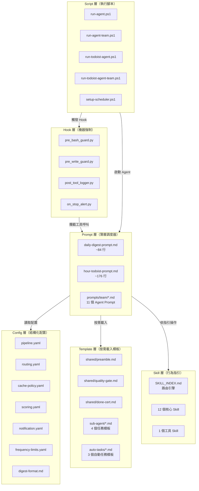
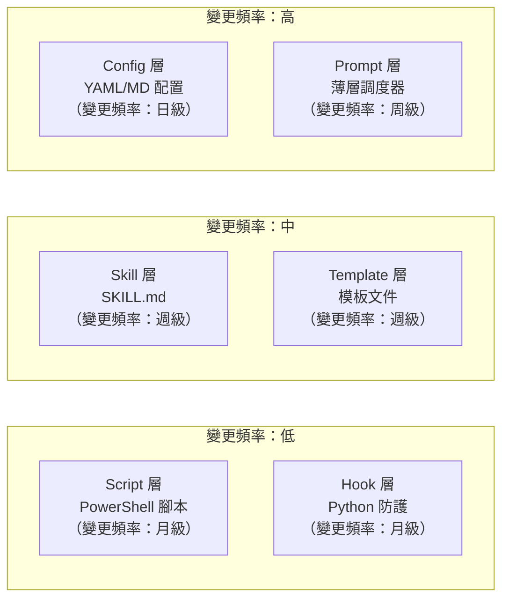
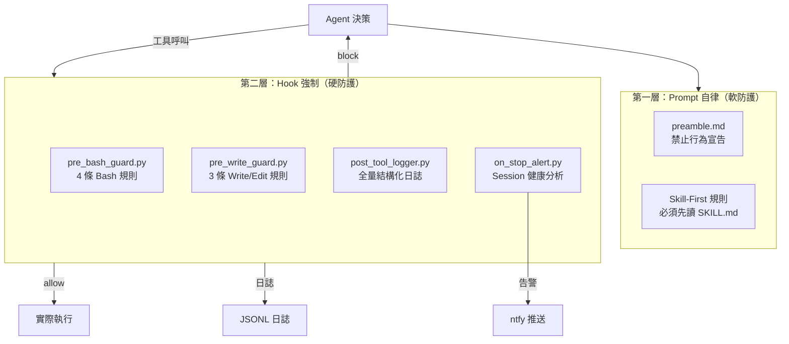
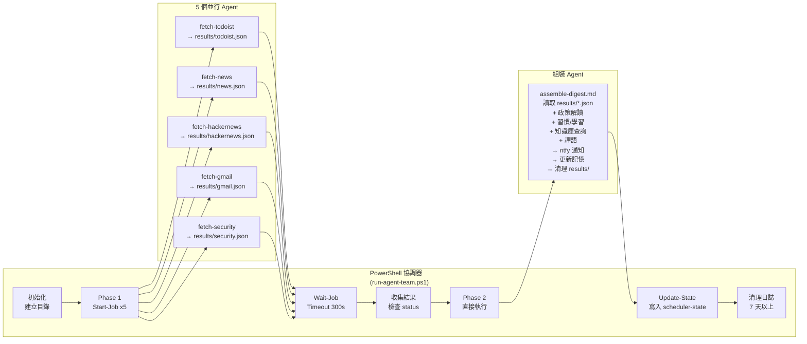
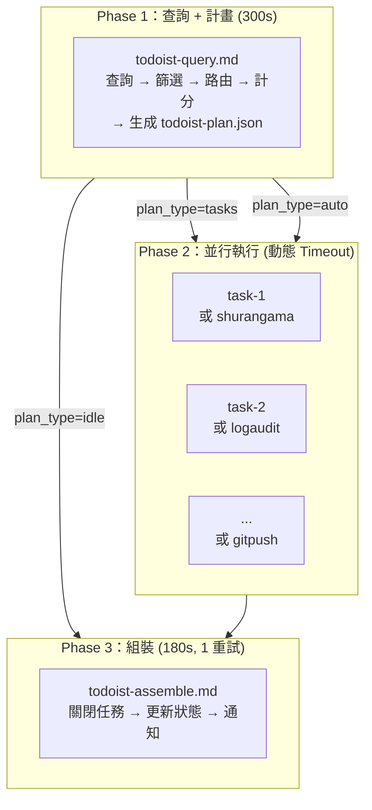
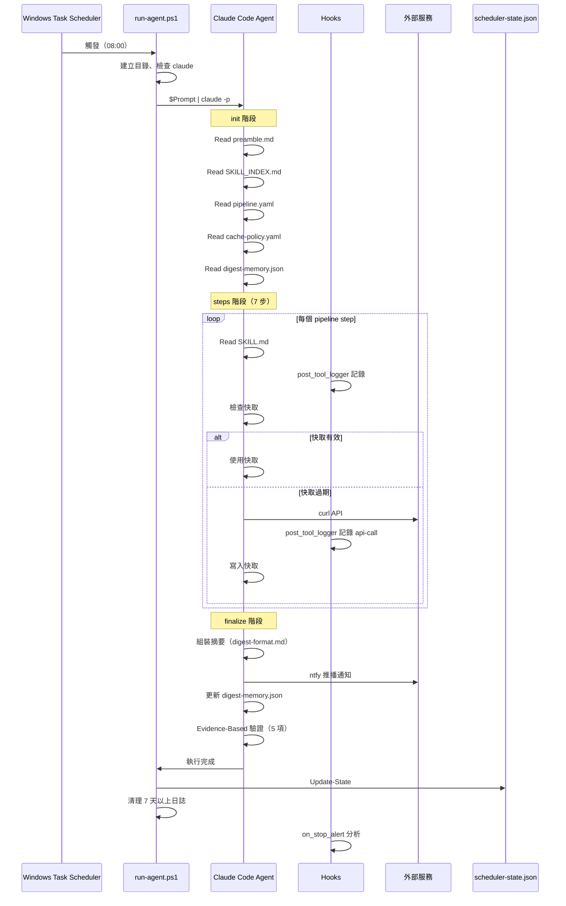
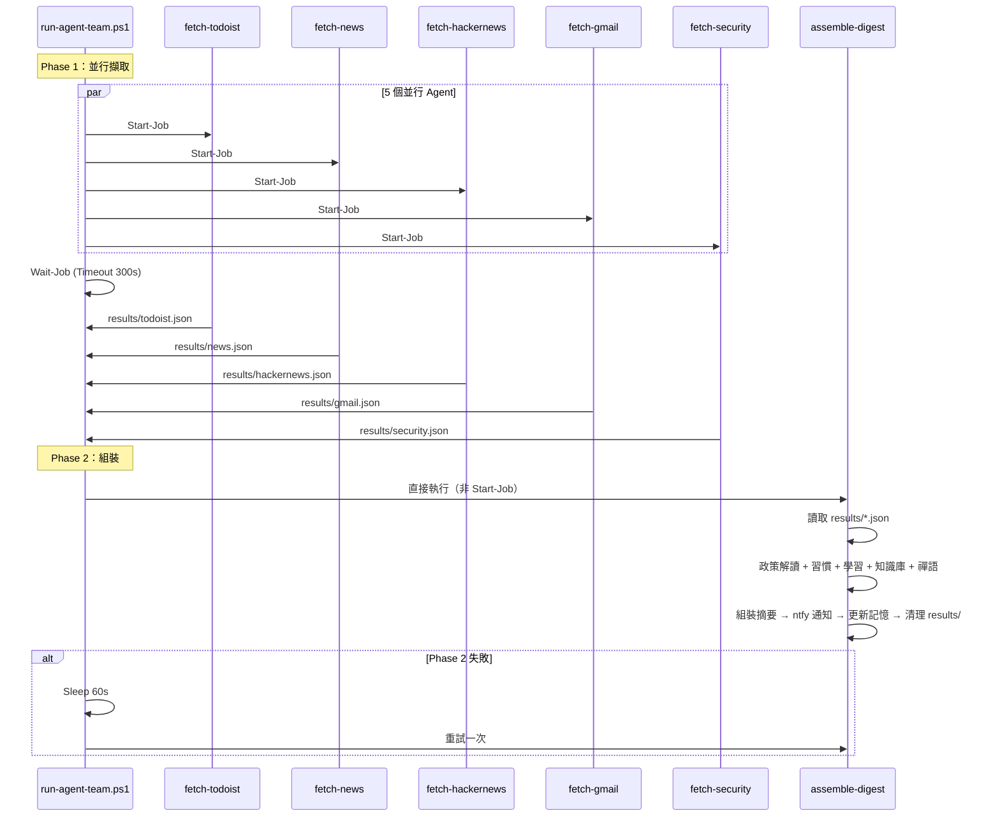
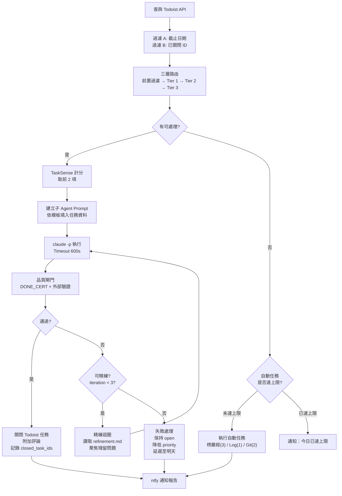
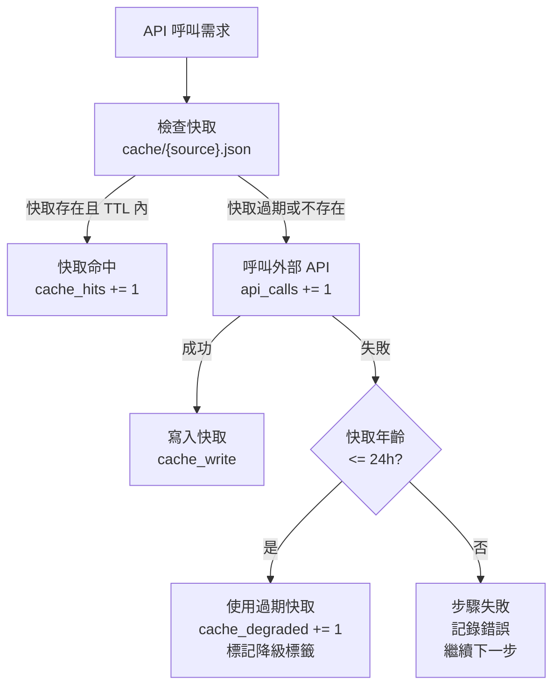

# Daily Digest Prompt -- 系統規格文件 (SSD)

---

## 1. 文件資訊

### 1.1 文件目的

本文件為 Daily Digest Prompt 系統的**技術規格文件**（System Specification Document），定義系統的元件構成、核心架構原則、資料結構、介面規格與部署配置。本文件是三層文件體系中技術深度最高的一份，提供從設計哲學到實作細節的完整技術論述。

**文件定位**：
- **SRD**（系統需求文件）：定義「系統**要做什麼**」——功能需求、非功能需求、驗收條件
- **SSD**（本文件）：定義「系統**怎麼做**」——架構原則、元件構成、資料流、介面規格
- **SDD**（系統設計文件）：定義「系統**為何這麼做**」——設計決策、替代方案比較、演進路線

### 1.2 SRD 需求覆蓋矩陣

本文件的每個技術規格均可追溯到 SRD 中的功能需求（FR）或非功能需求（NFR）。以下為覆蓋矩陣摘要：

| SSD 章節 | 覆蓋的 SRD 需求 |
|---------|----------------|
| 2. 元件清單 | FR-DIG-001~009, FR-TOD-001~008, FR-NTF-001~003, FR-MEM-001~004, FR-CAC-001~004, FR-SEC-001~004, FR-SKL-001~004 |
| 3. 核心架構原則 | NFR-MAINT-001, NFR-SEC-001~003, NFR-AVAIL-001~003, NFR-PERF-001~006, NFR-COMP-001~003 |
| 4. 資料結構 | FR-MEM-001~004, FR-CAC-001~004, FR-SEC-002 |
| 5. 介面規格 | 所有 EXT-* 外部整合需求 |
| 6. 執行流程 | FR-DIG-001~009, FR-TOD-001~008 |
| 7. 部署與排程 | NFR-AVAIL-001, NFR-COMP-001~003 |
| 8. 錯誤處理與容錯 | NFR-AVAIL-002~003, FR-CAC-003 |
| 9. 附錄 | 全部需求的交叉索引 |

### 1.3 術語表

沿用 SRD 第 1.3 節定義的術語，本文件新增以下技術術語：

| 術語 | 定義 |
|------|------|
| COMP | 元件編號前綴（Component），用於標識系統中的每個技術元件 |
| DATA | 資料結構編號前綴，用於標識系統中的每個持久化或暫存資料格式 |
| IF | 介面編號前綴（Interface），用於標識元件間或元件與外部服務間的通訊介面 |
| 六層架構 | 系統的分層模型：Prompt 層 → Config 層 → Template 層 → Skill 層 → Hook 層 → Script 層 |
| 薄層調度器 | Prompt 層的設計原則——僅含角色宣告、步驟骨架、容錯語義，不含數據型邏輯 |
| Harness | 機器強制層的統稱，包含所有 Hook 腳本及其攔截邏輯 |

---

## 2. 元件清單

### 2.1 六層架構總覽

系統採用六層分離架構，每一層有明確的職責邊界與變更頻率：



### 2.2 Prompt 層元件

#### COMP-PRM-001：每日摘要 Prompt

| 屬性 | 值 |
|------|-----|
| 檔案路徑 | `daily-digest-prompt.md` |
| 行數 | ~84 行 |
| 角色 | 每日摘要薄層調度器 |
| 啟動載入 | preamble.md, SKILL_INDEX.md, pipeline.yaml, cache-policy.yaml |
| 執行管線 | init(4 步) → steps(7 步) → finalize(4 步) |
| 工具白名單 | Read, Bash, Write |
| 覆蓋 FR | FR-DIG-001 ~ FR-DIG-009 |

**啟動序列**：
1. 讀取 `templates/shared/preamble.md`（共用規則）
2. 讀取 `skills/SKILL_INDEX.md`（Skill 認知地圖）
3. 讀取 `config/pipeline.yaml`（管線定義）
4. 讀取 `config/cache-policy.yaml`（快取策略）

**管線 7 步驟**：todoist → news → hackernews → habits → learning → knowledge → zen

#### COMP-PRM-002：Todoist 任務規劃 Prompt

| 屬性 | 值 |
|------|-----|
| 檔案路徑 | `hour-todoist-prompt.md` |
| 行數 | ~176 行 |
| 角色 | Todoist 任務規劃薄層調度器 |
| 啟動載入 | preamble.md, SKILL_INDEX.md, routing.yaml, frequency-limits.yaml, scoring.yaml |
| 執行步驟 | 查詢 → 路由 → 計分 → 執行(含品質閘門) → 通知 |
| 工具白名單 | Read, Bash, Write（主 Agent）；子 Agent 依路由動態決定 |
| 覆蓋 FR | FR-TOD-001 ~ FR-TOD-008 |

#### COMP-PRM-003：共用前言

| 屬性 | 值 |
|------|-----|
| 檔案路徑 | `templates/shared/preamble.md` |
| 角色 | 所有 Agent 的共用規則定義 |
| 內容 | 語言規則（正體中文）、Skill-First 5 條核心規則、4 項禁止行為、nul 禁令 |
| 引用者 | 所有 Prompt（daily-digest、hour-todoist、所有 team prompt） |

#### COMP-TEAM-001 ~ COMP-TEAM-006：團隊模式 Agent Prompt

| 編號 | 檔案路徑 | 角色 | Phase |
|------|---------|------|-------|
| COMP-TEAM-001 | `prompts/team/fetch-todoist.md` | Todoist 資料擷取 | Phase 1 |
| COMP-TEAM-002 | `prompts/team/fetch-news.md` | 屏東新聞擷取（含 5 次重試） | Phase 1 |
| COMP-TEAM-003 | `prompts/team/fetch-hackernews.md` | HN AI 新聞擷取 | Phase 1 |
| COMP-TEAM-004 | `prompts/team/fetch-gmail.md` | Gmail 郵件擷取 | Phase 1 |
| COMP-TEAM-005 | `prompts/team/fetch-security.md` | Cisco AI Defense 安全審查 | Phase 1 |
| COMP-TEAM-006 | `prompts/team/assemble-digest.md` | 摘要組裝 + 通知 + 記憶更新 | Phase 2 |

#### COMP-TEAM-TOD-001 ~ COMP-TEAM-TOD-003：Todoist 團隊模式 Agent Prompt

| 編號 | 檔案路徑 | 角色 | Phase |
|------|---------|------|-------|
| COMP-TEAM-TOD-001 | `prompts/team/todoist-query.md` | 查詢 + 篩選 + 路由 + 計畫 | Phase 1 |
| COMP-TEAM-TOD-002 | `prompts/team/todoist-assemble.md` | 關閉 + 更新 + 通知 | Phase 3 |
| COMP-TEAM-TOD-003 | `prompts/team/todoist-auto-*.md` | 自動任務 (3 種) | Phase 2 |

### 2.3 Config 層元件

#### COMP-CFG-001：管線配置

| 屬性 | 值 |
|------|-----|
| 檔案路徑 | `config/pipeline.yaml` |
| 版本 | version: 1 |
| 結構 | init(4 actions) → steps(7 步) → finalize(4 actions, 含 5 項 verify) |
| 引用者 | COMP-PRM-001 (daily-digest-prompt.md) |
| 覆蓋 FR | FR-DIG-001 ~ FR-DIG-009 |

**管線步驟詳細**：

| 步驟 ID | 名稱 | 使用 Skill | 快取鍵 | 後處理 |
|---------|------|-----------|--------|--------|
| todoist | 查詢今日待辦 | todoist, api-cache | todoist | -- |
| news | 查詢屏東新聞 | pingtung-news, pingtung-policy-expert, api-cache | pingtung-news | rag_enhance, mark_import, score_citizen_impact |
| hackernews | 查詢 AI 動態 | hackernews-ai-digest, api-cache | hackernews | rag_enhance, mark_import(score>=300), write_to_rag |
| habits | 習慣提示 | atomic-habits | -- | -- |
| learning | 學習技巧 | learning-mastery | -- | -- (required: true) |
| knowledge | 知識庫查詢 | knowledge-query, api-cache | knowledge | smart_import(dedup_threshold: 0.85) |
| zen | 佛學禪語 | (無) | -- | -- |

**驗證項（finalize.verify）**：

| 驗證 ID | 規則 | 驗證方法 |
|---------|------|---------|
| api_cache_compliance | 每個 API 呼叫前都先查了快取 | 回顧所有 curl 呼叫 |
| policy_analysis_present | 至少 1 則新聞有政策解讀 | 確認摘要含「政策背景」區塊 |
| knowledge_import_attempted | 有嘗試匯入判斷 | 無值得匯入也算通過 |
| memory_updated | digest-memory.json 的 last_run 為今天 | 用 Read 讀回確認 |
| notification_sent | ntfy curl 回應 HTTP 200 | 確認 curl 回應 |

#### COMP-CFG-002：路由配置

| 屬性 | 值 |
|------|-----|
| 檔案路徑 | `config/routing.yaml` |
| 版本 | version: 1 |
| 結構 | pre_filter → label_routing → keyword_routing → semantic_routing → output_format |
| 引用者 | COMP-PRM-002 (hour-todoist-prompt.md) |
| 覆蓋 FR | FR-TOD-002 |

**三層路由詳細**：

| 層級 | 信心度 | 匹配方式 | 項目數 |
|------|--------|---------|--------|
| 前置過濾 | -- | 排除類別比對（實體行動/人際互動/個人事務） | 3 類 |
| Tier 1 標籤 | 100% | Todoist 標籤直接映射（@code, @research 等） | 6 個標籤 |
| Tier 2 關鍵字 | 80% | SKILL_INDEX 觸發關鍵字比對 | 7 組關鍵字 |
| Tier 3 語義 | 60% | LLM 語義分析（可處理/不可處理類型） | 2 類 |

**Tier 1 標籤映射**：

| 標籤 | 映射 Skill | allowedTools | 模板 |
|------|-----------|-------------|------|
| @code | 程式開發 | Read,Bash,Write,Edit,Glob,Grep | code-task.md |
| @research | deep-research + knowledge-query | Read,Bash,Write,WebSearch,WebFetch | research-task.md |
| @write | 文件撰寫 | Read,Bash,Write | skill-task.md |
| @news | pingtung-news + policy-expert | Read,Bash,Write | skill-task.md |
| @ai | hackernews-ai-digest | Read,Bash,Write | skill-task.md |
| @knowledge | knowledge-query | Read,Bash,Write | skill-task.md |

#### COMP-CFG-003：快取策略

| 屬性 | 值 |
|------|-----|
| 檔案路徑 | `config/cache-policy.yaml` |
| 版本 | version: 1 |
| 快取目錄 | `cache/` |
| 降級時限 | 24 小時（`degradation_max_age_hours: 24`） |
| 降級標籤 | `"⚠️ 資料來自快取（{time}）"` |
| 覆蓋 FR | FR-CAC-001 ~ FR-CAC-004 |

**來源 TTL 表**：

| 來源 | 快取檔案 | TTL (分鐘) | 備註 |
|------|---------|-----------|------|
| todoist | `cache/todoist.json` | 30 | Todoist Agent 不用快取，僅 daily-digest 使用 |
| pingtung-news | `cache/pingtung-news.json` | 360 (6h) | -- |
| hackernews | `cache/hackernews.json` | 120 (2h) | -- |
| knowledge | `cache/knowledge.json` | 60 (1h) | -- |
| gmail | `cache/gmail.json` | 30 | -- |

#### COMP-CFG-004：計分配置

| 屬性 | 值 |
|------|-----|
| 檔案路徑 | `config/scoring.yaml` |
| 版本 | version: 1 |
| 公式 | `綜合分數 = Todoist 優先級分 x 信心度乘數 x 描述加成` |
| 每次最大執行數 | `max_tasks_per_run: 2` |
| 覆蓋 FR | FR-TOD-003 |

**計分參數**：

| 參數 | 值 |
|------|-----|
| 優先級分 | p1=4, p2=3, p3=2, p4=1 |
| 信心度乘數 | Tier1=1.0, Tier2=0.8, Tier3=0.6 |
| 描述加成 | 有 description=1.2, 無=1.0 |

#### COMP-CFG-005：通知配置

| 屬性 | 值 |
|------|-----|
| 檔案路徑 | `config/notification.yaml` |
| 版本 | version: 1 |
| Topic | `wangsc2025` |
| 服務 URL | `https://ntfy.sh` |
| 訊息上限 | 500 字元 |
| 覆蓋 FR | FR-NTF-001 ~ FR-NTF-003 |

**發送步驟**：
1. Write 建立 `ntfy_temp.json`（UTF-8）
2. `curl -H "Content-Type: application/json; charset=utf-8" -d @ntfy_temp.json https://ntfy.sh`
3. `rm ntfy_temp.json`

**Tags 映射**：

| 情境 | Tags |
|------|------|
| digest_success | `["white_check_mark", "memo"]` |
| digest_warning | `["warning", "memo"]` |
| todoist_success | `["white_check_mark"]` |
| todoist_no_tasks_auto_done | `["books", "wrench"]` |
| todoist_no_tasks | `["information_source"]` |
| todoist_all_failed | `["warning"]` |
| security_alert | `["warning", "skull_and_crossbones"]` |

#### COMP-CFG-006：頻率限制配置

| 屬性 | 值 |
|------|-----|
| 檔案路徑 | `config/frequency-limits.yaml` |
| 版本 | version: 1 |
| 追蹤檔案 | `context/auto-tasks-today.json` |
| 歷史檔案 | `state/todoist-history.json` |
| 重置策略 | daily（每日歸零） |
| 覆蓋 FR | FR-TOD-008, FR-MEM-004 |

**自動任務限制**：

| 任務 | 每日上限 | 計數欄位 | 模板 | 執行順序 |
|------|---------|---------|------|---------|
| 楞嚴經研究 | 3 | `shurangama_count` | `templates/auto-tasks/shurangama-research.md` | 1 |
| 系統 Log 審查 | 1 | `log_audit_count` | `templates/auto-tasks/log-audit.md` | 2 |
| 專案推送 GitHub | 2 | `git_push_count` | `templates/auto-tasks/git-push.md` | 3 |

#### COMP-CFG-007：摘要格式模板

| 屬性 | 值 |
|------|-----|
| 檔案路徑 | `config/digest-format.md` |
| 區塊數 | 12 |
| 引用者 | COMP-PRM-001, COMP-TEAM-006 |
| 覆蓋 FR | FR-DIG-008 |

**12 區塊排版順序**：
1. 連續報到資訊 -- 2. 系統健康度 -- 3. 今日待辦 -- 4. 本週屏東新聞 -- 5. AI 技術動態 -- 6. 今日習慣提示 -- 7. 今日學習技巧 -- 8. 知識庫回顧 -- 9. 今日郵件摘要（團隊模式限定）-- 10. 安全審查（團隊模式限定）-- 11. 佛學禪語 -- 12. Skill 使用報告

### 2.4 Template 層元件

#### COMP-TPL-001：品質閘門模板

| 屬性 | 值 |
|------|-----|
| 檔案路徑 | `templates/shared/quality-gate.md` |
| 最大迭代 | 3 次（初始 + 2 次精練） |
| 覆蓋 FR | FR-TOD-005, FR-TOD-006 |

**通過條件**：
```
通過 = (cert_status == "DONE")
     AND (quality_score >= 3)
     AND (remaining_issues 為空)
     AND (外部驗證全部通過)
```

**外部驗證矩陣**：

| 任務類型 | 驗證項目 | 驗證方式 |
|---------|---------|---------|
| @code | 變更存在、語法正確、測試通過 | git status, py_compile, pytest |
| @research | 產出物存在、內容超過 100 字 | 檔案檢查 |
| 一般 | exit code = 0 | 指令回傳碼 |

#### COMP-TPL-002：DONE 認證格式

| 屬性 | 值 |
|------|-----|
| 檔案路徑 | `templates/shared/done-cert.md` |
| 格式 | JSON，以 `===DONE_CERT_BEGIN===` / `===DONE_CERT_END===` 包裹 |
| 覆蓋 FR | FR-TOD-004, FR-TOD-005 |

#### COMP-TPL-003 ~ COMP-TPL-006：子 Agent 模板

| 編號 | 檔案路徑 | 適用場景 | 觸發條件 |
|------|---------|---------|---------|
| COMP-TPL-003 | `templates/sub-agent/skill-task.md` | 有 Skill 匹配的任務 | 路由匹配到 Skill |
| COMP-TPL-004 | `templates/sub-agent/research-task.md` | 知識庫/RAG 研究 | @research 或關鍵字 |
| COMP-TPL-005 | `templates/sub-agent/code-task.md` | @code 任務（Plan-Then-Execute） | @code 標籤 |
| COMP-TPL-006 | `templates/sub-agent/general-task.md` | 無 Skill 匹配 | Tier 3 語義路由 |

#### COMP-TPL-007：精練模板

| 屬性 | 值 |
|------|-----|
| 檔案路徑 | `templates/sub-agent/refinement.md` |
| 角色 | 品質閘門未通過時的聚焦修正 Prompt |
| 覆蓋 FR | FR-TOD-006 |

### 2.5 Skill 層元件

#### COMP-SKL-000：Skill 索引與路由引擎

| 屬性 | 值 |
|------|-----|
| 檔案路徑 | `skills/SKILL_INDEX.md` |
| 核心 Skill 數 | 12 |
| 工具 Skill 數 | 1 |
| 鏈式組合模式 | 5 種（A~E） |
| 覆蓋 FR | FR-SKL-001 ~ FR-SKL-004 |

**12 個核心 Skill**：

| # | Skill 名稱 | 用途 | 觸發關鍵字 | 外部服務 |
|---|-----------|------|-----------|---------|
| 1 | todoist | 待辦管理 | 待辦、任務、todo | api.todoist.com/api/v1 |
| 2 | pingtung-news | 屏東新聞 | 屏東、新聞、縣政 | ptnews-mcp.pages.dev/mcp |
| 3 | pingtung-policy-expert | 施政解讀 | 政策、施政、長照 | (LLM 生成) |
| 4 | hackernews-ai-digest | AI 動態 | AI、LLM、GPT | hacker-news.firebaseio.com |
| 5 | atomic-habits | 習慣提示 | 習慣、行為改變 | (LLM 生成) |
| 6 | learning-mastery | 學習技巧 | 學習、費曼 | (LLM 生成) |
| 7 | knowledge-query | 知識庫 | 知識庫、筆記 | localhost:3000 |
| 8 | ntfy-notify | 推播通知 | 通知、提醒 | ntfy.sh |
| 9 | digest-memory | 記憶持久化 | 記憶、連續天數 | (本地 JSON) |
| 10 | api-cache | API 快取 | 快取、cache | (本地 JSON) |
| 11 | scheduler-state | 排程狀態 | 狀態、健康度 | (本地 JSON, 唯讀) |
| 12 | gmail | 郵件讀取 | gmail、email | gmail.googleapis.com |
| 13 | skill-scanner | 安全掃描 | 安全、掃描 | (本地工具) |

**5 種鏈式組合模式**：

| 模式 | 鏈路 | 用途 |
|------|------|------|
| A | pingtung-news → policy-expert → knowledge-query → ntfy-notify | 新聞深度解讀 |
| B | todoist → knowledge-query → [執行] → todoist → ntfy-notify | 任務智慧執行 |
| C | hackernews → knowledge-query → learning-mastery → ntfy-notify | 研究與學習 |
| D | todoist(無任務) → [楞嚴經] → [Log 審查] → ntfy-notify | 無待辦自動任務 |
| E | digest-memory → api-cache → [主流程] → digest-memory | 全流程保護 |

### 2.6 Hook 層元件

#### COMP-HK-001：Bash 防護 Hook

| 屬性 | 值 |
|------|-----|
| 檔案路徑 | `hooks/pre_bash_guard.py` |
| Hook 類型 | PreToolUse |
| Matcher | Bash |
| 規則數 | 4 |
| 覆蓋 FR | FR-SEC-001 |

**4 條規則**：

| Rule | 正則/條件 | 攔截理由 | guard_tag |
|------|----------|---------|-----------|
| 1 | `(>|2>)\s*nul(\s|$|;|&|\|)` (IGNORECASE) | nul 重導向會建立實體檔案 | nul-guard |
| 2 | `scheduler-state.json` in command + 寫入模式 | Agent 禁寫 scheduler-state | state-guard |
| 3 | `rm\s+-[rR]f\s+/(\s|$)` | 刪除根目錄 | safety-guard |
| 4 | `git\s+push\s+.*--force.*\s+(main|master)` | force push 到 main/master | git-guard |

#### COMP-HK-002：Write/Edit 防護 Hook

| 屬性 | 值 |
|------|-----|
| 檔案路徑 | `hooks/pre_write_guard.py` |
| Hook 類型 | PreToolUse |
| Matcher | Write, Edit |
| 規則數 | 3 |
| 覆蓋 FR | FR-SEC-001, FR-SEC-004 |

**3 條規則**：

| Rule | 條件 | 攔截理由 | guard_tag |
|------|------|---------|-----------|
| 1 | `basename.lower() == "nul"` | nul 檔案建立 | nul-guard |
| 2 | `"scheduler-state.json" in file_path` | Agent 禁寫 scheduler-state | state-guard |
| 3 | basename in [`.env`, `credentials.json`, `token.json`] | 敏感檔案保護 | secret-guard |

#### COMP-HK-003：結構化日誌 Hook

| 屬性 | 值 |
|------|-----|
| 檔案路徑 | `hooks/post_tool_logger.py` |
| Hook 類型 | PostToolUse |
| Matcher | * (所有工具) |
| 日誌路徑 | `logs/structured/YYYY-MM-DD.jsonl` |
| 覆蓋 FR | FR-SEC-002 |

**自動標籤分類引擎**：

| 分類函式 | 適用工具 | 產生標籤 |
|---------|---------|---------|
| `classify_bash()` | Bash | api-call, [來源], file-delete, git, git-push, git-commit, sub-agent, python |
| `classify_write()` | Write | cache-write, [來源], memory-write, frequency-write, ntfy-payload, kb-import-payload, sub-agent-prompt, history-write |
| `classify_read()` | Read | cache-read, [來源], skill-read, skill-index, memory-read, state-read, frequency-read, history-read |
| `classify_edit()` | Edit | file-edit, powershell-edit, markdown-edit, json-edit |

**API 來源偵測模式**（`API_SOURCE_PATTERNS`）：

| 來源 | 比對關鍵字 |
|------|-----------|
| todoist | `todoist.com`, `todoist` |
| pingtung-news | `ptnews-mcp`, `pingtung` |
| hackernews | `hacker-news.firebaseio`, `hn.algolia` |
| knowledge | `localhost:3000` |
| ntfy | `ntfy.sh` |
| gmail | `gmail.googleapis` |

**錯誤關鍵字**（`ERROR_KEYWORDS`，12 個）：error, failed, timeout, refused, denied, exception, traceback, 404, 500, 502, 503

**誤報排除**：ErrorAction, error_msg, errormsg, silentlycontinue

#### COMP-HK-004：Session 結束告警 Hook

| 屬性 | 值 |
|------|-----|
| 檔案路徑 | `hooks/on_stop_alert.py` |
| Hook 類型 | Stop |
| Offset 追蹤 | `logs/structured/.last_analyzed_offset` |
| 告警管道 | ntfy.sh (`wangsc2025`) |
| 覆蓋 FR | FR-SEC-003, FR-NTF-003 |

**嚴重等級判定**：

| 等級 | 條件 | ntfy priority | ntfy tags |
|------|------|-------------|-----------|
| critical | blocked >= 3 或 errors >= 5 | 5 | `["rotating_light", "shield"]` |
| warning | blocked 1-2 或 errors 1-4 或 cache_bypassed | 4 | `["warning", "shield"]` |
| healthy | 無上述問題 | (不告警) | -- |

### 2.7 Script 層元件

#### COMP-SCR-001：每日摘要單一模式腳本

| 屬性 | 值 |
|------|-----|
| 檔案路徑 | `run-agent.ps1` |
| 執行引擎 | pwsh (PowerShell 7) |
| 重試 | `$MaxRetries = 1`，間隔 `$RetryDelaySeconds = 120` |
| 狀態寫入 | `state/scheduler-state.json`（agent: `daily-digest`） |
| 日誌清理 | 7 天以上自動刪除 |
| 覆蓋 NFR | NFR-PERF-001, NFR-AVAIL-002 |

#### COMP-SCR-002：每日摘要團隊模式腳本

| 屬性 | 值 |
|------|-----|
| 檔案路徑 | `run-agent-team.ps1` |
| 執行引擎 | pwsh (PowerShell 7) |
| Phase 1 | 5 個並行 Agent（Start-Job），Timeout = 300s |
| Phase 2 | 1 個組裝 Agent，Timeout = 300s，重試 1 次（間隔 60s） |
| 狀態寫入 | `state/scheduler-state.json`（agent: `daily-digest-team`，含 sections） |
| 覆蓋 NFR | NFR-PERF-002 ~ NFR-PERF-004, NFR-AVAIL-002 |

**Phase 1 並行 Agent**：

| Agent | Prompt 來源 | 結果檔案 |
|-------|-----------|---------|
| todoist | `prompts/team/fetch-todoist.md` | `results/todoist.json` |
| news | `prompts/team/fetch-news.md` | `results/news.json` |
| hackernews | `prompts/team/fetch-hackernews.md` | `results/hackernews.json` |
| gmail | `prompts/team/fetch-gmail.md` | `results/gmail.json` |
| security | `prompts/team/fetch-security.md` | `results/security.json` |

#### COMP-SCR-003：Todoist 單一模式腳本

| 屬性 | 值 |
|------|-----|
| 檔案路徑 | `run-todoist-agent.ps1` |
| 執行引擎 | pwsh (PowerShell 7) |
| Timeout | `$MaxDurationSeconds = 1800`（30 分鐘） |
| 重試 | 0（不重試） |
| 覆蓋 NFR | NFR-PERF-005 |

#### COMP-SCR-004：Todoist 團隊模式腳本

| 屬性 | 值 |
|------|-----|
| 檔案路徑 | `run-todoist-agent-team.ps1` |
| 執行引擎 | pwsh (PowerShell 7) |
| Phase 1 | 查詢 + 路由 + 計畫，Timeout = 300s |
| Phase 2 | N 個並行執行，Timeout 動態計算 |
| Phase 3 | 組裝 + 關閉 + 通知，Timeout = 180s，重試 1 次 |
| 覆蓋 NFR | NFR-PERF-005 |

**動態 Timeout 計算**（`$TimeoutBudget`）：

| 任務類型 | 預算（秒） |
|---------|-----------|
| research（WebSearch/WebFetch） | 600 |
| code（Edit/Glob/Grep） | 900 |
| skill（簡單 Skill） | 300 |
| general | 300 |
| auto（楞嚴經/Log 審查） | 600 |
| gitpush | 180 |
| buffer（CLI 啟動 + 安全緩衝） | 120 |

**Phase 2 Timeout 公式**：`buffer + max(各並行任務的 timeout)`

#### COMP-SCR-005：排程設定腳本

| 屬性 | 值 |
|------|-----|
| 檔案路徑 | `setup-scheduler.ps1` |
| 兩種模式 | `-FromHeartbeat`（從 HEARTBEAT.md 批次建立）、傳統模式（手動指定） |
| 排程名稱前綴 | `Claude_`（-FromHeartbeat 模式） |
| 執行程式 | `pwsh.exe`（非 powershell.exe） |
| 支援間隔排程 | 是（如 `interval: 60m`，透過 `Repetition` 實現） |

### 2.8 排程定義元件

#### COMP-HEARTBEAT：排程元資料

| 屬性 | 值 |
|------|-----|
| 檔案路徑 | `HEARTBEAT.md` |
| 格式 | Markdown with YAML frontmatter |
| 排程數 | 5 |

**5 個排程定義**：

| 排程名稱 | Cron | 腳本 | Timeout | 重試 |
|---------|------|------|---------|------|
| daily-digest-am | `0 8 * * *` | run-agent-team.ps1 | 300s | 1 |
| daily-digest-mid | `15 11 * * *` | run-agent-team.ps1 | 300s | 1 |
| daily-digest-pm | `15 21 * * *` | run-agent-team.ps1 | 300s | 1 |
| todoist-single | `0 2-23 * * *` (每小時) | run-todoist-agent.ps1 | 1800s | 0 |
| todoist-team | `30 2-23 * * *` (每小時:30) | run-todoist-agent-team.ps1 | 1200s | 0 |

---

## 3. 核心架構原則

本章是本文件的靈魂。定義 5 個核心架構原則，每個原則包含設計哲學、實作機制、適用場景與代碼級示例。

### 3.1 文件驅動架構（Document-Centric Architecture）

#### 設計哲學

本系統最根本的架構決策是：**所有行為定義都以文件為載體，而非程式碼**。

傳統的自動化系統以程式碼為中心——邏輯寫在 Python/JavaScript 中，配置是程式碼的附屬品。但在 LLM Agent 系統中，這個模型是錯誤的。Agent 的「程式碼」就是自然語言 Prompt，而 Prompt 的最佳載體就是 Markdown 文件。因此，本系統將文件從附屬品提升為**一等公民**：Prompt 是控制平面，Config 是資料平面，Template 是模板平面，Skill 是行為平面。

這個決策帶來的直接效益是：**修改系統行為不需要觸碰任何程式碼**。調整快取 TTL？改 `config/cache-policy.yaml`。新增路由規則？改 `config/routing.yaml`。調整摘要格式？改 `config/digest-format.md`。所有這些變更立即在下次排程執行時生效，無需重新部署。

#### 六層分離模型



每一層的職責嚴格分離：

**Prompt 層**（薄層調度器）：
- 職責：角色宣告、步驟骨架、容錯語義
- 不含：具體的 API 端點、TTL 數值、路由規則、格式模板
- 約束：行數控制在 80~180 行
- 範例：`daily-digest-prompt.md` 僅 84 行，所有數據型邏輯外部化

**Config 層**（結構化配置）：
- 職責：定義所有可變的數據型邏輯
- 格式：YAML（支援注釋、層級清晰）或 Markdown（LLM 最自然的理解格式）
- 7 個配置文件覆蓋：管線步驟、路由規則、快取 TTL、計分公式、通知格式、頻率限制、摘要排版
- 修改即生效：下次排程執行自動套用新配置

**Template 層**（按需載入模板）：
- 職責：提供可重用的結構化文件片段
- 載入時機：僅在需要時 Read，不預載進 context window
- 類別：共用前言（1 份，一處定義）、品質閘門（1 份）、子 Agent 模板（4 種）、自動任務（3 種）
- Token 節約：避免 13 個 Skill + 8 個模板同時佔用 context window

**Skill 層**（行為指引）：
- 職責：定義特定能力的觸發條件、操作步驟、API 端點、注意事項
- 自包含：每個 SKILL.md 包含該 Skill 的完整操作指南
- 索引驅動：`SKILL_INDEX.md` 提供速查表、路由決策樹、鏈式組合模式

**Hook 層**（機器強制）：
- 職責：在 runtime 攔截違規操作
- 語言：Python 3.8+（跨平台相容）
- 事件類型：PreToolUse（執行前攔截）、PostToolUse（執行後記錄）、Stop（Session 結束分析）

**Script 層**（執行腳本）：
- 職責：Agent 生命週期管理（啟動、監控、重試、狀態記錄、日誌清理）
- 語言：PowerShell 7（pwsh）
- 與 Agent 的關係：Script 不參與業務邏輯，僅負責基礎設施

#### 單一定義處原則

系統中每個規則只在一個地方定義，所有引用者從同一來源讀取：

| 規則 | 唯一定義處 | 引用者 |
|------|-----------|--------|
| nul 禁令 + Skill-First | `templates/shared/preamble.md` | 所有 Prompt |
| 快取 TTL | `config/cache-policy.yaml` | daily-digest, 所有 fetch Agent |
| 路由規則 | `config/routing.yaml` | hour-todoist, todoist-query |
| 頻率限制 | `config/frequency-limits.yaml` | hour-todoist, todoist-query |
| 通知配置 | `config/notification.yaml` | daily-digest, assemble-digest, hour-todoist |
| 排程定義 | `HEARTBEAT.md` | setup-scheduler.ps1 |

#### 按需載入機制

為控制 context window 消耗，系統採用按需載入策略：

```
Agent 啟動 → 讀取 preamble.md (固定)
           → 讀取 SKILL_INDEX.md (固定)
           → 讀取管線/路由 config (固定)

管線執行中 → 依步驟讀取對應 SKILL.md (按需)
           → 依路由讀取子 Agent 模板 (按需)
           → 依條件讀取自動任務模板 (按需)
           → 品質閘門時讀取 quality-gate.md (按需)
```

固定載入約消耗 2000~3000 tokens，按需載入每次約 500~1000 tokens，遠低於一次性全部載入的 15000+ tokens。

### 3.2 Harness 強制（Harness Enforcement）

#### 設計哲學

在 LLM Agent 系統中，安全防護不能依賴 Prompt 中的「禁止」宣告。Agent 在長時間執行中可能忘記禁令、在多步驟推理中偏離指示、或在壓力下選擇「捷徑」。這不是 Agent 的缺陷，而是概率性推理的本質特性。

因此，本系統將安全防護從「Agent 自律」升級到「機器強制」——透過 Claude Code Hooks 在工具呼叫的 runtime 層攔截違規操作。Agent 即使嘗試執行危險操作，Hook 也會在操作真正生效前阻斷它，並回傳明確的 block reason。

這個架構的核心洞察是：**安全規則的執行層級應該低於 Agent 的決策層級**。Prompt 中的規則在 Agent 的「思考層」生效，而 Hook 在「工具層」生效。即使 Agent 的思考過程出錯，工具層的攔截仍能阻止實際的危險操作。

#### 雙層防禦模型



**Prompt 自律（軟防護）**：透過 `preamble.md` 宣告禁止行為，Agent 在決策階段自主遵守。覆蓋範圍廣但不可靠——Agent 可能在複雜推理鏈中違反。

**Hook 強制（硬防護）**：透過 Python 腳本在工具呼叫層攔截，與 Agent 的決策過程無關。覆蓋範圍有限（僅 7 條規則）但 100% 可靠。

**兩者的協作**：軟防護覆蓋所有已知和未知的風險場景，硬防護確保最危險的 7 個場景絕對不會發生。

#### Hook 註冊機制

Hook 的註冊定義在 `.claude/settings.json`（專案級，commit 到 repo）：

```json
{
  "hooks": {
    "PreToolUse": [
      { "matcher": "Bash",  "hooks": [{ "type": "command", "command": "python hooks/pre_bash_guard.py" }] },
      { "matcher": "Write", "hooks": [{ "type": "command", "command": "python hooks/pre_write_guard.py" }] },
      { "matcher": "Edit",  "hooks": [{ "type": "command", "command": "python hooks/pre_write_guard.py" }] }
    ],
    "PostToolUse": [
      { "hooks": [{ "type": "command", "command": "python hooks/post_tool_logger.py" }] }
    ],
    "Stop": [
      { "hooks": [{ "type": "command", "command": "python hooks/on_stop_alert.py" }] }
    ]
  }
}
```

關鍵設計決策：
- **使用 `python` 而非 `python3`**：Windows Store 的 `python3` 是空殼（exit 49），會導致 Hook 靜默失敗
- **Write 和 Edit 共用同一個 guard**：`pre_write_guard.py` 同時處理 Write 和 Edit，因為兩者的風險模式相同（都涉及檔案寫入）
- **PostToolUse 無 matcher**（匹配所有工具）：確保每個工具呼叫都被記錄

#### 攔截通訊協定

Hook 與 Claude Code 之間的通訊基於 stdin/stdout JSON：

**輸入**（stdin）：
```json
{
  "tool_name": "Bash",
  "tool_input": { "command": "echo test > nul" },
  "session_id": "abc123..."
}
```

**攔截輸出**（stdout）：
```json
{ "decision": "block", "reason": "禁止 nul 重導向（會建立 nul 實體檔案）。請改用 > /dev/null 2>&1" }
```

**放行輸出**（stdout）：
```json
{ "decision": "allow" }
```

設計要點：放行時也輸出 JSON（而非空輸出），避免 Claude Code 的 debug 訊息「output not start with {」。

#### 結構化日誌與閉環監控

`post_tool_logger.py` 對每個工具呼叫產生 JSONL 記錄，形成完整的可審計追蹤鏈：

```json
{"ts":"2026-02-15T08:01:30+08:00","sid":"abc123","tool":"Bash","event":"post","summary":"curl -s https://api.todoist.com/...","output_len":1234,"has_error":false,"tags":["api-call","todoist"]}
```

`on_stop_alert.py` 在 Session 結束時讀取這些日誌，分析異常並告警，形成閉環：

```
Agent 執行 → Hook 記錄日誌 → Session 結束 → 分析日誌 → 發現異常 → ntfy 告警
```

Offset 追蹤機制（`.last_analyzed_offset`）確保只分析新條目，避免同日多次 Session 重複計數。

### 3.3 Heartbeat 宣告式排程（Heartbeat Declarative Scheduling）

#### 設計哲學

排程定義是系統的「脈搏」——它決定了系統何時醒來、執行什麼、等多久。傳統做法是在排程器的 GUI 中手動配置，或分散在多個腳本中。這帶來兩個問題：排程定義不受版本控制，以及排程變更無法追蹤。

Heartbeat 模式的核心洞察是：**排程定義應該像程式碼一樣被版本控制**。`HEARTBEAT.md` 將所有排程定義集中在一個 Markdown 文件中，使用 YAML frontmatter 作為機器可讀的結構化資料，同時保持人類可讀的說明文字。

```
HEARTBEAT.md (宣告式定義)
    ↓ setup-scheduler.ps1 -FromHeartbeat
Windows Task Scheduler (實際執行)
```

這是一個典型的**宣告式**模式：開發者定義「期望狀態」（5 個排程、各自的觸發時間），腳本負責將期望狀態轉換為 Windows Task Scheduler 的實際配置。

#### HEARTBEAT.md 格式規範

```yaml
---
schedules:
  daily-digest-am:
    cron: "0 8 * * *"
    script: run-agent-team.ps1
    timeout: 300
    retry: 1
    description: "每日摘要 - 早（08:00）"

  todoist-single:
    cron: "0 2-23 * * *"
    interval: 60m
    script: run-todoist-agent.ps1
    timeout: 1800
    retry: 0
    description: "Todoist 單一模式（每小時整點）"
---
```

格式設計要點：
- **cron 欄位**：使用標準 5 段 cron 表達式（分 時 日 月 週），由 `setup-scheduler.ps1` 解析
- **interval 欄位**：可選，表示重複間隔（如 `60m` = 每 60 分鐘），轉換為 Windows Task Scheduler 的 `Repetition` 屬性
- **timeout 和 retry**：雖然 Windows Task Scheduler 不直接支援，但由 PowerShell 腳本內部實現

#### Cron 到 Windows 排程的轉換

`setup-scheduler.ps1 -FromHeartbeat` 的轉換邏輯：

1. **解析 YAML frontmatter**：從 `---` 分隔符之間的內容，用正則逐行提取 key-value
2. **提取 cron 時間**：從 `"0 8 * * *"` 提取 `分鐘=0, 小時=8` → 格式化為 `08:00`
3. **建立 Daily 觸發器**：`New-ScheduledTaskTrigger -Daily -At "08:00"`
4. **處理 interval**：若有 `interval: 60m`，建立 `-Once` 觸發器借用 `Repetition` 物件，再掛載到 `-Daily` 觸發器

間隔排程的時間範圍從 cron 的小時範圍推算：`"0 2-23 * * *"` → 起始 2:00，持續 21 小時（2~23），每 60 分鐘重複。

#### 雙軌比較模式

HEARTBEAT.md 定義了兩種 Todoist 模式，時間錯開 30 分鐘：

| 模式 | 整點 (XX:00) | 半點 (XX:30) |
|------|-------------|-------------|
| single-mode | 1 個 claude 完成全部 | -- |
| team-mode | -- | Phase 1 查詢 → Phase 2 並行 → Phase 3 組裝 |

此設計允許在生產環境中同時運行兩種模式，比較效能與成功率，為後續架構決策提供數據支撐。

### 3.4 工具級觀測（Tool-Level Instrumentation）

#### 設計哲學

在 LLM Agent 系統中，傳統的應用層日誌（如 log.info("開始查詢")）是不夠的，因為 Agent 的行為由 LLM 推理驅動，不是預先編寫的程式碼。開發者無法在「程式碼」中埋點，因為「程式碼」是 LLM 在 runtime 即時生成的。

本系統的解法是：**在工具層而非應用層進行觀測**。LLM Agent 與外界互動的唯一管道是工具呼叫（Read、Write、Bash 等）。透過 PostToolUse Hook 攔截每一個工具呼叫，自動分類並記錄，就能得到 Agent 行為的完整追蹤，而不需要在 Prompt 中要求 Agent 自行記錄。

這帶來三個關鍵優勢：
1. **零遺漏**：每個工具呼叫都被記錄，Agent 不可能跳過
2. **自動分類**：Hook 根據工具輸入的模式自動標籤，不依賴 Agent 自報
3. **機器可審計**：JSONL 格式可以用程式批量分析，支援時間序列查詢

#### JSONL 日誌架構

```
logs/structured/
├── 2026-02-15.jsonl           # 今日所有 Session 的工具呼叫記錄
├── 2026-02-14.jsonl           # 昨日記錄
├── .last_analyzed_offset      # on_stop_alert 的 offset 追蹤
└── session-summary.jsonl      # 所有 Session 的健康摘要
```

每條 JSONL 記錄的結構：

| 欄位 | 類型 | 說明 |
|------|------|------|
| `ts` | string | ISO-8601 時間戳（含時區） |
| `sid` | string | Session ID 前 12 字元 |
| `tool` | string | 工具名稱（Bash/Read/Write/Edit/Glob/Grep 等） |
| `event` | string | 事件類型：`post`（正常）或 `blocked`（攔截） |
| `summary` | string | 操作摘要（前 200 字元） |
| `output_len` | int | 工具輸出長度 |
| `has_error` | bool | 輸出是否含錯誤關鍵字 |
| `tags` | string[] | 自動分類標籤陣列 |

#### 自動標籤分類引擎

`post_tool_logger.py` 的分類邏輯是一個多維度的模式匹配引擎：

**維度 1：工具類型**
- Bash → 檢查指令內容（curl? git? claude -p? rm?）
- Read → 檢查路徑模式（cache/? SKILL.md? digest-memory?）
- Write → 檢查路徑模式（cache/? ntfy? import_note?）
- Edit → 檢查副檔名（.ps1? .md? .json?）

**維度 2：API 來源**
- 從指令/路徑中偵測 6 個外部服務的關鍵字
- 一次呼叫可能匹配多個來源（如 curl todoist.com → `["api-call", "todoist"]`）

**維度 3：錯誤偵測**
- 掃描工具輸出的前 2000 字元
- 比對 12 個錯誤關鍵字
- 排除 4 個已知的誤報模式（如 PowerShell 的 `ErrorAction`）

#### 快取繞過偵測

`on_stop_alert.py` 的 `analyze_entries()` 實現了一個精巧的快取繞過偵測：

```python
# 收集所有 API 呼叫的來源
api_sources = {tag for entry in api_calls for tag in entry["tags"]
               if tag in ("todoist", "pingtung-news", ...)}

# 收集所有快取讀取的來源
cache_read_sources = {source for entry in cache_reads ...}

# 差集 = 繞過快取的來源
cache_bypassed = api_sources - cache_read_sources
```

這確保了 `config/cache-policy.yaml` 中定義的快取策略被實際執行——如果 Agent 呼叫了 Todoist API 但沒有先讀取快取，就會被偵測並告警。

#### 查詢工具

`hooks/query_logs.py` 提供 CLI 查詢介面：

| 查詢模式 | 指令 | 用途 |
|---------|------|------|
| 今日摘要 | `python hooks/query_logs.py` | 快速了解今日執行狀況 |
| 多日統計 | `--days 7` | 趨勢分析 |
| 攔截事件 | `--blocked` | 違規操作追蹤 |
| 錯誤事件 | `--errors` | 故障診斷 |
| 快取審計 | `--cache-audit` | 快取策略合規性 |
| Session 摘要 | `--sessions --days 7` | 整體健康度 |
| JSON 輸出 | `--format json` | 程式化處理 |

### 3.5 Agent 團隊模式（Agent Team Parallel Orchestration）

#### 設計哲學

單一 Agent 模式下，每日摘要需要依序查詢 5 個外部服務（Todoist、屏東新聞、HN、Gmail、安全審查），再依序生成 7 個區塊。總耗時約 3-4 分鐘，其中大部分時間浪費在等待外部 API 回應。

團隊模式的核心洞察是：**資料擷取與結果生成可以分離，擷取階段天然可並行**。5 個外部服務之間沒有依賴關係，可以同時查詢。只有在所有資料到齊後，才需要串列地組裝摘要。

這個模式借鑒了分散式系統中的 **MapReduce** 思想：Phase 1 是 Map（並行擷取），Phase 2 是 Reduce（串列組裝）。

#### 每日摘要團隊模式架構



**Skill 分配策略**：
- Phase 1 Agent 使用：todoist, pingtung-news, hackernews-ai-digest, gmail, skill-scanner, api-cache
- Phase 2 Agent 使用：pingtung-policy-expert, atomic-habits, learning-mastery, knowledge-query, ntfy-notify, digest-memory
- Phase 2 不重複使用 Phase 1 已用的 Skill（避免重複 API 呼叫）

**結果檔案統一格式**：
```json
{
  "agent": "fetch-todoist",
  "status": "success | failed",
  "source": "api | cache | cache_degraded | failed",
  "fetched_at": "ISO-8601",
  "skills_used": ["todoist", "api-cache"],
  "data": { ... },
  "error": null
}
```

#### Todoist 團隊模式架構

Todoist 團隊模式採用三階段架構，與每日摘要的兩階段不同：



**plan_type 三種場景**：

| plan_type | 含義 | Phase 2 行為 |
|-----------|------|-------------|
| tasks | 有可處理的 Todoist 待辦 | 並行執行 N 個任務 Agent |
| auto | 無待辦，執行自動任務 | 並行執行楞嚴經/Log審查/gitpush |
| idle | 所有自動任務已達上限 | 跳過 Phase 2 |

**動態 Timeout 計算**：
```
Phase2Timeout = buffer(120s) + max(各並行任務的 timeout)
```
其中各任務的 timeout 由 `$TimeoutBudget` 表根據 allowedTools 推斷。

#### PowerShell Start-Job 並行模型

系統使用 PowerShell 7 的 `Start-Job` 實現 Agent 並行：

```powershell
$job = Start-Job -WorkingDirectory $AgentDir -ScriptBlock {
    param($prompt)
    [Console]::OutputEncoding = [System.Text.Encoding]::UTF8
    $OutputEncoding = [System.Text.Encoding]::UTF8
    $prompt | claude -p --allowedTools "Read,Bash,Write" 2>&1
} -ArgumentList $promptContent
```

關鍵設計決策：
- **`-WorkingDirectory $AgentDir`**：確保子 Job 的工作目錄正確（PS 5.1 不支援此參數，PS 7 必須）
- **UTF-8 強制設定**：每個 Job 內部重設 `$OutputEncoding`（Job 不繼承父進程的編碼設定）
- **`2>&1`**：stderr 合併到 stdout，確保 `Receive-Job` 能收到所有輸出

---

## 4. 資料結構

### 4.1 持久化資料

#### DATA-001：摘要記憶（digest-memory.json）

| 屬性 | 值 |
|------|-----|
| 檔案路徑 | `context/digest-memory.json` |
| Schema 版本 | 2 |
| 寫入者 | Agent（Write 工具） |
| 讀取者 | Agent（Read 工具） |
| 覆蓋 FR | FR-MEM-001, FR-MEM-002 |

```json
{
  "schema_version": 2,
  "last_run": "YYYY-MM-DD",
  "run_count": 27,
  "streak": 26,
  "todoist_summary": {
    "total": 5,
    "completed": 3
  },
  "habits_streak": 26,
  "learning_streak": 26,
  "digest_summary": "昨日摘要內容摘要...",
  "knowledge_notes_count": 172,
  "skill_usage": {
    "cache_hits": 3,
    "api_calls": 5,
    "cache_degraded": 0
  }
}
```

**連續天數計算規則**：
- 以本地日期（+08:00）為準
- `last_run` == 今天 → 同日不遞增
- `last_run` == 昨天 → `streak += 1`
- `last_run` < 昨天 → `streak = 1`
- JSON 損壞 → `streak = 1`

#### DATA-002：排程狀態（scheduler-state.json）

| 屬性 | 值 |
|------|-----|
| 檔案路徑 | `state/scheduler-state.json` |
| 寫入者 | PowerShell 腳本（獨佔） |
| 讀取者 | Agent（唯讀，Hook 強制） |
| 記錄上限 | 200 筆 |
| 覆蓋 FR | FR-MEM-003 |

```json
{
  "runs": [
    {
      "timestamp": "2026-02-15T00:00:00",
      "agent": "daily-digest-team | daily-digest | todoist-team | todoist",
      "status": "success | failed | timeout",
      "duration_seconds": 65,
      "error": null,
      "sections": {
        "todoist": "success",
        "news": "success",
        "hackernews": "failed"
      },
      "log_file": "team_20260215_080000.log"
    }
  ]
}
```

**寫入權保護機制**：
- `pre_bash_guard.py` Rule 2：攔截 Bash 中的寫入重導向
- `pre_write_guard.py` Rule 2：攔截 Write/Edit 工具的寫入

#### DATA-003：Todoist 歷史（todoist-history.json）

| 屬性 | 值 |
|------|-----|
| 檔案路徑 | `state/todoist-history.json` |
| 寫入者 | Agent |
| auto_tasks 上限 | 200 條 |
| daily_summary 上限 | 30 條 |
| 覆蓋 FR | FR-MEM-004 |

#### DATA-004：自動任務頻率追蹤（auto-tasks-today.json）

| 屬性 | 值 |
|------|-----|
| 檔案路徑 | `context/auto-tasks-today.json` |
| 寫入者 | Agent |
| 重置策略 | 每日歸零 |
| 覆蓋 FR | FR-MEM-004, FR-TOD-008 |

```json
{
  "date": "2026-02-15",
  "shurangama_count": 0,
  "log_audit_count": 0,
  "git_push_count": 0,
  "closed_task_ids": ["6g2JQggXJQrHPCJ5", "6fxjQwgq59wg39M5"]
}
```

**歸零邏輯**：
- 檔案不存在 → 建立初始檔案（所有計數為 0）
- `date` != 今天 → 歸零重建（計數重置、`closed_task_ids` 清空）
- `date` == 今天 → 沿用目前計數值

### 4.2 快取資料

#### DATA-005：統一快取格式

所有 5 個快取檔案使用統一 schema（定義於 `config/cache-policy.yaml`）：

```json
{
  "cached_at": "2026-02-15T08:01:30Z",
  "ttl_minutes": 30,
  "source": "todoist",
  "data": { "...原始 API 回應..." }
}
```

| 快取檔案 | 對應 DATA 編號 |
|---------|--------------|
| `cache/todoist.json` | DATA-005a |
| `cache/pingtung-news.json` | DATA-005b |
| `cache/hackernews.json` | DATA-005c |
| `cache/knowledge.json` | DATA-005d |
| `cache/gmail.json` | DATA-005e |

### 4.3 團隊模式暫存資料

#### DATA-006：Phase 1 結果檔案

| 屬性 | 值 |
|------|-----|
| 目錄 | `results/` |
| 生命週期 | Phase 1 建立 → Phase 2 讀取 → Phase 2 清理 |
| 檔案數 | 5（todoist, news, hackernews, gmail, security） |

統一格式（同 SKILL_INDEX.md 定義的結果檔案格式）：
```json
{
  "agent": "fetch-todoist",
  "status": "success | failed",
  "source": "api | cache | cache_degraded | failed",
  "fetched_at": "ISO-8601",
  "skills_used": ["todoist", "api-cache"],
  "data": { "..." },
  "error": null
}
```

#### DATA-007：Todoist 團隊模式計畫檔案

| 屬性 | 值 |
|------|-----|
| 檔案路徑 | `results/todoist-plan.json` |
| 生命週期 | Phase 1 建立 → Phase 2 讀取 |

```json
{
  "plan_type": "tasks | auto | idle",
  "tasks": [
    {
      "rank": 1,
      "content": "任務名稱",
      "prompt_file": "results/task-1-prompt.md",
      "allowed_tools": "Read,Bash,Write,Edit,Glob,Grep"
    }
  ],
  "auto_tasks": {
    "shurangama": { "enabled": true },
    "log_audit": { "enabled": false },
    "git_push": { "enabled": true }
  }
}
```

### 4.4 結構化日誌資料

#### DATA-008：DONE 認證格式

| 屬性 | 值 |
|------|-----|
| 定義文件 | `templates/shared/done-cert.md` |
| 包裹標記 | `===DONE_CERT_BEGIN===` / `===DONE_CERT_END===` |
| 覆蓋 FR | FR-TOD-004, FR-TOD-005 |

```json
{
  "status": "DONE | PARTIAL | FAILED",
  "checklist": {
    "primary_goal_met": true,
    "artifacts_produced": ["commit hash", "檔案路徑"],
    "tests_passed": true,
    "quality_score": 4
  },
  "self_assessment": "一句話自評",
  "remaining_issues": [],
  "iteration_count": 1
}
```

#### DATA-009：JSONL 日誌條目

| 屬性 | 值 |
|------|-----|
| 目錄 | `logs/structured/` |
| 檔名格式 | `YYYY-MM-DD.jsonl` |
| 產生者 | `post_tool_logger.py`、`pre_bash_guard.py`、`pre_write_guard.py` |
| 覆蓋 FR | FR-SEC-002 |

（格式詳見 3.4 節）

#### DATA-010：Session 摘要

| 屬性 | 值 |
|------|-----|
| 檔案路徑 | `logs/structured/session-summary.jsonl` |
| 產生者 | `on_stop_alert.py` |
| 覆蓋 FR | FR-SEC-003 |

```json
{
  "ts": "ISO-8601",
  "total_calls": 45,
  "api_calls": 8,
  "cache_reads": 5,
  "cache_writes": 3,
  "skill_reads": 7,
  "sub_agents": 0,
  "blocked": 0,
  "errors": 1,
  "cache_bypassed": [],
  "status": "healthy | warning | critical",
  "alert_sent": false
}
```

---

## 5. 介面規格

### 5.1 Agent 與外部服務介面

#### IF-001：Todoist API v1

| 屬性 | 值 |
|------|-----|
| 基礎端點 | `https://api.todoist.com/api/v1/` |
| 認證 | Bearer Token（`$env:TODOIST_API_TOKEN`） |
| 呼叫方式 | Bash curl |
| 快取鍵 | todoist（TTL 30 分鐘） |

| 操作 | HTTP 方法 | 端點 | 備註 |
|------|----------|------|------|
| 篩選今日待辦 | GET | `/tasks/filter?query=today` | 回傳 `{ "results": [...] }`；**注意**：`/tasks?filter=` 的 filter 會被靜默忽略 |
| 取得任務詳情 | GET | `/tasks/{id}` | Task ID 為英數混合字串 |
| 關閉任務 | POST | `/tasks/{id}/close` | 循環任務會自動推進截止日期 |
| 新增任務 | POST | `/tasks` | Windows 必須 `-d @file.json` |
| 新增評論 | POST | `/comments` | Windows 必須 `-d @file.json` |
| 更新任務 | POST | `/tasks/{id}` | 支援 priority、due_string |

#### IF-002：屏東新聞 MCP

| 屬性 | 值 |
|------|-----|
| 端點 | `https://ptnews-mcp.pages.dev/mcp` |
| 協議 | HTTPS JSON-RPC（MCP 格式） |
| 認證 | 無 |
| 快取鍵 | pingtung-news（TTL 360 分鐘） |
| 重試 | 521 錯誤最多 5 次，間隔 2 秒 |

| 工具名稱 | 參數 | 用途 |
|---------|------|------|
| `pingtung_news_latest` | count: 1-50 | 最新新聞 |
| `pingtung_news_search` | keyword (必填), limit: 1-100 | 關鍵字搜尋 |
| `pingtung_news_by_date` | start, end: YYYY-MM-DD | 日期範圍 |

#### IF-003：Hacker News Firebase API

| 屬性 | 值 |
|------|-----|
| 基礎端點 | `https://hacker-news.firebaseio.com/v0` |
| 認證 | 無 |
| 快取鍵 | hackernews（TTL 120 分鐘） |

| 操作 | 端點 |
|------|------|
| 熱門文章 ID | `GET /topstories.json` |
| 文章詳情 | `GET /item/{id}.json` |

掃描範圍：前 30 筆，AI 關鍵字篩選後取前 3-5 則。

#### IF-004：RAG 知識庫

| 屬性 | 值 |
|------|-----|
| 基礎端點 | `http://localhost:3000` |
| 認證 | 無（本地服務） |
| 快取鍵 | knowledge（TTL 60 分鐘） |

| 操作 | HTTP 方法 | 端點 | 備註 |
|------|----------|------|------|
| 查詢筆記 | GET | `/api/notes?limit=N` | -- |
| 混合搜索 | POST | `/api/search/hybrid` | 參數：query, topK |
| 建立筆記 | POST | `/api/notes` | source 僅接受 manual/web/import；**不填 content**，用 contentText |
| 統計 | GET | `/api/stats` | 回傳 total_notes |
| 健康檢查 | GET | `/api/health` | -- |

**去重規則**：hybrid search score > 0.85 視為重複，跳過匯入。

#### IF-005：ntfy.sh

| 屬性 | 值 |
|------|-----|
| 端點 | `https://ntfy.sh` |
| Topic | `wangsc2025` |
| 認證 | 無 |
| 訊息上限 | 500 字元 |

**Windows 發送規範**：
1. Write 建立 JSON 檔案（UTF-8）
2. `curl -H "Content-Type: application/json; charset=utf-8" -d @file.json https://ntfy.sh`
3. `rm` 清理暫存檔

**禁止**：inline JSON（`curl -d '{...}'`）——Windows Bash 下 error_code 42。

#### IF-006：Gmail API

| 屬性 | 值 |
|------|-----|
| 基礎端點 | `https://gmail.googleapis.com/gmail/v1` |
| 認證 | OAuth 2.0（credentials.json + token.json） |
| 快取鍵 | gmail（TTL 30 分鐘） |
| 呼叫方式 | Python（google-api-python-client） |

### 5.2 元件間內部介面

#### IF-INT-001：PowerShell → Agent（Prompt 管道）

```powershell
$PromptContent | claude -p --allowedTools "Read,Bash,Write" 2>&1
```

- 輸入：Prompt 文件內容（透過管道 stdin）
- 輸出：Agent 執行的 stdout + stderr（合併）
- 工具白名單：由 `--allowedTools` 參數控制

#### IF-INT-002：Agent → Hook（stdin JSON）

PreToolUse Hook 接收：
```json
{
  "tool_name": "Bash",
  "tool_input": { "command": "..." },
  "session_id": "..."
}
```

PostToolUse Hook 接收：
```json
{
  "tool_name": "Bash",
  "tool_input": { "command": "..." },
  "tool_output": "...",
  "session_id": "..."
}
```

#### IF-INT-003：Phase 1 Agent → Phase 2 Agent（結果檔案）

Phase 1 Agent 透過 Write 工具建立 `results/*.json`，Phase 2 Agent 透過 Read 工具讀取。兩個 Agent 之間無直接通訊，完全透過檔案系統耦合。

---

## 6. 執行流程

### 6.1 每日摘要執行流程（單一模式）



### 6.2 每日摘要執行流程（團隊模式）



### 6.3 Todoist 任務執行流程



---

## 7. 部署與排程

### 7.1 系統前置需求

| 需求 | 版本 | 安裝方式 | 必要性 |
|------|------|---------|--------|
| Windows 11 Pro | 10.0+ | -- | 必要 |
| PowerShell 7 (pwsh) | 7.x | `winget install Microsoft.PowerShell` | 必要 |
| Claude Code CLI | latest | `npm install -g @anthropic-ai/claude-code` | 必要 |
| Python | 3.8+ | Microsoft Store 或官方安裝包 | 必要（Hooks 用） |
| Node.js | LTS | `winget install OpenJS.NodeJS.LTS` | 必要（Claude CLI 依賴） |
| Git | latest | `winget install Git.Git` | 選用（@code 任務、git push 用） |

### 7.2 環境變數

| 變數名稱 | 用途 | 必要性 |
|---------|------|--------|
| `TODOIST_API_TOKEN` | Todoist API 認證 | 必要 |
| `ANTHROPIC_API_KEY` | Claude Code CLI 認證 | 必要 |
| `GMAIL_CREDENTIALS_PATH` | Gmail OAuth 認證檔路徑 | 選用 |
| `GMAIL_TOKEN_PATH` | Gmail OAuth Token 路徑 | 選用 |

### 7.3 目錄結構初始化

所有 PowerShell 腳本在啟動時自動建立必要目錄：

```powershell
New-Item -ItemType Directory -Force -Path $LogDir | Out-Null
New-Item -ItemType Directory -Force -Path "$LogDir\structured" | Out-Null
New-Item -ItemType Directory -Force -Path "$AgentDir\state" | Out-Null
New-Item -ItemType Directory -Force -Path "$AgentDir\context" | Out-Null
New-Item -ItemType Directory -Force -Path "$AgentDir\cache" | Out-Null
New-Item -ItemType Directory -Force -Path $ResultsDir | Out-Null
```

### 7.4 排程註冊

```powershell
# 一鍵從 HEARTBEAT.md 建立所有排程
.\setup-scheduler.ps1 -FromHeartbeat

# 驗證排程
schtasks /query /tn Claude_daily-digest-am /v
schtasks /query /tn Claude_todoist-single /v
schtasks /query /tn Claude_todoist-team /v
```

### 7.5 日誌管理

| 日誌類型 | 路徑 | 保留策略 | 清理方式 |
|---------|------|---------|---------|
| 執行日誌 | `logs/*.log` | 7 天 | 各 .ps1 腳本結尾自動清理 |
| 結構化 JSONL | `logs/structured/*.jsonl` | 無自動清理 | 手動或定期腳本 |
| Session 摘要 | `logs/structured/session-summary.jsonl` | 無自動清理 | 手動 |

---

## 8. 錯誤處理與容錯

### 8.1 分層容錯策略

| 層級 | 容錯機制 | 覆蓋 NFR |
|------|---------|---------|
| API 呼叫 | 快取 TTL + 24 小時降級 | NFR-AVAIL-003 |
| 單一模式 Agent | 重試 1 次，間隔 120 秒 | NFR-AVAIL-002 |
| 團隊模式 Phase 2 | 重試 1 次，間隔 60 秒 | NFR-AVAIL-002 |
| Todoist Agent | 不重試（HEARTBEAT retry: 0） | -- |
| 管線步驟 | 單步失敗不中斷整體流程 | NFR-AVAIL-003 |
| 子 Agent 執行 | 精練迴圈（最多 3 次迭代） | FR-TOD-006 |
| 任務失敗 | Back-Pressure（降級 + 延遲至明天） | FR-TOD-007 |
| MCP 新聞 521 | 重試 5 次，每次間隔 2 秒 | -- |

### 8.2 快取降級流程



### 8.3 Back-Pressure 機制（任務失敗處理）

當子 Agent 在 3 次迭代後仍未通過品質閘門：

1. **保持 open**：不關閉 Todoist 任務
2. **降低優先級**：若 priority > 1，降低 1 級
3. **延遲至明天**：設 `due_string = "tomorrow"`
4. **添加失敗評論**：含迭代次數、最終狀態、殘留問題、下次處理建議

此機制確保困難任務不會被無限重試，而是透過降級和延遲給予更多時間或人工介入的機會。

---

## 9. 附錄

### 9.1 SRD 需求交叉索引

#### 功能需求覆蓋

| SRD 需求 | SSD 對應元件/章節 |
|---------|-----------------|
| FR-DIG-001 管線初始化 | COMP-PRM-001, COMP-CFG-001 |
| FR-DIG-002 待辦彙整 | COMP-CFG-001 (步驟 todoist), IF-001 |
| FR-DIG-003 屏東新聞 | COMP-CFG-001 (步驟 news), IF-002 |
| FR-DIG-004 AI 動態 | COMP-CFG-001 (步驟 hackernews), IF-003 |
| FR-DIG-005 習慣提示 | COMP-CFG-001 (步驟 habits), COMP-SKL-000 (#5) |
| FR-DIG-006 學習技巧 | COMP-CFG-001 (步驟 learning), COMP-SKL-000 (#6) |
| FR-DIG-007 知識庫 | COMP-CFG-001 (步驟 knowledge), IF-004 |
| FR-DIG-008 摘要組裝 | COMP-CFG-007 |
| FR-DIG-009 佛學禪語 | COMP-CFG-001 (步驟 zen) |
| FR-TOD-001 任務查詢 | COMP-PRM-002, IF-001, DATA-004 |
| FR-TOD-002 三層路由 | COMP-CFG-002 |
| FR-TOD-003 優先級計分 | COMP-CFG-004 |
| FR-TOD-004 子 Agent 執行 | COMP-TPL-003~006, DATA-008 |
| FR-TOD-005 品質閘門 | COMP-TPL-001, COMP-TPL-002 |
| FR-TOD-006 精練迴圈 | COMP-TPL-007, COMP-TPL-001 |
| FR-TOD-007 完成/失敗處理 | 8.3 節 Back-Pressure |
| FR-TOD-008 自動任務 | COMP-CFG-006, COMP-TPL (auto-tasks) |
| FR-NTF-001 摘要推播 | COMP-CFG-005, IF-005 |
| FR-NTF-002 Todoist 通知 | COMP-CFG-005, IF-005 |
| FR-NTF-003 Harness 告警 | COMP-HK-004, IF-005 |
| FR-MEM-001 記憶持久化 | DATA-001 |
| FR-MEM-002 連續天數 | DATA-001 (streak 計算規則) |
| FR-MEM-003 排程狀態 | DATA-002 |
| FR-MEM-004 頻率追蹤 | DATA-003, DATA-004 |
| FR-CAC-001 API 快取 | COMP-CFG-003, DATA-005 |
| FR-CAC-002 有效性檢查 | COMP-CFG-003, 8.2 節 |
| FR-CAC-003 降級快取 | COMP-CFG-003, 8.2 節 |
| FR-CAC-004 命中追蹤 | COMP-CFG-003, DATA-001 (skill_usage) |
| FR-SEC-001 違規攔截 | COMP-HK-001, COMP-HK-002 |
| FR-SEC-002 結構化日誌 | COMP-HK-003, DATA-009 |
| FR-SEC-003 健康分析 | COMP-HK-004, DATA-010 |
| FR-SEC-004 敏感保護 | COMP-HK-002 (Rule 3) |
| FR-SKL-001 Skill-First | COMP-PRM-003, COMP-SKL-000 |
| FR-SKL-002 索引路由 | COMP-SKL-000 |
| FR-SKL-003 鏈式組合 | COMP-SKL-000 (5 種模式) |
| FR-SKL-004 使用追蹤 | COMP-HK-003 (skill-read 標籤) |

#### 非功能需求覆蓋

| SRD 需求 | SSD 對應元件/章節 |
|---------|-----------------|
| NFR-PERF-001 單一模式 <= 300s | COMP-SCR-001 |
| NFR-PERF-002 團隊模式 <= 120s | COMP-SCR-002 |
| NFR-PERF-003 Phase 1 <= 300s | COMP-SCR-002 ($Phase1TimeoutSeconds) |
| NFR-PERF-004 Phase 2 <= 300s | COMP-SCR-002 ($Phase2TimeoutSeconds) |
| NFR-PERF-005 Todoist <= 1800s | COMP-SCR-003, COMP-SCR-004 |
| NFR-PERF-006 每次最多 2 項 | COMP-CFG-004 (max_tasks_per_run) |
| NFR-AVAIL-001 排程可靠性 | COMP-HEARTBEAT, COMP-SCR-005 |
| NFR-AVAIL-002 失敗重試 | COMP-SCR-001~004, 8.1 節 |
| NFR-AVAIL-003 API 降級 | COMP-CFG-003, 8.2 節 |
| NFR-MAINT-001 文件驅動 | 3.1 節 |
| NFR-MAINT-002 日誌保留 7 天 | COMP-SCR-001~004, 7.5 節 |
| NFR-MAINT-003 狀態記錄上限 | DATA-002 (200筆), DATA-003 (200/30) |
| NFR-SEC-001 Token 環境變數 | 7.2 節 |
| NFR-SEC-002 敏感檔案保護 | COMP-HK-002 (Rule 3) |
| NFR-SEC-003 Force Push 防護 | COMP-HK-001 (Rule 4) |
| NFR-COMP-001 PowerShell 7 | 7.1 節 |
| NFR-COMP-002 Windows 11 | 7.1 節 |
| NFR-COMP-003 UTF-8 一致性 | 3.5 節 (Start-Job UTF-8 設定) |

### 9.2 元件完整清單

| 編號 | 層級 | 檔案路徑 | 類型 |
|------|------|---------|------|
| COMP-PRM-001 | Prompt | `daily-digest-prompt.md` | Markdown |
| COMP-PRM-002 | Prompt | `hour-todoist-prompt.md` | Markdown |
| COMP-PRM-003 | Prompt | `templates/shared/preamble.md` | Markdown |
| COMP-TEAM-001~006 | Prompt | `prompts/team/*.md` | Markdown |
| COMP-CFG-001~007 | Config | `config/*.yaml`, `config/digest-format.md` | YAML/Markdown |
| COMP-TPL-001~007 | Template | `templates/shared/*.md`, `templates/sub-agent/*.md` | Markdown |
| COMP-SKL-000 | Skill | `skills/SKILL_INDEX.md` | Markdown |
| COMP-HK-001~004 | Hook | `hooks/*.py` | Python |
| COMP-SCR-001~005 | Script | `*.ps1` | PowerShell |
| COMP-HEARTBEAT | Config | `HEARTBEAT.md` | Markdown/YAML |

### 9.3 資料結構完整清單

| 編號 | 檔案路徑 | 寫入者 | 格式 |
|------|---------|--------|------|
| DATA-001 | `context/digest-memory.json` | Agent | JSON |
| DATA-002 | `state/scheduler-state.json` | PowerShell | JSON |
| DATA-003 | `state/todoist-history.json` | Agent | JSON |
| DATA-004 | `context/auto-tasks-today.json` | Agent | JSON |
| DATA-005a~e | `cache/*.json` | Agent | JSON |
| DATA-006 | `results/*.json` | Agent (Phase 1) | JSON |
| DATA-007 | `results/todoist-plan.json` | Agent (Phase 1) | JSON |
| DATA-008 | (子 Agent 輸出中) | 子 Agent | JSON (inline) |
| DATA-009 | `logs/structured/YYYY-MM-DD.jsonl` | Hook | JSONL |
| DATA-010 | `logs/structured/session-summary.jsonl` | Hook | JSONL |

---

*文件結束*

*本文件依據 SRD 中定義的所有 FR/NFR 需求、`CLAUDE.md` 專案指引、`config/` 目錄下 7 個配置文件、`hooks/` 目錄下 4 個 Python 腳本、5 個 PowerShell 執行腳本、`HEARTBEAT.md` 排程定義、`skills/SKILL_INDEX.md` 及 `templates/` 目錄下所有模板的實際內容撰寫。所有數值均從原始檔案提取，未做推測或假設。*
