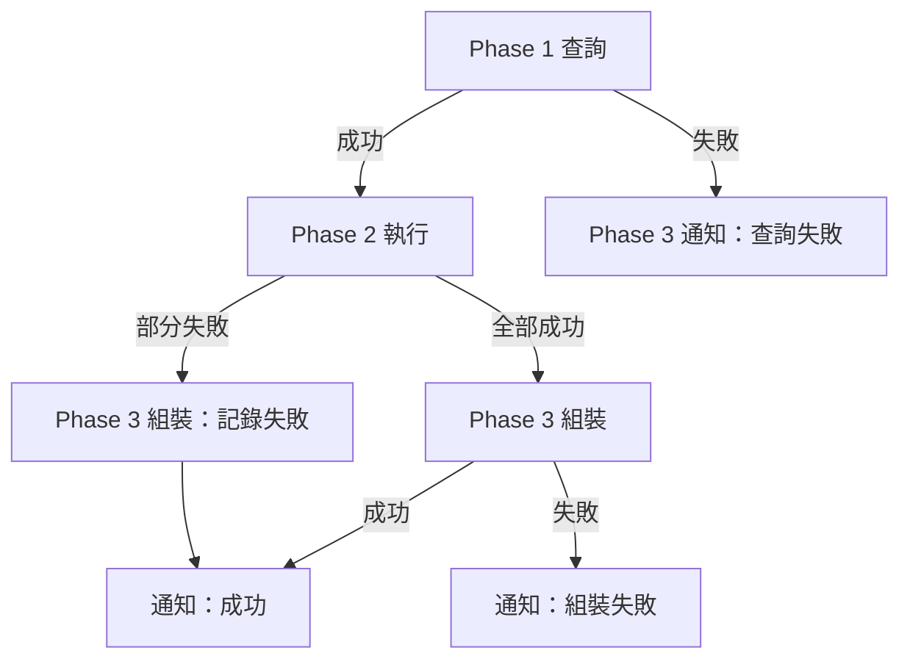

# Phase 間交接格式驗證清單

> **版本**：1.0.0
> **建立日期**：2026-03-23
> **用途**：確保 `run-todoist-agent-team.ps1` 的 Phase 1→2→3 交接格式一致，減少組裝失敗
> **適用對象**：Todoist 團隊模式開發者、run-todoist-agent-team.ps1 維護者

---

## 背景

**問題**：Phase 間交接格式不一致導致組裝失敗：
- Phase 1 輸出格式未明確定義（`results/todoist-query.json`）
- Phase 2 結果雖有 Schema（`results-auto-task-schema.json`），但缺少 Phase 間資料流驗證
- Phase 3 組裝時缺乏錯誤處理規範

**影響**：
- system-insight 顯示成功率僅 87.5%（目標 95%）
- Phase 3 組裝失敗時無明確診斷路徑
- 錯誤被靜默忽略，導致部分任務未正確執行

**目標**：
- 執行成功率提升至 95% 以上
- Phase 3 組裝失敗率下降 50%+
- 建立標準化的 Phase 間交接規範

---

## 驗證清單

### 1. Phase 1 輸出驗證（`results/todoist-query.json`）

**檢查項目**：
- [ ] 必填欄位完整：`processable_tasks`, `skipped_tasks`, `routing_summary`, `timestamp`
- [ ] `processable_tasks[]` 每項包含：`id`, `content`, `labels`, `tier`, `confidence`, `skills`, `template`
- [ ] `routing_summary` 計數正確：`tier1_count + tier2_count + tier3_count = processable_tasks.length`
- [ ] `skipped_tasks[]` 每項包含：`id`, `content`, `reason`
- [ ] `timestamp` 為 ISO 8601 格式（如 `2026-03-23T10:00:00+08:00`）

**良好範例**：
```json
{
  "processable_tasks": [
    {
      "id": "12345678",
      "content": "研究 Claude Code 最佳實踐",
      "labels": ["研究", "Claude Code"],
      "tier": 1,
      "confidence": 100,
      "skills": ["deep-research", "knowledge-query"],
      "template": "templates/sub-agent/research-task.md"
    }
  ],
  "skipped_tasks": [
    {
      "id": "87654321",
      "content": "買東西",
      "reason": "pre_filter: 實體行動"
    }
  ],
  "routing_summary": {
    "tier1_count": 1,
    "tier2_count": 0,
    "tier3_count": 0,
    "total_processable": 1
  },
  "timestamp": "2026-03-23T10:00:00+08:00"
}
```

**錯誤範例**（避免）：
```json
{
  "tasks": [],  // ❌ 欄位名稱錯誤，應為 processable_tasks
  "routing_summary": {
    "total": 5  // ❌ 缺少 tier1_count / tier2_count / tier3_count
  }
  // ❌ 缺少 timestamp
}
```

---

### 2. Phase 2 輸出驗證（`results/todoist-auto-*.json`）

**檢查項目**：
- [ ] 必填欄位：`agent`, `task_key`, `status`（已由 `results-validation-checklist.md` 定義）
- [ ] `agent` 欄位格式：`todoist-auto-{task_key}`（底線）
- [ ] `status` 取值：`success` / `partial` / `failed` / `format_failed`
- [ ] 檔案命名一致：`results/todoist-auto-{task_key}.json`（與 `task_key` 一致）

**參考文件**：[workflows/results-validation-checklist.md](./results-validation-checklist.md)

---

### 3. Phase 1→2 交接驗證

**檢查項目**：
- [ ] Phase 2 執行的任務數 ≤ Phase 1 `processable_tasks.length`
- [ ] Phase 2 每個執行任務的來源可追溯至 Phase 1 `processable_tasks[].id`
- [ ] Phase 2 使用的 template 與 Phase 1 路由結果一致

**驗證方式**：
```bash
# 假設 Phase 1 輸出 3 個可處理任務
# Phase 2 應產出至多 3 個結果檔案

P1_COUNT=$(jq '.processable_tasks | length' results/todoist-query.json)
P2_COUNT=$(ls results/todoist-auto-*.json 2>/dev/null | wc -l)

if [ $P2_COUNT -gt $P1_COUNT ]; then
  echo "❌ Phase 2 執行任務數 ($P2_COUNT) 超過 Phase 1 可處理數 ($P1_COUNT)"
else
  echo "✅ Phase 1→2 交接數量正確"
fi
```

---

### 4. Phase 2→3 交接驗證

**檢查項目**：
- [ ] Phase 3 組裝前，所有 Phase 2 結果檔案存在且可讀
- [ ] Phase 3 組裝時，可正確解析所有 Phase 2 結果 JSON
- [ ] Phase 3 `summary.total_tasks` = Phase 2 實際執行任務數

**驗證方式**：
在 `prompts/team/todoist-assemble.md` 步驟 3（組裝前）加入：
```bash
# 驗證所有 Phase 2 結果檔案可讀
for file in results/todoist-auto-*.json; do
  if ! jq empty "$file" 2>/dev/null; then
    echo "❌ 無法解析 $file"
    exit 1
  fi
done
echo "✅ 所有 Phase 2 結果檔案格式正確"
```

---

### 5. 錯誤處理規範

**檢查項目**：
- [ ] **Phase 1 失敗（查詢錯誤）** → 跳過 Phase 2，直接進入 Phase 3 通知
- [ ] **Phase 2 部分失敗** → 記錄失敗任務於 `summary.failed_tasks`，繼續組裝
- [ ] **Phase 3 組裝失敗** → 標記 `status=format_failed`，不中斷通知流程
- [ ] 所有錯誤訊息必須寫入對應結果 JSON 的 `error.message` 欄位

**錯誤處理流程**：


**錯誤訊息範例**：
```json
{
  "agent": "todoist-auto-workflow_forge",
  "task_key": "workflow_forge",
  "status": "format_failed",
  "error": {
    "code": "SCHEMA_VALIDATION_FAILED",
    "message": "結果 JSON 缺少必填欄位 'artifact'",
    "details": {
      "missing_fields": ["artifact"],
      "validation_timestamp": "2026-03-23T10:15:00+08:00"
    }
  }
}
```

---

### 6. 整合驗證（端到端）

**檢查項目**：
- [ ] Phase 1 `processable_tasks.length` 與 Phase 3 `summary.total_tasks` 一致
- [ ] Phase 1 `routing_summary.total_processable` 與 Phase 2 執行任務數邏輯一致（≤）
- [ ] Phase 3 組裝後：`summary.success_tasks + failed_tasks + partial_tasks = total_tasks`

**端到端驗證腳本**（可選，整合至 CI/CD）：
```bash
#!/bin/bash
# 端到端 Phase 驗證腳本

set -e

echo "=== Phase 1 驗證 ==="
if ! jq empty results/todoist-query.json 2>/dev/null; then
  echo "❌ Phase 1 輸出格式錯誤"
  exit 1
fi
P1_TOTAL=$(jq '.processable_tasks | length' results/todoist-query.json)
echo "✅ Phase 1: $P1_TOTAL 個可處理任務"

echo "=== Phase 2 驗證 ==="
P2_COUNT=$(ls results/todoist-auto-*.json 2>/dev/null | wc -l)
if [ $P2_COUNT -gt $P1_TOTAL ]; then
  echo "❌ Phase 2 執行任務數 ($P2_COUNT) 超過 Phase 1 可處理數 ($P1_TOTAL)"
  exit 1
fi
echo "✅ Phase 2: $P2_COUNT 個任務執行"

echo "=== Phase 3 驗證 ==="
# 假設 Phase 3 組裝結果寫入 results/todoist-summary.json
if [ -f results/todoist-summary.json ]; then
  P3_TOTAL=$(jq '.summary.total_tasks' results/todoist-summary.json)
  if [ "$P3_TOTAL" -ne "$P2_COUNT" ]; then
    echo "❌ Phase 3 total_tasks ($P3_TOTAL) ≠ Phase 2 執行數 ($P2_COUNT)"
    exit 1
  fi
  echo "✅ Phase 3: 組裝成功，total_tasks=$P3_TOTAL"
else
  echo "⚠️ Phase 3 結果檔案不存在，跳過驗證"
fi

echo "=== 端到端驗證通過 ==="
```

---

## 驗證方式

### 手動驗證（推薦）

1. 開啟 `results/` 目錄
2. 檢查 `todoist-query.json`（Phase 1 輸出）
3. 檢查所有 `todoist-auto-*.json`（Phase 2 輸出）
4. 對照本清單逐條檢查（6 大類共 24 項檢查點）
5. 發現缺失時，依「良好範例」修正

### 自動化驗證（可選）

**整合點 1：run-todoist-agent-team.ps1**
```powershell
# Phase 1 結束後
Write-Host "[Phase 1 驗證] 檢查 results/todoist-query.json"
$p1Valid = Test-Json (Get-Content results/todoist-query.json)
if (-not $p1Valid) {
    Write-Host "❌ Phase 1 輸出格式錯誤" -ForegroundColor Red
    exit 1
}
```

**整合點 2：prompts/team/todoist-assemble.md**
```markdown
## 步驟 3：驗證 Phase 2 結果（新增）

用 Bash 執行：
```bash
for file in results/todoist-auto-*.json; do
  if ! jq empty "$file" 2>/dev/null; then
    echo "❌ 無法解析 $file"
    exit 1
  fi
done
echo "✅ 所有 Phase 2 結果檔案格式正確"
```
```

---

## 整合說明

### 文件引用

- **workflows/index.yaml**：新增 entry：
  ```yaml
  - id: "wf-20260323-phase-handoff"
    path: "workflows/phase-handoff-validation-checklist.md"
    type: "validation_checklist"
    title: "Phase 間交接格式驗證清單"
    version: "1.0.0"
    created_at: "2026-03-23"
    task_types:
      - "workflow_forge"
    priority: "P0"
    summary: "確保 run-todoist-agent-team.ps1 的 Phase 1→2→3 交接格式一致，減少組裝失敗，提升成功率至 95%"
    read_when: "developing_or_reviewing_phase_logic"
  ```

- **docs/ARCHITECTURE.md**：配置文件速查表新增一行：
  ```markdown
  | workflows/phase-handoff-validation-checklist.md | Phase 間交接格式驗證 | run-todoist-agent-team.ps1 |
  ```

### 對齊檔案

- **參考檔案**：
  - `workflows/results-validation-checklist.md`（Phase 2 結果 Schema）
  - `config/schemas/results-auto-task-schema.json`（Phase 2 Schema 定義）
  - `run-todoist-agent-team.ps1`（執行腳本）

- **互補關係**：
  - `results-validation-checklist.md`：專注 Phase 2 結果檔案格式
  - `prompt-output-validation-checklist.md`：專注 Prompt 輸出規範
  - `config-consistency-validation-checklist.md`：專注 Config 一致性
  - **本清單**：專注 Phase 1 輸出 + Phase 間資料流 + 錯誤處理

---

## 預期成果

### 即時成果
- 所有 Todoist 團隊模式開發者有明確的 Phase 交接規範
- 修改 run-todoist-agent-team.ps1 時可自我驗證交接格式

### 中期成果（2-4 週）
- Phase 3 組裝失敗率下降 **50% 以上**
- 系統執行成功率提升至 **92%+**（目前 87.5%）

### 長期成果（2-3 個月）
- 執行成功率穩定在 **95% 以上**
- Phase 間交接成為標準化流程，新任務開發時自動遵守

---

## 附錄：快速參考表

| 檢查類別 | 檢查點數量 | 關鍵驗證項 |
|---------|-----------|----------|
| Phase 1 輸出 | 5 | 必填欄位、routing_summary 計數、timestamp 格式 |
| Phase 2 輸出 | 4 | 引用 results-validation-checklist.md |
| Phase 1→2 交接 | 3 | 任務數量、來源追溯、template 一致 |
| Phase 2→3 交接 | 3 | 檔案存在、可解析、total_tasks 一致 |
| 錯誤處理 | 4 | 三種失敗情境 + 錯誤訊息格式 |
| 整合驗證 | 3 | 端到端數量一致性 |
| **總計** | **22** | - |

---

**版本記錄**：
- **v1.0.0（2026-03-23）**：初版，定義 Phase 1→2→3 交接格式標準，補充現有 3 個 workflow 未覆蓋的執行流程驗證

**Generated by workflow-forge** | v1.0.0 | 2026-03-23
